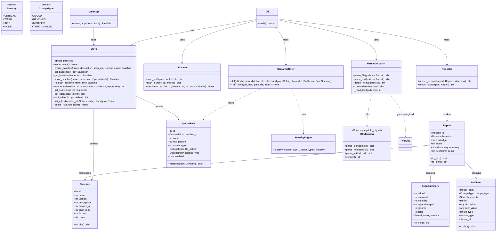
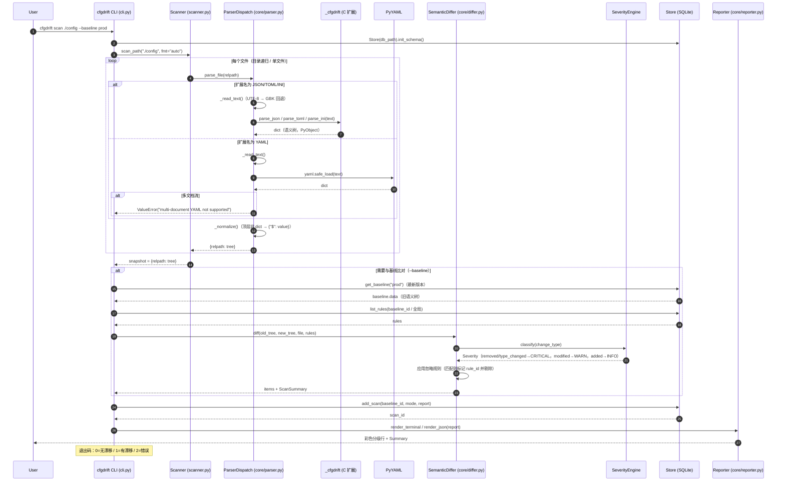
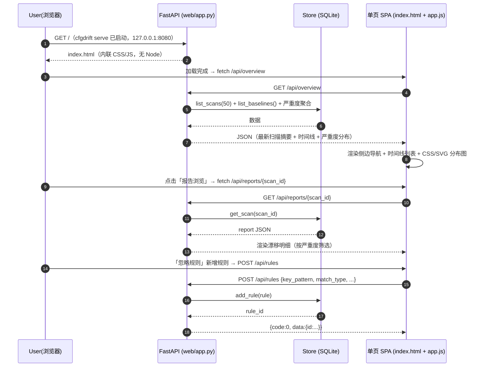
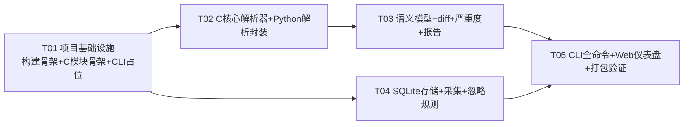
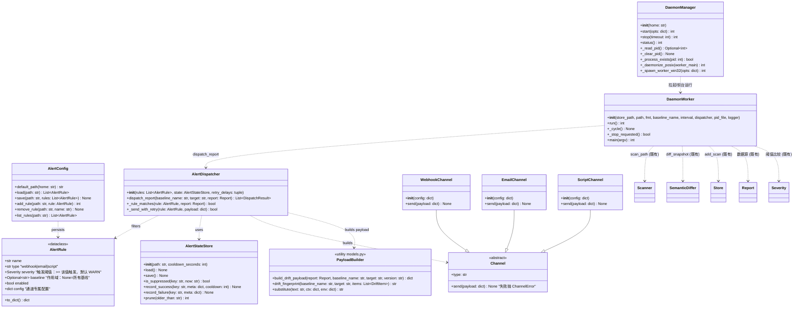
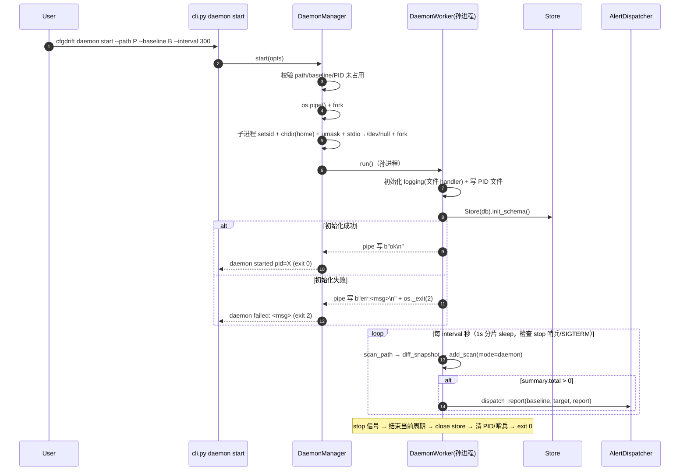
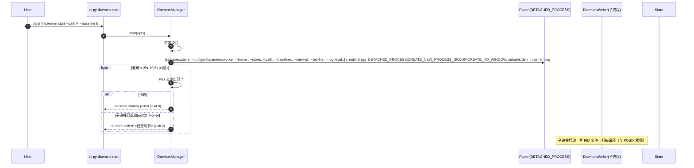
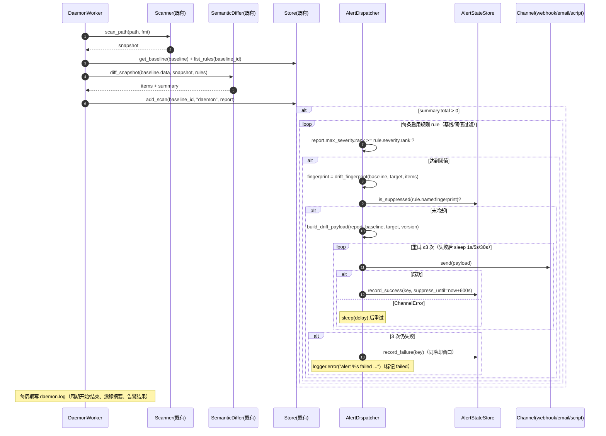
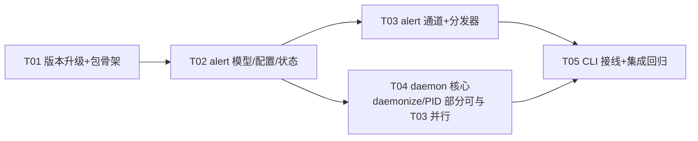

# cfgdrift 语义级配置漂移检测系统 — 系统设计文档

- 版本：v1.0
- 作者：高见远（架构师 / software-architect）
- 状态：待评审 → 转交工程师实现 + QA 测试
- 配套文件：`docs/class-diagram.mermaid`、`docs/sequence-diagram.mermaid`

---

## 0. 决策摘要（开放问题闭环 + 架构师新增决策）

团队（team-lead/PM）已确认的 8 个开放问题全部闭环，另新增 4 项架构师决策：

| # | 决策项 | 决策内容 | 来源 |
|---|--------|----------|------|
| 1 | 轮询模式 | `scan --watch` 简单循环，默认间隔 60s，`--interval` 可配置 | 团队确认 |
| 2 | 严重度规则 | 采用 PRD 默认规则，暂不支持自定义（P2 预留） | 团队确认 |
| 3 | Web 鉴权 | 本机单用户、无鉴权，绑定 127.0.0.1 | 团队确认 |
| 4 | 目录扫描文件级漂移 | 新增文件=INFO、删除文件=CRITICAL | 团队确认 |
| 5 | 编码 / 路径 | 文件读取 UTF-8 优先、GBK 回退；路径 `os.path.normpath` + 相对路径（统一 `/` 分隔）存储 | 团队确认 |
| 6 | 语义边界 | YAML 单文档流（多文档报错）；INI 键大小写不折叠；TOML 表数组=`list[dict]` | 团队确认 |
| 7 | 敏感值 | P0 不实现脱敏，仅 P2 预留 | 团队确认 |
| 8 | C 扩展方式 | 纯 CPython C API + setuptools（不用 pybind11/Cython） | 团队确认 |
| 9 | **YAML 解析位置** | **C 层仅实现 JSON/TOML/INI；YAML 由 Python 侧 pyyaml 解析后归一化进语义树** | 架构师决策 |
| 10 | **CLI 框架** | **click**（嵌套子命令 + 彩色输出 + help 生态） | 架构师决策 |
| 11 | **存储位置** | **`~/.cfgdrift/cfgdrift.db`（用户级、跨项目），支持 `CFGDRIFT_HOME` 环境变量 / `--store` 覆盖** | 架构师决策 |
| 12 | **语义树结构** | **纯 dict/list/scalar（不用 `{"type":..,"children":..}` 包装节点）；顶层非 dict 包装为 `{"$": value}`** | 架构师决策 |

---

## 1. 实现方案 + 框架选型

### 1.1 总体架构分层

四层架构（C 核心 → Python 引擎 → CLI → Web）：

```
┌──────────────────────────────────────────────────────────────┐
│ Web 层（可选）  cfgdrift serve                                 │
│   FastAPI + 原生 HTML/JS 单页（无 Node 构建链，无外部 CDN）       │
├──────────────────────────────────────────────────────────────┤
│ CLI 层  cfgdrift [init|scan|baseline|diff|report|ignore|serve] │
│   click 子命令 + 退出码规范（0=无漂移 / 1=有漂移 / 2=错误）        │
├──────────────────────────────────────────────────────────────┤
│ Python 引擎层（src/cfgdrift/）                                  │
│   core   : 语义模型 / 解析分发 / diff / 严重度 / 报告             │
│   storage: SQLite 仓库（基线/历史/忽略规则）                      │
│   scanner: 文件·目录采集 + watch 轮询                            │
│   rules  : 忽略规则引擎                                         │
├──────────────────────────────────────────────────────────────┤
│ C 核心层（src/csrc/ → 编译为 cfgdrift._cfgdrift 扩展）            │
│   parser_core / parser_json / parser_toml / parser_ini         │
│   （YAML 由 pyyaml 处理，不在 C 层）                              │
└──────────────────────────────────────────────────────────────┘
```

模块职责：

| 层 | 模块 | 职责 |
|----|------|------|
| C 核心 | `_cfgdrift` 扩展 | 将 JSON/TOML/INI 文本解析为嵌套 PyObject（dict/list/scalar）语义树；统一抛 `ValueError`（含行/列号）；不依赖任何外部 C 库 |
| Python 引擎 | `core/parser.py` | 格式识别（扩展名）+ 解析分发（C 扩展 + pyyaml）+ `_normalize` 归一化 + 编码处理（UTF-8→GBK→兜底） |
| Python 引擎 | `core/model.py` | 数据模型：`Severity`/`ChangeType`/`DriftItem`/`ScanSummary`/`Baseline`/`IgnoreRule` |
| Python 引擎 | `core/differ.py` | 递归语义 diff + 严重度分级 + 忽略规则过滤 |
| Python 引擎 | `core/reporter.py` | `Report` 组装、JSON 序列化、终端彩色/纯文本渲染 |
| Python 引擎 | `storage/store.py` | SQLite schema、基线（版本化/回滚）、扫描历史、忽略规则 CRUD |
| Python 引擎 | `scanner/scanner.py` | 单文件/目录递归采集、watch 轮询循环 |
| Python 引擎 | `rules/ignore.py` | 忽略规则匹配引擎（exact/prefix/regex + file/change_type 过滤） |
| CLI | `cli.py` | 命令编排、参数解析、退出码、彩色开关 |
| Web | `web/app.py` + `web/static/*` | FastAPI JSON API + 单页仪表盘（概览/时间线/严重度分布/报告浏览/基线管理/忽略规则） |

### 1.2 核心难点与对策

| 难点 | 对策 |
|------|------|
| 四种格式统一为一种语义模型 | 统一为"纯 dict/list/scalar"树；顶层非 dict 包装为 `{"$": value}`；TOML datetime 归一化为 ISO-8601 字符串 |
| 忽略格式噪音（注释/缩进/键序） | 解析器天然丢弃注释与缩进；diff 基于 dict 无序比较，键序差异不产生漂移 |
| C 扩展跨平台编译（Win/Linux/macOS） | 纯标准 C（C99 子集），仅用 C 标准库，不引入 POSIX/Windows 专属头；MSVC/gcc/clang 均可编译 |
| YAML 语法复杂 | 用 `pyyaml.safe_load` 在 Python 侧解析（见 1.3 决策），不手写 C YAML |
| TOML 语法较复杂 | C 层实现 TOML v1.0 常用子集，超范围构造明确报错（见 1.3 范围表） |
| 中文 / GBK 编码 | Python 侧按字节读取：UTF-8 严格 → GBK 严格 → UTF-8 `errors=replace` 兜底并告警 |
| 列表语义 diff | 按索引逐元素比较（键路径 `arr[i]`），不检测元素重排（文档化限制） |
| 目录扫描文件级漂移 | 快照结构为 `{relpath: tree}`；文件仅存在于一侧 → 文件级 added/removed 漂移，不再深入键级 diff |

### 1.3 C 扩展设计（关键决策）

#### 1.3.1 模块名与暴露函数

模块名：`cfgdrift._cfgdrift`（私有扩展，Python 侧通过 `cfgdrift.core.parser` 封装，不对外直接暴露）。

| C 函数 | Python 侧签名 | 说明 |
|--------|----------------|------|
| `parse_json` | `parse_json(text: str) -> dict` | JSON → 语义树 |
| `parse_toml` | `parse_toml(text: str) -> dict` | TOML → 语义树 |
| `parse_ini` | `parse_ini(text: str) -> dict` | INI → 语义树 |
| `version` | `version() -> str` | 扩展版本号（自检用） |

> 不导出 `parse_yaml`。YAML 在 Python 侧用 pyyaml 处理。

#### 1.3.2 C 函数签名（CPython C API 层）

```c
/* parser_core.c —— 模块初始化 + 公共工具 */
PyMODINIT_FUNC PyInit__cfgdrift(void);

static PyObject* _cfgdrift_parse_json(PyObject* self, PyObject* args);  /* "s#" 输入 */
static PyObject* _cfgdrift_parse_toml(PyObject* self, PyObject* args);
static PyObject* _cfgdrift_parse_ini(PyObject* self, PyObject* args);
static PyObject* _cfgdrift_version(PyObject* self, PyObject* args);

/* 公共工具（parser_core.c 提供，parser_json/toml/ini 复用） */
void cfgdrift_raise_error(const char* msg, int line, int col);          /* 抛 ValueError: parse error at line L, column C: msg */
PyObject* cfgdrift_new_str(const char* s, Py_ssize_t len);              /* UTF-8 → PyUnicode */
PyObject* cfgdrift_parse_number(const char* s, Py_ssize_t len, int* consumed); /* int/float 判定并构造 PyLong/PyFloat */
```

#### 1.3.3 键值树数据结构设计

不引入自定义 C 结构体，解析结果直接构造嵌套 PyObject：

| 语义 | PyObject 表示 |
|------|----------------|
| 对象 | `PyDict`（`PyDict_SetItem`，Python 3.7+ 保持插入序） |
| 数组 | `PyList` |
| 字符串 | `PyUnicode` |
| 整数 | `PyLong` |
| 浮点 | `PyFloat` |
| 布尔 | `PyBool`（`Py_True`/`Py_False`） |
| 空值 | `Py_None` |

C 解析器内部仅用局部指针游标 + 递归下降/行级状态机，最终产出 PyObject 树；Python 侧可直接 `json.dumps` 序列化，零转换成本。

#### 1.3.4 错误约定

所有解析错误统一抛 `ValueError("parse error at line L, column C: <msg>")`；`L`/`C` 为 1-based，通过扫描输入中 `\n` 数量与当前偏移量计算。

#### 1.3.5 各格式解析范围

| 格式 | 支持 | 明确行为 / 限制 |
|------|------|------------------|
| JSON（RFC 8259 子集） | 对象、数组、字符串（含 `\uXXXX` 代理对）、数字（int/float、`e/E` 指数、负数）、`true/false/null` | 重复键 **last-wins**；拒绝尾随逗号、裸单引号 |
| TOML（v1.0 常用子集） | 基本/字面字符串（含三引号多行）、整数（dec/hex/oct/bin + 下划线）、浮点、布尔、数组、内联表、`[a.b]` 表、`[[a.b]]` 表数组（→ `list[dict]`）、点分键、datetime→ISO-8601 字符串 | **重复键/重复表头报错**（对齐 TOML 规范）；不支持的构造报错而非静默 |
| INI | `[section]`、`key=value` / `key:value`、整行注释 `#`/`;`、键大小写保留、值去首尾空白并剥配对引号 | 重复键 **last-wins**；无 section 的键置于顶层；不支持行尾注释（文档化限制） |

#### 1.3.6 YAML 解析决策（明确）

**决策：C 层不做 YAML；YAML 由 Python 侧 `pyyaml.safe_load` 解析后归一化进语义树。**

理由：
1. **libyaml 是外部 C 依赖**：Windows 无系统 libyaml，需 vendoring 或引入构建复杂度，直接违背约束 8（纯 CPython C API + setuptools、减少依赖）。
2. **YAML 语法复杂度高**：锚点/别名/标签/多行标量/流式集合等，C 手写正确性风险大、成本高，收益低。
3. **pyyaml 是事实标准**：pip 一键安装；底层自带 libyaml C 加速（可用时），性能足够。
4. **归一化成本几乎为零**：pyyaml 输出天然是 dict/list/scalar 树，直接进入统一语义树。

> 说明：PRD 原文要求"C 实现四种格式解析"。本设计以 JSON/TOML/INI 三种由 C 实现、YAML 由 pyyaml（底层 C 加速）实现，是工程性价比最高的取舍；语义树统一在 Python 层完成，"语义级"核心价值不受影响。若后续强制要求全 C，可再引入 libyaml（P2 预留）。

### 1.4 关键依赖选型

| 依赖 | 选型 | 理由 |
|------|------|------|
| 构建后端 | setuptools>=68 + wheel | C 扩展编译标准方案 |
| CLI | click>=8.1 | 嵌套子命令（baseline/ignore 分组）、help、彩色输出生态好 |
| YAML | PyYAML>=6.0 | 事实标准，`safe_load` 足够 |
| SQLite | stdlib `sqlite3` | 零依赖 |
| Web（可选 extra） | fastapi>=0.110 + uvicorn>=0.27 | 轻量；配合原生 HTML/JS，无 Node |
| 测试 | pytest>=8.0 | 标准测试框架 |

### 1.5 架构模式

分层 + 模块化（无 MVC 必要）：`core`（模型/服务）与 `storage`（仓库）、`scanner`（采集）、`rules`（规则）解耦；CLI 与 Web 是同一引擎的两种适配器（Adapter），均只依赖 Python 引擎公共 API，互不感知。

---

## 2. 文件列表（相对路径，≤20 个实现源文件）

> 说明：`__init__.py` 为一行占位文件，**不计入** 20 个源文件预算；README 为文档。实现源文件共 **19 个**。

```
cfgdrift/
├── pyproject.toml                      # 项目元数据 + setuptools 构建后端 + 入口脚本 cfgdrift=cfgdrift.cli:main + 可选 extra[web]
├── setup.py                            # C 扩展 cfgdrift._cfgdrift 编译配置（Extension + sources + include_dirs + package_dir=src）
├── README.md                           # 安装/使用说明（文档，不计入预算）
├── src/
│   ├── cfgdrift/
│   │   ├── __init__.py                 # 占位：__version__ = "0.1.0"（不计入预算）
│   │   ├── cli.py                      # click CLI：init/scan/baseline/diff/report/ignore/serve + 退出码 0/1/2
│   │   ├── core/
│   │   │   ├── __init__.py             # 占位
│   │   │   ├── model.py                # 数据模型：Severity/ChangeType/DriftItem/ScanSummary/Baseline/IgnoreRule + 键路径工具
│   │   │   ├── parser.py               # 格式识别 + 解析分发（_cfgdrift + pyyaml）+ _normalize + 编码处理（UTF-8→GBK→兜底）
│   │   │   ├── differ.py               # SemanticDiffer 递归 diff + SeverityEngine.classify + 忽略规则应用
│   │   │   └── reporter.py             # Report 组装 + to_json + 终端彩色/纯文本渲染
│   │   ├── storage/
│   │   │   ├── __init__.py             # 占位
│   │   │   └── store.py                # SQLite 仓库：schema、基线(版本化/回滚)、扫描历史、忽略规则 CRUD
│   │   ├── scanner/
│   │   │   ├── __init__.py             # 占位
│   │   │   └── scanner.py              # 单文件/目录递归采集 + watch 轮询循环
│   │   ├── rules/
│   │   │   ├── __init__.py             # 占位
│   │   │   └── ignore.py               # IgnoreRule 匹配引擎（exact/prefix/regex + file/change_type 过滤）
│   │   └── web/
│   │       ├── __init__.py             # 占位
│   │       ├── app.py                  # FastAPI 应用 + JSON API（overview/timeline/severity/reports/baselines/rules）
│   │       └── static/
│   │           ├── index.html          # 单页 SPA（内联 <style>）：侧边导航 6 视图 + 主区
│   │           └── app.js              # 前端逻辑：fetch + 时间线渲染 + CSS/SVG 严重度分布图 + 规则表单
│   └── csrc/
│       ├── parser_core.c               # C 模块初始化、方法表、公共工具（错误/字符串/数字）、version()
│       ├── parser_json.c               # JSON 递归下降解析器（RFC 8259 子集）
│       ├── parser_toml.c               # TOML v1.0 常用子集解析器
│       └── parser_ini.c                # INI 解析器
├── tests/
│   ├── test_core.py                    # 单测：C 解析器 + pyyaml 归一化 + diff + 严重度 + 忽略规则
│   └── test_cli.py                     # 端到端：subprocess 跑 CLI（init/scan/baseline/diff/ignore/serve/退出码）
└── docs/
    ├── system_design.md                # 本文档
    ├── class-diagram.mermaid           # 类图（提取）
    └── sequence-diagram.mermaid        # 时序图（提取）
```

实现源文件计数：`pyproject.toml`、`setup.py`、`cli.py`、`model.py`、`parser.py`、`differ.py`、`reporter.py`、`store.py`、`scanner.py`、`ignore.py`、`app.py`、`index.html`、`app.js`、`parser_core.c`、`parser_json.c`、`parser_toml.c`、`parser_ini.c`、`test_core.py`、`test_cli.py` = **19 个**。

---

## 3. 数据结构和接口（类图）



---

## 4. 程序调用流程（时序图）

### 4.1 主流程：scan → parse(C) → 语义树 → baseline/diff → report



### 4.2 Web 仪表盘流程：serve → API → 单页渲染



---

## 5. 任务列表（有序、含依赖）

### 5.1 任务表

| 任务号 | 任务名 | 依赖 | 优先级 | 验收标准 |
|--------|--------|------|--------|----------|
| T01 | 项目基础设施：构建骨架 + C 模块骨架 + CLI 占位 | 无 | P0 | `pip install -e .` 成功编译 `_cfgdrift`（含空方法表 + `version()`）；`cfgdrift --version` 输出 `0.1.0`；`cfgdrift --help` 显示子命令占位；`pytest` 冒烟通过 |
| T02 | C 核心解析器 + Python 解析封装 | T01 | P0 | `_cfgdrift.parse_json/parse_toml/parse_ini` 对四种格式样例返回正确语义树；错误带 `line L, column C`；YAML 经 pyyaml 归一化、多文档报错；`--format auto` 按扩展名识别；UTF-8/GBK 中文内容解析正确；`tests/test_core.py` 解析用例全绿 |
| T03 | 语义模型 + diff + 严重度 + 报告 | T02 | P0 | 检出新增/删除/修改/类型变化（含列表按索引、顶层 `{"$":...}` 包装）；严重度默认映射正确（删除/类型变化=CRITICAL、修改=WARN、新增=INFO）；`report --json` 输出符合第 7 节 JSON 规范；终端彩色/`--no-color` 渲染正确；`tests/test_core.py` diff 用例全绿 |
| T04 | SQLite 存储 + 采集 + 忽略规则 | T01 | P0 | `baseline create/list/show/rollback` 版本化与回滚正确；`scan` 记录历史（`scans` 表）；`ignore add/list/remove` 支持 exact/prefix/regex + file/change_type 过滤 + 全局/按基线作用域，diff 结果正确剔除并计入 `ignored`；`scan --watch --interval` 循环可用（Ctrl+C 退出）；`tests/test_cli.py` 存储/规则用例全绿 |
| T05 | CLI 全命令 + Web 仪表盘 + 打包验证 | T03, T04 | P0(P1 特性并入) | 端到端：`init → scan --save-as-baseline prod → 改配置 → diff --baseline prod` 输出彩色报告且退出码=1；改回后退出码=0；非法参数退出码=2；`cfgdrift serve` 启动后浏览器访问 127.0.0.1:8080 可见 6 视图仪表盘，API 全通；`pip install .` 构建 wheel 可安装并执行 `cfgdrift`；`tests/test_cli.py` 全绿 |

### 5.2 任务依赖图



> 并行度：T02 与 T04 在 T01 后可并行开发；T03 依赖 T02；T05 依赖 T03+T04。每个任务均 ≥3 个相关文件（T01: 6 个，T02: 5 个，T03: 4 个，T04: 4 个，T05: 6 个）。

---

## 6. 依赖包列表

**必装（core）**：
```
- setuptools>=68: 构建后端（C 扩展编译）
- wheel>=0.40: 构建 wheel 所需
- click>=8.1: CLI 框架
- PyYAML>=6.0: YAML 解析（safe_load）
```
（SQLite 使用标准库 `sqlite3`，无第三方依赖。）

**可选（extra `[web]`）**：
```
- fastapi>=0.110: Web API 框架
- uvicorn>=0.27: ASGI 服务器（serve 命令启动）
```

**开发/测试（dev）**：
```
- pytest>=8.0: 单元与端到端测试
```

安装方式：`pip install cfgdrift`（核心）、`pip install "cfgdrift[web]"`（含仪表盘）、`pip install "cfgdrift[dev]"`（开发）。

---

## 7. 共享知识（跨文件约定）

### 7.1 语义树 JSON 结构规范

- 语义树 = 纯 `dict` / `list` / 标量，**不使用** `{"type":"object","children":{...}}` 包装节点。
- 标量类型映射：`str` / `int` / `float` / `bool` / `null`；TOML datetime 归一化为 ISO-8601 字符串（`str`）。
- 顶层必须为 dict；若解析结果为 list/scalar，包装为 `{"$": value}`（保留键 `"$"`，文档化）。
- 快照（snapshot）结构：`{relpath: tree}`，其中 `relpath` 为文件相对扫描根路径，统一 `/` 分隔；单文件模式 `relpath` = 文件名。
- 类型类别（用于类型变化检测）：`str` / `int` / `float` / `bool` / `null` / `list` / `dict`；`int↔float` 视为类型变化（CRITICAL，遵循 PRD 默认）。

### 7.2 键路径表示

- 段间以 `.` 连接：`server.tls.enabled`。
- 数组用 `[i]`：`servers[0].host`。
- 段名含 `.` `[` `]` `\` 时用反斜杠转义：`\.` `\[` `\]` `\\`。
- 文件级漂移（目录扫描时整文件新增/删除）的 `key_path` 固定为 `""`（空串），以 `file` 字段区分。

### 7.3 严重度枚举

- 枚举值（字符串）：`CRITICAL` > `WARN` > `INFO` > `NONE`（无漂移时 summary 用 `NONE`）。
- 默认映射：`removed`=CRITICAL、`type_changed`=CRITICAL、`modified`=WARN、`added`=INFO。
- 文件级：文件删除=CRITICAL、文件新增=INFO。
- `max_severity` = items 中最高严重度；无 items 时为 `NONE`。

### 7.4 退出码约定

| 退出码 | 含义 |
|--------|------|
| 0 | 命令成功；diff/scan 未检出漂移 |
| 1 | diff/scan 检出漂移（有 items） |
| 2 | 错误（参数非法、解析失败、存储错误、基线不存在等） |

### 7.5 存储路径与配置约定

- 默认数据目录：`~/.cfgdrift/`（用户级、跨项目）；DB 文件 `~/.cfgdrift/cfgdrift.db`。
- 覆盖方式：环境变量 `CFGDRIFT_HOME`（改数据目录）或 CLI 全局选项 `--store PATH`（直接指定 DB 文件）。
- DB 内 `scan_root` 存绝对路径（`os.path.abspath` + `normpath`）；快照内 `relpath` 存相对路径（`/` 分隔）。
- 时间一律 ISO 8601 UTC（`datetime.now(timezone.utc).isoformat()`）。

### 7.6 报告 JSON 结构（CLI `--json` 与 Web API 共用）

```json
{
  "code": 0,
  "data": {
    "scan_id": 7,
    "mode": "manual",
    "created_at": "2025-01-01T00:00:00+00:00",
    "baseline": {"name": "prod", "version": 1},
    "summary": {"added": 2, "removed": 1, "modified": 1, "type_changed": 0, "ignored": 1, "total": 4, "max_severity": "CRITICAL"},
    "items": [
      {
        "key_path": "server.tls.enabled",
        "change_type": "removed",
        "severity": "CRITICAL",
        "file": "conf/app.yaml",
        "old_value": true,
        "new_value": null,
        "old_type": "bool",
        "new_type": null,
        "rule_id": null
      }
    ]
  },
  "message": "ok"
}
```
（错误响应：`{"code": 2, "data": null, "message": "<原因>"}`。）

### 7.7 编码处理约定

- 文件读取：字节流 → UTF-8 严格 → GBK 严格 → UTF-8 `errors="replace"` 兜底（并输出告警）。
- C 解析器输入为已解码的 `str`，内部按 UTF-8 处理。

### 7.8 目录扫描约定

- `--format auto`：按扩展名识别 `.json` / `.yaml|.yml` / `.toml` / `.ini|.cfg|.conf`；未知扩展名文件跳过并告警。
- 单文件 + 未知扩展名：需显式 `--format`，否则报错（退出码 2）。
- 快照中文件集合变化 = 文件级漂移（新增=INFO / 删除=CRITICAL），不再深入键级 diff。
- 重复键行为：JSON/INI last-wins；TOML 重复键/重复表头报错。
- 列表 diff 按索引比较，不检测重排（限制，文档化）。

### 7.9 代码/命名约定

- Python 包内禁止直接 import `_cfgdrift` 之外的 C 符号；一律经 `cfgdrift.core.parser` 分发。
- 忽略规则 `match_type` 枚举：`path_exact` / `path_prefix` / `regex`；`key_pattern` 匹配键路径，`file_pattern`（可选）为 relpath 正则。
- Web 静态资源零外部依赖（无 CDN），保证离线可用。

---

## 8. 待明确事项

**团队开放问题已全部闭环**（见第 0 节决策表 1–8）。以下为实现期假设（低风险，工程师可直接采用，QA 可据此设计用例）：

1. JSON/INI 重复键 last-wins；TOML 重复键/重复表头报错（对齐 TOML 规范）。
2. 目录扫描仅识别已知扩展名，未知扩展跳过并告警；单文件未知扩展需显式 `--format`。
3. TOML datetime 归一化为 ISO-8601 字符串，datetime↔str 不视为类型变化。
4. YAML/JSON 顶层为 list/scalar 时统一包装为 `{"$": value}`。
5. `baseline rollback <name>` 语义：删除该基线最新版本，使上一版本成为当前版本；仅有一个版本时报错（退出码 2）。
6. `scan` 不指定 `--baseline` 时只记录历史、不产出漂移报告；指定 `--save-as-baseline NAME` 时同时创建/更新基线（同名则版本 +1）。

---

# 附录 A：v0.2.0 增量设计 — Python 版本兼容性改造（纯 Python 兜底）

- 版本：v0.2.0
- 作者：高见远（架构师 / software-architect），工程师寇豆码实现
- 状态：已实现 + 双模式一致性回归通过

## A.1 目标与三个已确认决策

**目标**：将 cfgdrift 从 cp313 专用二进制包改造为「任何 Python 3.8+ 均可安装
运行」的通用包 —— C 扩展改为可选加速器 + 纯 Python 兜底。软件适配用户，
而非用户适配软件。

| # | 决策 | 内容 |
|---|------|------|
| 1 | 分发 | 双 wheel 为主 + sdist 可选编译。主发布件 `cfgdrift-0.2.0-py3-none-any.whl`（纯 Python 通用）；可选 cp313 平台 wheel（C 加速）；sdist 保留 C 源码。pip 标签优先级天然让 cp313 用户拿加速件、其他版本拿通用件 |
| 2 | tomli | 环境标记硬依赖 `tomli>=2.0; python_version < '3.11'`；导入范式 `try: import tomllib except ModuleNotFoundError: import tomli as tomllib` |
| 3 | 双模式一致性基准 | 合法输入 → 语义树严格等价（类型敏感，键顺序不计入）；非法输入 → 双模式均抛 `ValueError` 且消息以 `"parse error at line L, column C"` 开头（L/C 与冒号后文本允许差异） |

## A.2 文件变更清单

| 文件 | 变更 |
|------|------|
| `src/cfgdrift/core/pure_parsers.py` | **新增**：纯 Python 兜底解析器（见 A.3） |
| `src/cfgdrift/core/parser.py` | 自动降级机制：`HAVE_C` / `PARSER_BACKEND` / `set_backend()` / `CFGDRIFT_BACKEND` 分发（见 A.4） |
| `src/cfgdrift/cli.py` | `CFGDRIFT_DEBUG=1` → `logging.basicConfig(level=logging.DEBUG)`（观察后端选择） |
| `setup.py` | C 扩展 `optional=True`；`CFGDRIFT_NO_C=1` 确定性跳过编译 |
| `pyproject.toml` | version=0.2.0；requires-python>=3.8；dependencies 增 `tomli>=2.0; python_version < '3.11'` |
| `src/cfgdrift/__init__.py` | `__version__ = "0.2.0"` |
| `src/csrc/parser_core.c` | `version()` 返回 `"0.2.0-c"` |
| `MANIFEST.in` | **新增**：`recursive-include src/csrc *.c *.h`（保证 sdist 携带 C 源码） |
| `tests/test_dual_mode.py` | **新增**：双模式一致性 harness |
| `tests/test_core.py` / `tests/test_qa_extra.py` | C 直接 import 改 `HAVE_C` 守卫；C 专属错误消息断言按 HAVE_C skip |
| `README.md` / `.github/workflows/ci.yml` | 安装/构建/环境变量文档；CI 多版本矩阵 |

## A.3 纯 Python 兜底解析器（pure_parsers.py）

模块级函数，返回**原始 dict/list/scalar**（归一化仍由 parser.py 的
`_normalize` / `_wrap_top_level` 统一完成，两后端共用同一归一化路径）：

- `parse_json_pure(text)`：stdlib `json.loads` + 错误格式对齐 shim
  - 裸单引号 shim：先扫描（跟踪双引号字符串内/转义状态），字符串外的 `'`
    抛 `"bare single quotes are not allowed in JSON"`（对齐 C 含 "single quote" 字样）；
  - 尾随逗号 shim：`json.loads` 失败后检测末尾 `,}` / `,]` 抛
    `"trailing comma in object"` / `"trailing comma in array"`（保留 exc 的 L/C）；
  - 其余错误沿用 stdlib 消息（D1 豁免）；未配对代理对按 D2 豁免（stdlib 接受）。
- `parse_toml_pure(text)`：`tomllib`/`tomli.loads`，`TOMLDecodeError` 包装为
  `_parse_error(line, col, msg)`。**关键**：datetime 归一化 —— C 对
  `1979-05-27T07:32:00Z` 输出字面量，tomli 返回的 datetime 对象 `isoformat()`
  输出 `+00:00`，用 `_toml_datetime_to_iso()` 转成 C 规范输出：offset 为 0 的
  tz-aware → `Z` 后缀；否则保留 ±HH:MM。转换后已是 str，交 `_normalize`
  不再二次转换。注：Python 3.13+ 的 `tomllib.TOMLDecodeError` 不再暴露
  `lineno/colno/msg` 属性，从消息尾部 `"(at line L, column C)"` 解析。
- `parse_ini_pure(text)`：configparser 严格配置对齐 C 语义
  （`strict=False, optionxform=str, interpolation=None,
  inline_comment_prefixes=None, empty_lines_in_values=False,
  delimiters=("=", ":"), default_section="__cfgdrift_never_default__"`）。
  - 默认 section 合并陷阱：DEFAULT 段会传播进每个 section 的 `items()`；
    对策：读 `cp._sections[sec]`（内部 dict，不含 defaults 合并）取 section
    数据、`cp.defaults()` 取顶层键；哨兵键 `__name__` 剔除。该内部 API 在
    CPython 3.8-3.13 长期稳定。
  - Python 3.13+ 的 configparser 重构后不再把「首个节头前的键」放进 defaults，
    改用 `allow_unnamed_section=True`（3.13+ 参数）存入 UNNAMED_SECTION；
    `_ini_collect` 同时兼容两条路径。
  - `_ini_trim_value(v)`：完全复刻 C 的 `ini_trim_value` —— 先剥首尾空白，
    若首尾为成对引号（" 或 '）则剥掉（引号内空白保留）。
  - 错误包装：捕获 `configparser.Error`（继承 Exception 而非 ValueError）→
    `_parse_error(line, 1, msg)`；line 优先取 `ParsingError.errors[0][0]`，
    否则异常自带 `lineno`，再否则 1。
- `_parse_error(line, col, msg)`：统一构造
  `ValueError("parse error at line L, column C: <msg>")`。
- 3.8 兼容：文件保留 `from __future__ import annotations`。

## A.4 parser.py 自动降级机制

- 保留 try/except import `_cfgdrift`，升级为：
  - `HAVE_C: bool`：`_cfgdrift` 是否可导入（模块级常量）；
  - `PARSER_BACKEND: str`：当前生效后端，取值 `"c"` / `"pure"`。
- 初始选择（import 时执行）：环境变量 `CFGDRIFT_BACKEND` ∈ {auto(默认)/pure/c}；
  auto：HAVE_C 为真 → `"c"` 否则 `"pure"`（静默降级，仅 debug 日志）；
  pure：强制纯模式；c：强制 C，无 C 则 import 即抛 RuntimeError。
- 运行时切换钩子：`parser.set_backend(name)`，内部测试钩子不承诺稳定；
  `"c"` 但无 C 抛 RuntimeError。
- `_parse_json/_parse_toml/_parse_ini` 按 `PARSER_BACKEND` 分发：
  c → `_cfgdrift.parse_*`；pure → `pure_parsers.parse_*_pure`。
- debug 日志：`logger = logging.getLogger("cfgdrift.core.parser")`，
  选定后端与 set_backend 时 `logger.debug("parser backend: %s", PARSER_BACKEND)`。
- `parse_text/parse_file/_normalize/_wrap_top_level/_read_text/detect_format`
  均不改动（归一化两后端共用）。

## A.5 豁免清单 D1-D4 与已知文档化差异

| 编号 | 内容 |
|------|------|
| D1 | JSON 非 shim 错误沿用 stdlib 消息（如 "Expecting property name..." vs C "expected string key..."） |
| D2 | JSON 未配对代理对：纯模式接受（stdlib），C 模式拒绝；P2 可选，不实现对齐 |
| D3 | TOML 错误消息文本与精确 L/C 允许差异（tomli vs C） |
| D4 | INI 错误消息文本与精确 L/C 允许差异（configparser vs C） |

已知文档化差异（不进入双模式等价语料库）：

1. 无时区 TOML 日期时间的小数秒：C 输出字面量 `"1979-05-27T07:32:00.5"`，
   纯模式 `isoformat()` 输出 `"1979-05-27T07:32:00.500000"`；
2. 本地时间带 UTC 偏移（`07:32:00Z`）不符合 TOML v1.0 语法：纯模式拒绝
   （抛 ValueError），C 模式按字面量接受；
3. INI 节头尾随内容（`[s] junk`）C 拒绝 / configparser 静默接受；
   节名带空格（`[ s ]`）两种后端归一化不同；
4. INI 多行续行：C 拒绝缩进续行（`a = 1\n  indented\n` →
   `"expected '=' or ':' in key-value line"`），纯模式 configparser 更宽松，
   接受为多行值 `"1\nindented"`（`empty_lines_in_values=False` 只禁止空行
   参与续行，不禁止缩进续行）。

## A.6 测试策略

- `tests/test_dual_mode.py`：同一语料库 × {c, pure} × `tree_equal` + 错误前缀
  断言 + D1-D4 显式标记。`tree_equal` 规则：dict 键集合相同且逐键递归（键顺序
  不计入）、list 长度相同逐元素（顺序计入）、标量类型完全相同
  （int≠float≠bool≠str≠None）且值相等、双方 float 均 isnan → 相等、TOML
  datetime 双方为 str 且可解析为 tz-aware datetime 时按同一时刻比较
  （Z 与 +00:00 等价）否则精确字符串比较。语料库含 test_core/test_qa_extra
  的合法/非法样例 + 大整数、inf/nan、datetime、重复键、INI 引号剥离、
  GBK 编码文件；`match="duplicate key"` 等错误消息文本断言保留为 C 模式专用
  （无 C skip）。
- `tests/test_core.py` / `tests/test_qa_extra.py`：C 直接 import 改
  `pytest.importorskip` / `HAVE_C` 守卫；C 专属边界/错误消息断言按 HAVE_C skip。
- CI 矩阵（`.github/workflows/ci.yml`）：3.8 / 3.10 / 3.11 / 3.13 × {C, 纯}，
  受限环境可只提交配置不实跑。

---

# 附录 B：v0.3.0 增量设计 — 守护进程 daemon + 告警钩子 alert

- 版本：v0.3.0
- 作者：高见远（架构师 / software-architect-3）
- 状态：待评审 → 转交工程师实现 + QA 测试
- 原则：**基于 v0.2.0 最小变更**；不重设计已稳定部分（解析/语义树/diff/存储/报告/Web）；新增能力以新包承载，既有接口只复用不改造（除 CLI 增加子命令组与版本号三处同步）。

---

## B.0 决策摘要（Q1-Q5 拍板 + 架构师新增决策）

| # | 决策项 | 决策内容 | 来源 |
|---|--------|----------|------|
| 1 | Windows daemon 技术路线 | **子进程方案确认**：`subprocess.Popen([sys.executable, "-m", "cfgdrift.daemon.worker", ...], creationflags=DETACHED_PROCESS\|CREATE_NEW_PROCESS_GROUP\|CREATE_NO_WINDOW)` 拉起 worker、父进程退出；不引入 pywin32 | Q1 |
| 2 | stop 跨平台终止 | POSIX：SIGTERM（worker 装 handler 优雅退出：结束当前周期→关 Store→清 PID→exit 0）；Windows：**停止哨兵文件** `.cfgdrift/daemon.stop`（worker 每秒检查，优雅退出）为主，超时（默认 30s）未退则 `taskkill /PID /F`（TerminateProcess）兜底 | Q1 |
| 3 | payload 结构 | 顶层字段与已确认草案**完全一致**；`drift_items` 每项在草案 4 字段（key/baseline/current/severity）基础上**扩展 `file` 与 `change_type`**（目录扫描多文件场景必须，Q2 决策）；payload 永不包含通道凭据/完整配置/环境变量秘密 | Q2 |
| 4 | SMTP 密码 | **确认 `--smtp-password-env` 只存环境变量名**，worker 运行时解析；扩展统一约定：webhook 头值 / script argv / 邮件主题模板均支持 `{env:VAR}` 替换，避免明文秘密落盘 | Q2 |
| 5 | 默认值 | interval=300s、告警阈值 severity=WARN（≥WARN 触发）、防抖冷却窗口 10min、重试 3 次（1s/5s/30s） | Q3 |
| 6 | severity 归属 | **阈值是每条 alert 规则属性**（`alert add --severity`，默认 WARN），daemon 不设全局 `--severity`（避免双真源；PRD 中 "--severity 可指定"落在 `alert add` 上） | Q3 |
| 7 | 去重键 | **去重键 = rule.name + fingerprint**（fingerprint 按 PRD = hash(baseline+target+drift 项)）；多规则（多通道）对同一漂移各触发一次，但同一规则冷却期内不重复 | Q3 |
| 8 | Web 仪表盘 | **P1 不纳入 Web**：alert 规则/状态仅 CLI 管理 + daemon.log 可见；`/api/alerts` 只读接口 + SPA 告警视图推迟到 P2 | Q4 |
| 9 | 脚本通道失败语义 | **非零退出码 = 发送失败**，计入同一重试策略（3 次退避）；重试策略为全局固定参数，**P1 不支持按通道配置**（P2 预留） | Q5 |
| 10 | 模块结构 | daemon 用包（daemon.py + worker.py 两文件）；alert 用包（models/config/state/dispatcher/channels 五文件，**三通道合并在 channels.py 单文件**，保留类抽象以满足 ≤10 文件预算） | 架构师决策 |
| 11 | Store 变更 | **零新增表/方法**：告警历史不进 SQLite，防抖状态存 alert_state.json；daemon 的扫描历史复用 `add_scan(mode="daemon")` | 架构师决策 |
| 12 | 复用边界 | daemon **复用 `Scanner.scan_path` + `SemanticDiffer.diff_snapshot` + `Store`**；不复用 `Scanner.watch`（daemon 自建循环以支持 1s 分片 sleep 的 stop 响应 + 日志） | 架构师决策 |

---

## B.1 增量实现方案

### B.1.1 模块结构（决策：新增两个包，共 7 个新模块）

```
src/cfgdrift/
├── daemon/
│   ├── __init__.py        # 占位
│   ├── daemon.py          # DaemonManager：start/stop/status + PID 管理 + 双平台 daemonize
│   └── worker.py          # DaemonWorker：扫描循环（scan→diff→store→dispatch）+ 模块级 main() 供 Windows 子进程入口
└── alert/
    ├── __init__.py        # 占位
    ├── models.py          # AlertRule 数据模型 + build_drift_payload + drift_fingerprint（纯函数，零包内依赖，避免循环 import）
    ├── config.py          # alerts.yaml 读写 + 规则 CRUD + 校验
    ├── state.py           # AlertStateStore：alert_state.json 读写/冷却/清理
    ├── dispatcher.py      # AlertDispatcher：阈值/基线过滤 → 防抖 → 三通道分发 + 重试
    └── channels.py        # Channel 抽象基类 + WebhookChannel/EmailChannel/ScriptChannel + retry_with_backoff（单文件，类抽象保留）
```

**决策理由**：
- 进程生命周期（DaemonManager）与周期工作（DaemonWorker）分离，worker 可不经 fork 被单测/前台模式直接驱动。
- models.py 承载 payload 构造与指纹函数（被 channels/dispatcher/CLI 共用），且不 import 包内其它模块 → 消除 circular import。
- channels 三通道合一文件是文件预算约束下的取舍：通道抽象（`Channel.send(payload)` 统一接口）保留，三个实现类各自独立、可单独测试；若后续单文件超 500 行再拆分。

### B.1.2 双平台 daemonize 设计

**POSIX（标准双 fork + readiness pipe）**：

```
start()
 1. 前置校验（fork 之前）：--path 存在、--baseline 存在、PID 文件不存在或进程已死（否则 "already running" → exit 2）
 2. os.pipe() 建 readiness pipe
 3. fork #1：父进程关闭写端，select 读端（超时 15s）
       - 收到 b"ok\n"     → echo "daemon started pid=X" → exit 0
       - 收到 b"err:..."  → echo 错误 → exit 2
       - 超时             → echo "daemon start timeout" → exit 2
       子进程继续：
 4. 子进程：os.setsid() → os.chdir(home) → os.umask(0o022) → 重定向 stdin/stdout/stderr 到 /dev/null（日志由 logging 文件 handler 负责）
 5. fork #2：第一个子进程 os._exit(0)；孙进程成为 daemon
 6. 孙进程（DaemonWorker.run()）：
       - 初始化 logging（文件 handler）
       - 写 PID 文件
       - 打开 Store → init_schema()
       - 全部成功 → 向 pipe 写 b"ok\n"；失败 → 写 b"err:<msg>\n" 并 os._exit(2)
       - 进入扫描循环
```

**Windows（子进程方案，P0 避免 pywin32）**：

```
start()
 1. 前置校验同 POSIX
 2. subprocess.Popen(
        [sys.executable, "-m", "cfgdrift.daemon.worker",
         "--home", home, "--store", db, "--path", target, "--baseline", name,
         "--format", fmt, "--interval", str(interval), "--pid-file", pid_path,
         "--log-level", level],
        creationflags=subprocess.DETACHED_PROCESS
                    | subprocess.CREATE_NEW_PROCESS_GROUP
                    | subprocess.CREATE_NO_WINDOW,
        stdout=log_file, stderr=log_file, stdin=subprocess.DEVNULL,
        close_fds=True)
 3. 父进程轮询 PID 文件 ≤15s（间隔 0.5s）：
       - 出现      → "daemon started pid=X" → exit 0
       - 子进程已退出（poll() 非 None）→ "daemon failed: <日志尾部>" → exit 2
 4. 参数全部经命令行传递（worker 模块级 main() 解析 argparse）；环境变量随父进程透传（CFGDRIFT_HOME、CFGDRIFT_SMTP_PASSWORD 等）
```

**PID 文件约定**（双平台统一）：`<home>/daemon.pid`，内容为单行十进制 PID。写/清/失效识别全部集中在 `DaemonManager`：
- `_read_pid()`：文件不存在 → None；内容非纯整数 → 视为损坏（status exit 2 / start 报错）。
- `_process_exists(pid)`：
  - POSIX：`os.kill(pid, 0)`，`ProcessLookupError`→False、`PermissionError`→True。
  - Windows：**禁止 `os.kill(pid, 0)`**（在 Windows 上会把进程 TerminateProcess 杀掉！）→ 用 `ctypes.windll.kernel32.OpenProcess(0x00100000 /*SYNCHRONIZE*/, False, pid)`，句柄非 0 即存在，随后 `CloseHandle`。ctypes 为标准库，无需 pywin32。
- `_clear_pid()`：stop/优雅退出后删除；status 发现失效 PID 时删除并提示。

**stop 机制（跨平台）**：

| 平台 | 优雅路径 | 兜底路径 |
|------|----------|----------|
| POSIX | 写哨兵文件 + `os.kill(pid, SIGTERM)`；worker 的 SIGTERM handler 置 stop_event | 等待 ≤timeout(默认30s) 未退出 → `os.kill(pid, SIGKILL)` |
| Windows | 写哨兵文件 `.cfgdrift/daemon.stop`（内容=期望 PID）；worker 每 1s 分片 sleep 时检查，命中则优雅退出 | 等待 ≤timeout 未退出 → `taskkill /PID <pid> /F`（TerminateProcess） |

- 哨兵文件是双平台统一的"软停止"通道：worker 循环内 `_stop_requested()` = stop_event.is_set() OR 哨兵文件存在（且 PID 匹配）。stop 完成后清理哨兵与 PID 文件。
- `daemon stop` 退出码：成功停止（含"本来就没在运行"）→ 0；PID 文件损坏/超时强杀仍失败 → 2。

**status 逻辑**：

```
无 PID 文件                     → echo "daemon not running"      → exit 1 (stopped)
PID 文件存在且进程存在           → echo "daemon running (pid=N)"  → exit 0 (running)
PID 文件存在但进程不存在         → 清理 PID 文件                 → echo "daemon not running (stale pid cleared)" → exit 1
PID 文件内容非法 / 权限异常      → echo 错误                     → exit 2 (error)
```

### B.1.3 alert 模块设计

**规则模型（1 规则 = 1 通道，决策）**：

```python
@dataclass
class AlertRule:
    name: str                       # 唯一名
    type: str                       # "webhook" | "email" | "script"
    severity: Severity = Severity.WARN   # 触发阈值：report.max_severity.rank >= severity.rank 才触发
    baseline: Optional[str] = None  # 作用域：None = 所有基线；指定则仅该基线
    enabled: bool = True
    config: dict = field(default_factory=dict)  # 通道专属配置（见 alerts.yaml schema）
```

**alerts.yaml schema（完整字段）**：

```yaml
version: 1
rules:
  - name: nginx-webhook
    enabled: true
    severity: WARN              # 触发阈值：>= WARN 即触发（默认 WARN）
    baseline: prod-nginx        # 可选；省略 = 作用于所有基线
    type: webhook
    config:
      url: https://hooks.example.com/cfgdrift
      headers:                  # 自定义头；值支持 {env:VAR} 引用环境变量
        X-Cfgdrift-Token: "{env:CFGDRIFT_WEBHOOK_TOKEN}"
      timeout: 10               # 秒，默认 10
  - name: ops-email
    enabled: true
    severity: CRITICAL
    baseline: null
    type: email
    config:
      smtp_host: smtp.example.com
      smtp_port: 587
      smtp_user: alerts@example.com
      smtp_from: alerts@example.com
      smtp_to: ["ops@example.com"]
      smtp_password_env: CFGDRIFT_SMTP_PASSWORD   # 只存环境变量名，不存明文
      use_tls: true             # STARTTLS（默认 true）；隐式 SSL 用 use_ssl: true
      subject_template: "[cfgdrift] {severity} drift in {baseline}"
      timeout: 15
  - name: pager-script
    enabled: true
    severity: WARN
    baseline: null
    type: script
    config:
      command: /usr/local/bin/notify-drift
      args: ["--baseline", "{baseline}"]   # 占位符替换；漂移信息以环境变量为主、argv 为辅
      timeout: 30
```

- 配置文件默认路径 `<home>/alerts.yaml`（与主配置分离）；首次 `alert add` 自动创建目录与文件；POSIX 下 `os.chmod(0o600)`。
- 未知 `type` / 缺必填字段 → 加载即报错（`alert list`、daemon 启动时报 exit 2），不静默忽略。
- 通用替换约定：`{severity}` `{baseline}` `{target}` `{summary}` `{env:VAR}` 在 subject_template / headers 值 / script args 中生效；`{env:VAR}` 缺失时该字段替换为空串并记 warning。

**触发与分发（AlertDispatcher）**：

```
dispatch_report(baseline_name, report) -> List[DispatchResult]
  for rule in rules:                      # 来自 alerts.yaml
      if not rule.enabled: continue
      if rule.baseline and rule.baseline != baseline_name: continue
      if report.summary.max_severity.rank < rule.severity.rank: continue   # 阈值过滤
      fingerprint = drift_fingerprint(baseline_name, target, report.items)
      key = f"{rule.name}:{fingerprint}"
      if state.is_suppressed(key, now): continue                           # 防抖
      payload = build_drift_payload(report, baseline_name, target, VERSION)
      ok = _send_with_retry(rule, payload)                                 # 重试 3 次
      if ok:  state.record_success(key, meta, cooldown=600)
      else:   state.record_failure(key, meta)   # 冷却期内同样抑制，避免每周期刷屏
      logger.info/error(...)
```

**重试**：`retry_with_backoff(send_fn, attempts=3, delays=(1,5,30))` —— 首次失败后依次 sleep 1s/5s/30s 重试，共 3 次尝试；全部失败抛 `ChannelError`，dispatcher 捕获后 `record_failure` + `logger.error("alert %s failed: %s", rule.name, exc)`（标记 failed）。**防抖状态对成功与失败都写冷却**：成功 = suppress_until = now+600s；失败 = 同窗口冷却（保证失败重试频率 ≤ 每 10min 一次，避免日志刷屏），状态标 `last_status: "failed"`。

**三通道实现**（channels.py，全部 stdlib）：

| 通道 | 实现 | 失败判定 |
|------|------|----------|
| WebhookChannel | `urllib.request.Request(url, data=json.dumps(payload), headers={"Content-Type":"application/json", **custom_headers})` + `urlopen(timeout=config.timeout)` | HTTP 状态 ≥400 或 `URLError` → ChannelError |
| EmailChannel | `smtplib.SMTP(host, port, timeout)`；`use_tls`→`starttls()`；`smtp_user`→`login(user, os.environ[password_env])`；`email.message.EmailMessage` 组信（subject 模板替换 + 正文=summary+drift 明细） | `SMTPException` / 缺 env 变量 → ChannelError |
| ScriptChannel | `subprocess.run([command]+args, env={**os.environ, **CFGDRIFT_*变量}, timeout=config.timeout)`；漂移信息以 `CFGDRIFT_*` 环境变量为主、argv 占位符为辅 | 返回码 ≠ 0 或 `TimeoutExpired` → ChannelError |

**AlertStateStore（alert_state.json）**：结构见 B.6 共享知识；`load()` 时清理超期条目（保留最近 24h），防止无限增长；文件损坏时重建空状态并记 warning（不阻塞 daemon）。

**payload 构造**（models.py，与草案一致 + 文档化扩展）：

```json
{
  "event": "cfgdrift.drift",
  "version": "0.3.0",
  "timestamp": "ISO-8601 UTC",
  "severity": "CRITICAL",
  "baseline": "prod-web",
  "target": "/etc/nginx/nginx.conf",
  "drift_count": 2,
  "drift_items": [
    {"key": "worker_processes", "baseline": "4", "current": "2",
     "severity": "CRITICAL", "file": "nginx.conf", "change_type": "modified"}
  ],
  "summary": "2 CRITICAL drift(s) in baseline prod-web"
}
```

- `target` = daemon 监控的扫描根路径（目录扫描时接收方按每项 `file` 定位文件）。
- 仅含漂移摘要 + 差异片段；**永不包含**：告警通道凭据、完整配置内容、环境变量秘密、`old_value/new_value` 之外的配置原文。
- `drift_fingerprint`：`sha256(canonical_json({"baseline": name, "target": target, "items": sorted[(file, key_path, change_type)...]}))` —— 只含漂移签名不含值，值来回抖动不产生新指纹。

### B.1.4 与既有代码的接口复用（最小变更）

| 既有接口 | 复用方式 | 变更 |
|----------|----------|------|
| `Scanner.scan_path(path, fmt)` | worker 每周期调用取 snapshot | 无 |
| `Scanner.watch` | **不复用**（daemon 自建循环） | 无 |
| `SemanticDiffer.diff_snapshot(old, new, rules)` | worker 调用得 items+summary | 无 |
| `Store.get_baseline / list_rules / add_scan(baseline_id, "daemon", report)` | worker 写入扫描历史 | 无（**零新增表/方法**） |
| `Severity.rank / Severity.max_of` | dispatcher 阈值比较 | 无 |
| `Report / DriftItem / ScanSummary` | payload 构造数据来源 | 无 |
| `Reporter` | 可选（daemon 日志可复用 render_terminal 文本） | 无 |
| `cli.py` | 新增 `daemon` 与 `alert` 两个 click group | 仅追加 |
| 版本三处 | `__init__.py` / `pyproject.toml` / `parser_core.c` version() | 0.2.0 → 0.3.0 |

### B.1.5 版本规划

- `src/cfgdrift/__init__.py`：`__version__ = "0.3.0"`
- `pyproject.toml`：`version = "0.3.0"`
- `src/csrc/parser_core.c`：`version()` 返回 `"0.3.0-c"`
- Web app 已读取 `__version__`，自动跟随；无需改。

### B.1.6 依赖确认

**无新增第三方依赖（可行）**：HTTP 用 `urllib.request`（stdlib）、邮件用 `smtplib`+`email.message`（stdlib）、YAML 用已有 `PyYAML`、进程管理用 `os/subprocess/signal/ctypes/select`（stdlib）、日志用 `logging.handlers.RotatingFileHandler`（stdlib，1MB×3 轮转）。Windows 进程存在性检查用 `ctypes`（stdlib），避免 pywin32。

---

## B.2 文件列表（变更清单）

> 实现源文件共 **11 个**（其中 3 个为一行版本号同步）；另加 2 个包占位 `__init__.py`（不计预算）与 3 个测试文件。

| 文件 | 状态 | 职责 |
|------|------|------|
| `src/cfgdrift/daemon/__init__.py` | 新增（占位） | 包标记 |
| `src/cfgdrift/daemon/daemon.py` | 新增 | DaemonManager：start/stop/status、PID 文件管理、POSIX 双 fork + readiness pipe、Windows 子进程拉起、进程存在性检查 |
| `src/cfgdrift/daemon/worker.py` | 新增 | DaemonWorker：扫描循环（scan→diff→store→dispatch）、stop 哨兵/信号响应、日志初始化、模块级 `main()`（argparse）供 `python -m cfgdrift.daemon.worker` |
| `src/cfgdrift/alert/__init__.py` | 新增（占位） | 包标记 |
| `src/cfgdrift/alert/models.py` | 新增 | AlertRule 数据模型 + `build_drift_payload` + `drift_fingerprint` + 通用 `{env:VAR}`/占位符替换工具（零包内依赖） |
| `src/cfgdrift/alert/config.py` | 新增 | alerts.yaml 加载/保存/校验 + `add_rule/remove_rule/list_rules` + `default_path(home)` + 0600 权限 |
| `src/cfgdrift/alert/state.py` | 新增 | AlertStateStore：alert_state.json 读写、is_suppressed、record_success/failure、prune |
| `src/cfgdrift/alert/dispatcher.py` | 新增 | AlertDispatcher：规则过滤（enabled/基线/阈值）→ 防抖 → payload → 分发 + 重试 + 状态记录 |
| `src/cfgdrift/alert/channels.py` | 新增 | Channel 基类 + WebhookChannel/EmailChannel/ScriptChannel + retry_with_backoff + ChannelError |
| `src/cfgdrift/cli.py` | 修改 | 追加 `daemon` group（start/stop/status）与 `alert` group（add/list/remove/test） |
| `pyproject.toml` | 修改 | version → 0.3.0（无其它变更） |
| `src/cfgdrift/__init__.py` | 修改 | __version__ → 0.3.0 |
| `src/csrc/parser_core.c` | 修改 | version() 返回 "0.3.0-c" |
| `tests/test_alert.py` | 新增 | alert 模型/配置/状态/通道/分发/防抖/重试单测 |
| `tests/test_daemon.py` | 新增 | PID 管理/status 退出码/worker 循环/双平台 daemonize（按平台 skip 守卫） |
| `tests/test_qa_v030.py` | 新增 | 端到端：基线→webhook 告警→daemon 检出→收到告警→日志/退出码 |

> 不改动：core/、storage/store.py、scanner/scanner.py、rules/、web/、setup.py、MANIFEST.in、README（README 仅 T05 收尾时补一句 daemon/alert 用法，不强制）。

---

## B.3 类图 / 接口（Mermaid）



---

## B.4 时序图（Mermaid）

### B.4.1 daemon start（POSIX 双 fork 分支）



### B.4.2 daemon start（Windows 子进程分支）



### B.4.3 每周期扫描 → 检出漂移 → 过滤 → 防抖 → 分发 → 重试 → 日志



---

## B.5 增量任务列表（≤5 任务，按实现顺序）

| 任务号 | 任务名 | 依赖 | 优先级 | 验收标准 |
|--------|--------|------|--------|----------|
| T01 | 版本升级 + 新包骨架 | 无 | P0 | `cfgdrift --version` 输出 0.3.0；C 扩展 `version()` 返回 0.3.0-c；`cfgdrift.daemon` / `cfgdrift.alert` 两包可 import；现有 252 测试全绿 |
| T02 | alert 模型 / 配置 / 状态 | T01 | P0 | alerts.yaml 增删改查 + 非法 type/缺字段校验报错；alert_state.json 读写/冷却/24h 清理；`build_drift_payload` 输出与 B.1.3 草案一致（含 file/change_type 扩展）；指纹稳定（同漂移同指纹、值抖动不换指纹）；单测全绿 |
| T03 | alert 通道 + 分发器 | T02 | P0 | 三通道本地验证：本地 `http.server` 收 webhook（断言 body+headers）、monkeypatch `smtplib.SMTP` 验证信封与 env 密码、真实脚本验证 env 变量/argv/非零退出；重试退避 1s/5s/30s 共 3 次（monkeypatch sleep）；阈值/基线过滤；防抖冷却 10min；失败 record_failure；`alert test` 通道连通性（成功 exit 0 / 失败 exit 2） |
| T04 | daemon 核心 | T02, T03 | P0 | PID 文件写/清/失效识别；status 退出码 0/1/2 全路径；POSIX 双 fork + readiness pipe 启动成功/失败两分支（非 win32 用例）；Windows 子进程拉起 + PID 轮询（win32 用例）；stop 哨兵 + SIGTERM/taskkill 兜底；worker 循环 scan→diff→store(mode=daemon)→dispatch；daemon.log 落盘 + 1s 分片 sleep 响应 stop；`--foreground` 前台模式可用 |
| T05 | CLI 接线 + 集成回归 | T03, T04 | P0 | `daemon start/stop/status` 与 `alert add/list/remove/test` 全可用且退出码规范（0/1/2）；端到端：建基线 → 加 webhook 告警指向本地 server → `daemon --foreground --interval 1` 检出漂移 → 收到告警且 payload 正确 → 冷却期内不重复 → daemon.log 有记录；全量回归（旧 252 + 新用例）通过 |

并行度说明：



- T04 形式依赖 T03（worker 的 dispatch 接线用 T03 接口）；但 daemonize/PID/循环骨架只需 T02，可与 T03 并行推进，最后合并 dispatch 调用。
- 每任务 ≥3 个相关文件（T01: 5，T02: 3，T03: 3，T04: 3，T05: 3）。

---

## B.6 共享知识（跨文件约定，仅变更部分）

### B.6.1 alerts.yaml schema（见 B.1.3 完整示例）

- 顶层 `version: 1` + `rules: []`；规则唯一键 `name`（`alert add` 重名报错 exit 2）。
- `severity` 枚举复用 `Severity`（CRITICAL/WARN/INFO/NONE），触发语义 = `report.summary.max_severity.rank >= rule.severity.rank`。
- 密码/秘密约定：**SMTP 密码只存环境变量名**（`smtp_password_env`）；webhook 头值、script args、subject_template 支持 `{env:VAR}` 替换；任何明文秘密不落盘（alerts.yaml 权限 0600 兜底）。
- 通道配置必填校验：webhook 需 `url`；email 需 `smtp_host/smtp_port/smtp_from/smtp_to`；script 需 `command`。

### B.6.2 alert_state.json 结构

```json
{
  "version": 1,
  "entries": {
    "<sha256(rule.name:fingerprint)>": {
      "rule": "nginx-webhook",
      "fingerprint": "<sha256-hex>",
      "baseline": "prod-nginx",
      "target": "/etc/nginx",
      "last_attempt_at": "2026-08-03T00:00:00+00:00",
      "last_success_at": "2026-08-03T00:00:00+00:00",
      "last_status": "sent",
      "attempts": 1,
      "suppress_until": "2026-08-03T00:10:00+00:00"
    }
  }
}
```

- 时间一律 ISO-8601 UTC（与既有约定一致）；`last_status` ∈ `sent|failed`。
- 冷却判定：`now < suppress_until` → 抑制；成功/失败都写冷却（窗口默认 600s）。
- load 时 prune 24h 前条目；文件损坏 → 重建空状态 + warning。

### B.6.3 脚本通道环境变量约定（与 payload 字段对齐）

```
CFGDRIFT_EVENT=cfgdrift.drift
CFGDRIFT_VERSION=0.3.0
CFGDRIFT_TIMESTAMP=<ISO-8601 UTC>
CFGDRIFT_SEVERITY=CRITICAL
CFGDRIFT_BASELINE=prod-web
CFGDRIFT_TARGET=/etc/nginx/nginx.conf
CFGDRIFT_DRIFT_COUNT=2
CFGDRIFT_SUMMARY=2 CRITICAL drift(s) in baseline prod-web
CFGDRIFT_DRIFT_ITEMS_JSON=[{"key":"worker_processes","baseline":"4","current":"2","severity":"CRITICAL","file":"nginx.conf","change_type":"modified"}]
```

- argv 为辅：`args` 中 `{baseline}/{severity}/{target}/{summary}/{env:VAR}` 占位符替换。
- `alert test` 时 `CFGDRIFT_EVENT=cfgdrift.test`，便于接收方区分连通性测试。

### B.6.4 重试 / 防抖参数

- 重试：3 次尝试，失败间隔 1s/5s/30s（指数退避），全部失败 = 该次发送 failed；策略为全局固定（P1 不支持按通道配置，P2 预留）。
- 防抖：冷却窗口 600s（默认）；去重键 = `rule.name + ":" + sha256(baseline+target+drift 项签名)`。
- daemon interval 默认 300s；`--foreground` 前台模式（开发/CI 用，控制台同步日志）。

### B.6.5 日志约定（daemon.log）

- 路径 `<home>/logs/daemon.log`；`RotatingFileHandler`（1MB × 3 备份）；`--log-level` 默认 INFO。
- 行格式：`<ISO-8601 UTC> <LEVEL> [<logger.name>] <message>`（自定义 Formatter，converter=UTC）。
- 关键日志点：周期开始/结束（含漂移计数与 max_severity）、告警规则命中/发送成功/失败（含 attempts）、daemon 启动/停止、PID 写/清。
- 前台模式：console handler + 文件 handler 并存；daemon 模式仅文件 handler。

### B.6.6 PID 文件与数据目录

- PID 文件 `<home>/daemon.pid`（单行十进制 PID）；哨兵文件 `<home>/daemon.stop`（内容 = 期望 PID）。
- home = `CFGDRIFT_HOME` 或 `~/.cfgdrift`；`daemon stop/status` 只读 PID 文件，不要求 Store 可打开。
- Windows 禁止 `os.kill(pid, 0)` 作存在性检查（会 TerminateProcess）；用 ctypes OpenProcess(SYNCHRONIZE)。

### B.6.7 payload 安全边界

- payload 仅含漂移摘要 + 差异片段；**永不包含**：通道凭据（SMTP 密码/头 token）、完整配置原文、环境变量秘密；`drift_items` 仅含漂移项的 key/baseline/current/severity/file/change_type。

---

## B.7 待明确事项（Q1-Q5 结论 + 实现期假设）

| # | 问题 | 结论 |
|---|------|------|
| Q1 | Windows daemon 技术路线？stop 机制？ | 子进程方案确认（见 B.1.2）；stop = 哨兵文件优雅退出 + 超时 TerminateProcess 兜底；POSIX = SIGTERM。**Windows 上 `os.kill(pid,0)` 会杀进程，禁止用于存在性检查** |
| Q2 | payload 结构确认 + SMTP 密码 env 引用？ | payload 顶层与草案一致；`drift_items` 扩展 `file`/`change_type`（目录扫描必须）；SMTP 密码 `--smtp-password-env` 只存变量名，worker 运行时解析；扩展 `{env:VAR}` 统一替换到 header/args/subject |
| Q3 | 默认值？ | interval=300s、阈值 WARN、冷却 10min 确认；**severity 为规则属性**（`alert add --severity`），daemon 不设全局阈值；去重键含 rule.name（多通道各自触发一次） |
| Q4 | Web 仪表盘 alert 管理？ | P1 不纳入 Web；`/api/alerts` + SPA 告警视图推迟 P2；CLI `alert list` + daemon.log 覆盖可见性 |
| Q5 | 脚本通道失败语义？重试按通道可配？ | 非零退出 = 发送失败计入重试；重试策略全局固定（3 次 1s/5s/30s），P1 不支持按通道配置（P2 预留） |

实现期假设（低风险，工程师可直接采用）：
1. `daemon start` 要求 `--path` 与 `--baseline` 必填；`--format` 默认 auto；重复 start（已 running）exit 2。
2. `daemon stop` 幂等：未运行也返回 0；PID 文件损坏/强杀失败返回 2。
3. 目录扫描的 `target` = 扫描根路径；接收方按 `drift_items[].file` 定位具体文件。
4. 前台扫描（`cfgdrift scan`）**不触发告警**（v0.3.0 范围仅 daemon 触发）。
5. `alert test` 使用 `event=cfgdrift.test` 样本 payload，走重试，绕过防抖；成功 exit 0 / 失败 exit 2。
6. 基线被删除/作用域不匹配的规则在 daemon 运行期只是不命中，不报错。
