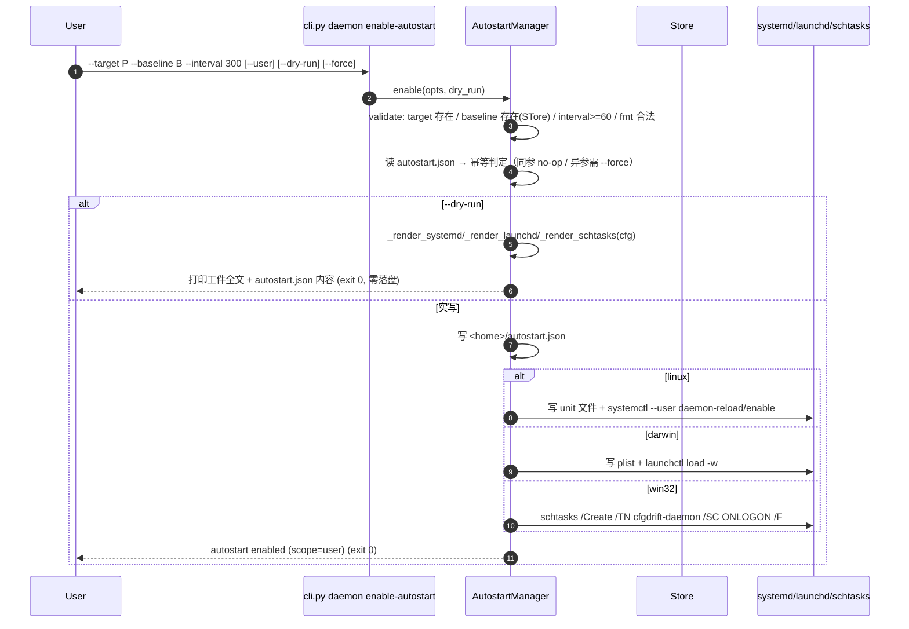
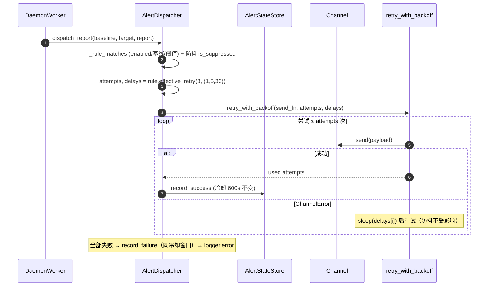
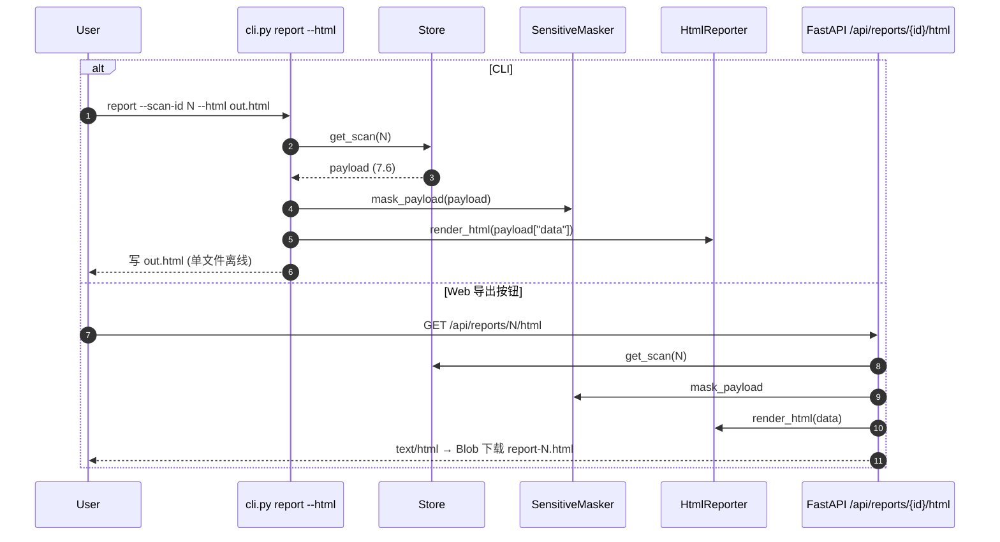
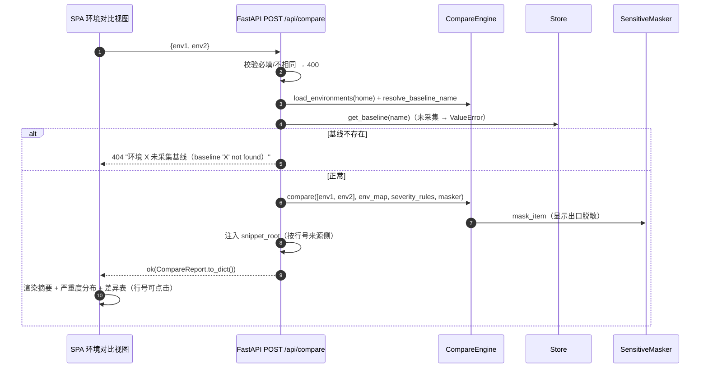
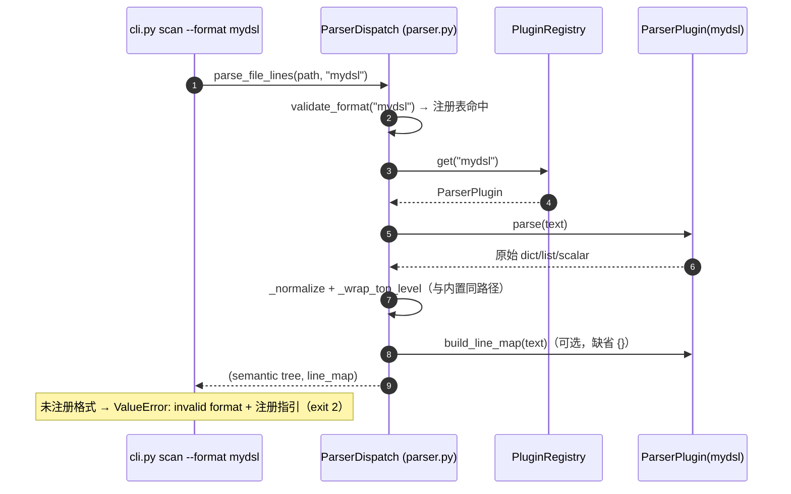
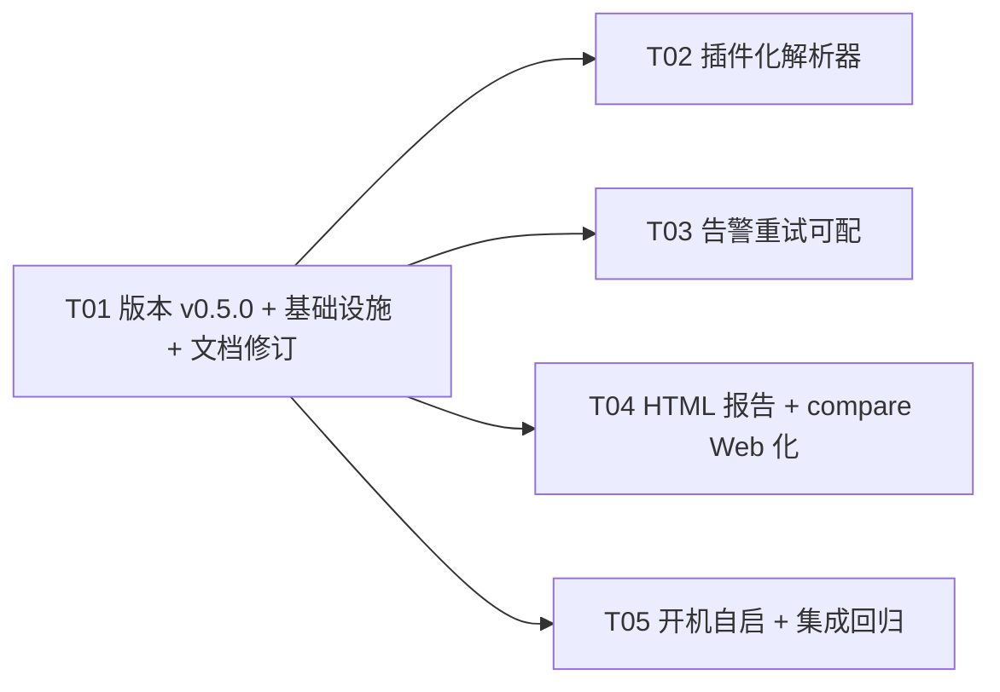

# cfgdrift v0.5.0 增量系统设计 — 五项新功能

- 版本：v0.5.0（增量）
- 作者：高见远（架构师 / software-architect）
- 状态：待评审 → 转交工程师实现 + QA 测试
- 基线：现有 v0.4.0 代码库（docs/system_design.md v1.0 + 附录 A/B/C；436 passed / 2 skipped）
- 原则：**基于 v0.4.0 最小变更**；不重设计已稳定部分（解析/语义树/diff/存储/报告/Web/daemon/alert）；新增能力以新模块承载，既有接口只复用不改造（除 CLI 追加、`AlertRule` 扩展、`--format` 校验扩展与版本号三处同步）。

---

## 0. 决策摘要（PRD 六个问题拍板 + 架构师新增决策）

| # | 决策项 | 决策内容 | 来源 |
|---|--------|----------|------|
| Q1 | Windows 自启形态 | **计划任务（schtasks）**：`schtasks /Create /TN cfgdrift-daemon /SC ONLOGON`，任务拉起 `python -m cfgdrift.daemon.worker`，interval 由 worker 内部循环承担。简单、无第三方依赖、与 daemon 子进程方案同构 | Q1 拍板 |
| Q2 | systemd root 权限 | **`--user` 模式主推（默认）**，用户级 unit 写 `~/.config/systemd/user/`；`--system` 为显式可选（需 root）；**`--dry-run` 保留**（打印将写入的 unit/plist/schtasks 命令与 autostart.json 内容，不落盘） | Q2 拍板 |
| Q3 | 重试配置粒度 | **规则级 + 全局默认两层**即够（P1 范围）；通道级重试 P2 预留（`config` dict 中未来加 `retry` 键即可，模型已兼容） | Q3 拍板 |
| Q4 | HTML 样式范围 | **内联 CSS/JS 条即可**：单文件离线约束下不做外链字体/图标/图表库；严重度配色与 Web 仪表盘 CSS 变量一致（CRITICAL #ef4444 / WARN #f59e0b / INFO #22c55e / NONE #64748b） | Q4 拍板 |
| Q5 | 插件注册 | **entry point（`cfgdrift.parsers` 组）+ 装饰器（进程内注册）都支持，entry point 优先**；同名冲突时 entry point 覆盖装饰器注册；装饰器注册在 import 时完成 | Q5 拍板 |
| Q6 | compare API 鉴权 | **与现有 Web 同级别**：本机 127.0.0.1、无鉴权（`create_app` 默认绑定），不新增认证 | Q6 拍板 |
| D1 | autostart interval 校验 | 按 PRD 硬性要求 **interval ≥ 60**（autostart 场景防误配刷屏）；daemon start 本身仍允许任意正整数（既有行为不变） | 架构师决策 |
| D2 | autostart 幂等语义 | 已启用且**参数完全一致** → no-op 成功（exit 0）；已启用但**参数不同** → 需 `--force` 覆盖，否则 exit 2；`--dry-run` 恒不落盘 | 架构师决策 |
| D3 | autostart 数据落点 | **`<home>/autostart.json`** 为唯一真源（记录 target/baseline/interval/scope/unit 信息）；平台工件（unit/plist/任务）与 json 双写、disable 双清 | 架构师决策 |
| D4 | alerts.yaml schema 版本 | **保持 `version: 1`**，`retry_count`/`retry_delays` 为可选字段（旧文件缺省即回退全局默认）；`AlertRule.from_dict` 缺省 None，向后兼容 | 架构师决策 |
| D5 | 重试语义 | `retry_count` = 总尝试次数（默认 3，≥1）；`retry_delays` = 尝试间等待秒数列表（元素 ≥0）。**只给 delays 时 attempts = len(delays)+1**；只给 count 时 delays 用全局默认 `(1,5,30)`（`retry_with_backoff` 天然兼容短列表） | 架构师决策 |
| D6 | HTML 数据源 | **复用 `store.get_scan` 同一份 7.6 payload**，经 `SensitiveMasker.mask_payload` 后再渲染 → CLI `report --html` 与 Web 导出**结构一致**（同一 `HtmlReporter.render_html`） | 架构师决策 |
| D7 | compare Web 环境列表来源 | **下拉 = `/api/baselines` 基线名**（保证 env 名可解析、必有基线）；environments.yaml 为 CLI 侧别名便利，Web 直接用基线名最稳妥；API 校验 env1/env2 必填、不可相同、必须已注册（基线存在） | 架构师决策 |
| D8 | `--format` 取值扩展 | `click.Choice(["auto","json","yaml","toml","ini"])` 改为**自由字符串 + 运行时 `validate_format` 校验**（兼容插件名）；既有合法值行为不变；未注册插件名给出可读错误与注册指引 | 架构师决策 |
| D9 | worker 命令单一真源 | 抽取 `worker.build_worker_command(home, opts)`，`DaemonManager._worker_command` 与 `AutostartManager` 共用，避免自启命令与 daemon 启动命令漂移 | 架构师决策 |
| D10 | 插件行号映射 | 插件**可选**提供 `build_line_map(text) -> {key_path: line}`；未提供时行号 = None（渲染不输出 `:N`，与 compare 无源文件语义一致） | 架构师决策 |
| D11 | 插件入口发现 | Python 3.8+ 用 stdlib `importlib.metadata`（3.8 已内置），零新增依赖 | 架构师决策 |

---

## 1. 增量实现方案

### 1.1 功能 1：daemon 开机自启

**新增模块**：`src/cfgdrift/daemon/autostart.py` → `AutostartManager`。

**CLI 三命令**（挂在既有 `daemon` group 下）：

```
cfgdrift daemon enable-autostart --target P [--target P2...] --baseline B
                                 [--format F] [--interval N] [--user/--system]
                                 [--dry-run] [--force]
cfgdrift daemon disable-autostart [--dry-run]
cfgdrift daemon autostart-status
```

**自启配置固化（autostart.json，`<home>/autostart.json`）** —— 唯一真源，schema 见 §6.1：

```json
{
  "version": 1,
  "enabled": true,
  "scope": "user",
  "created_at": "2026-08-03T00:00:00+00:00",
  "config": {
    "targets": ["/etc/nginx"],
    "baseline": "prod",
    "fmt": "auto",
    "interval": 300,
    "store": "/home/u/.cfgdrift/cfgdrift.db",
    "log_file": "/home/u/.cfgdrift/logs/daemon.log",
    "log_level": "INFO"
  },
  "unit": {"type": "systemd", "path": "/home/u/.config/systemd/user/cfgdrift.service"}
}
```

**enable 流程**：

1. `validate(opts)`（`--dry-run` 同样执行）：每个 `--target` 必须存在（`os.path.exists`）；`--baseline` 必须存在（`Store.get_baseline`，失败 exit 2）；`--interval ≥ 60`（否则 exit 2，报 `--interval must be >= 60 for autostart`）；`--format` 经 `validate_format`。
2. 幂等判定：读 autostart.json；未启用 → 继续；已启用且配置逐字段相等 → `already enabled (no change)` exit 0；已启用但配置不同 → 无 `--force` 报 `autostart is already enabled with different parameters (use --force to overwrite)` exit 2。
3. 渲染平台工件（§1.1.1-1.1.3），`--dry-run` 打印工件全文 + autostart.json 内容后 exit 0（零落盘）。
4. 实写：写 autostart.json + 平台工件落盘 / 执行 schtasks。

**disable 流程**：删除平台工件（systemd unit 文件 + `systemctl --user disable`（若可用）/ launchd plist 删除 / `schtasks /Delete /TN cfgdrift-daemon /F`）+ 删除 autostart.json；未启用也返回 0（幂等）；`--dry-run` 只打印将执行的命令。

**autostart-status**：0 = enabled / 1 = disabled / 2 = error；输出 scope、config（targets/baseline/interval）、unit 路径、平台工件存在性（best-effort 校验）。

**三平台生成器**：

#### 1.1.1 Linux systemd（`_render_systemd(cfg) -> str`）

```
[Unit]
Description=cfgdrift drift daemon
After=network.target

[Service]
Type=simple
ExecStart=<python> -m cfgdrift.daemon.worker --home <home> --store <store> --baseline <baseline> --format <fmt> --interval <interval> --path <t1> --path <t2> --log-file <log> --log-level <level> --alerts-config <home>/alerts.yaml --alert-state <home>/alert_state.json
Restart=on-failure
RestartSec=10

[Install]
WantedBy=default.target
```

- `--user`：写 `~/.config/systemd/user/cfgdrift.service`，随后 `systemctl --user daemon-reload` + `systemctl --user enable cfgdrift.service`（best-effort，失败仅 warning）。
- `--system`：写 `/etc/systemd/system/cfgdrift.service` + `systemctl daemon-reload` + `systemctl enable`。

#### 1.1.2 macOS launchd（`_render_launchd(cfg) -> str`）

标准 plist：`Label=com.cfgdrift.daemon`、`ProgramArguments`（与 systemd ExecStart 同 argv）、`RunAtLoad=true`、`KeepAlive=true`、`StandardOutPath/StandardErrorPath=<log_file>`。
- `--user`：写 `~/Library/LaunchAgents/com.cfgdrift.daemon.plist`，`launchctl load -w <plist>`（失败降级 warning）。
- `--system`：写 `/Library/LaunchDaemons/com.cfgdrift.daemon.plist`，`launchctl load -w`。

#### 1.1.3 Windows schtasks（`_render_schtasks(cfg) -> str` 命令预览 + `_apply_windows` 实执行）

```
schtasks /Create /TN "cfgdrift-daemon" /TR "\"<python>\" -m cfgdrift.daemon.worker --home <home> --store <store> --baseline <baseline> --format <fmt> --interval <interval> --path <t1> ... " /SC ONLOGON /RL LIMITED /F
```

- `/F` 天然覆盖（配合 `--force` 语义）；`disable` 用 `schtasks /Delete /TN cfgdrift-daemon /F`。
- 平台判断：`sys.platform`（linux / darwin / win32），其余平台 enable 报错 exit 2（可读提示不支持平台）。

**与既有代码接口**：抽取 `worker.build_worker_command(home, opts) -> List[str]`（D9），`DaemonManager._worker_command` 改为委托调用；`AutostartManager` 复用同一函数生成 ExecStart/ProgramArguments/TR，保证自启命令与 `daemon start` 完全一致。

### 1.2 功能 2：告警重试可配

**模型扩展**（`alert/models.py`）：

```python
@dataclass
class AlertRule:
    name: str
    type: str
    severity: Severity = Severity.WARN
    baseline: Optional[str] = None
    enabled: bool = True
    config: dict = field(default_factory=dict)
    # v0.5.0: 规则级重试（None = 使用全局默认 3 次 1s/5s/30s）
    retry_count: Optional[int] = None        # 总尝试次数，≥1
    retry_delays: Optional[List[float]] = None  # 尝试间等待秒数，元素 ≥0

    def effective_retry(self, default_attempts: int, default_delays: tuple) -> tuple:
        """解析生效重试策略：规则级 > 全局默认（D5 语义）。"""
        if self.retry_count is not None:
            return int(self.retry_count), tuple(default_delays)
        if self.retry_delays is not None:
            return len(self.retry_delays) + 1, tuple(float(d) for d in self.retry_delays)
        return default_attempts, tuple(default_delays)
```

- `to_dict` / `from_dict`：加入两字段；`from_dict` 对旧文件（无键）默认 None；`__post_init__` 校验：`retry_count` 为 None 或 ≥1 整数；`retry_delays` 为 None 或非空数字列表且元素 ≥0。
- **alerts.yaml schema 版本保持 1**（D4），新字段可选：

```yaml
version: 1
rules:
  - name: nginx-webhook
    type: webhook
    severity: WARN
    config: { url: ... }
    retry_count: 5            # 可选：5 次尝试，间隔用全局默认
  - name: ops-email
    type: email
    severity: CRITICAL
    config: { ... }
    retry_delays: [2, 10, 60] # 可选：4 次尝试，间隔 2/10/60s
```

**分发器改造**（`alert/dispatcher.py`）：

- `_send_with_retry(self, channel, payload, rule)`：`attempts, delays = rule.effective_retry(self.retry_attempts, self.retry_delays)`，再调 `retry_with_backoff(...)`。
- `test_rule(rule)`：同样按规则级解析（`alert test` 走同一策略）。
- `dispatch_report` 调用处传入 `rule`。
- **防抖不受影响**：去重键仍为 `rule.name:fingerprint`，冷却窗口逻辑零改动。

**CLI**（`alert add`）：

- `--retry-count INT`：≥1，总尝试次数。
- `--retry-delay FLOAT`：**可重复**；每个值也可为逗号分隔（`--retry-delay 1,5,30` 或 `--retry-delay 1 --retry-delay 5 --retry-delay 30`），扁平化为列表。
- `alert list` 增加重试展示：`retry=3/1,5,30`（未配置显示 `retry=default`）。
- 只给 count / 只给 delays / 两者都给 / 都不给 四种组合均合法（语义见 D5）。

**channels.py 不改**：`retry_with_backoff(attempts, delays)` 已参数化，无需变更。

### 1.3 功能 3：HTML 报告导出

**新增模块**：`src/cfgdrift/core/htmlreport.py` → `HtmlReporter.render_html(data: dict, title: str = "") -> str`。

**输入**：7.6 报告 `data` 部分（`{"scan_id", "mode", "created_at", "baseline", "summary", "items"}`），与 `render_json` 同一数据来源（D6）。

**输出**：单文件完整 HTML 文档（`<!DOCTYPE html>`，`<style>` 内联、可选少量内联 JS 做严重度筛选），零外部依赖离线可用。内容：

1. **摘要卡**：scan_id / created_at / mode / 基线名与版本（可选，有 baseline 才显示）+ 漂移总数 + 严重度分布（CRITICAL/WARN/INFO 计数条）。
2. **变更列表**：表格列 = 严重度 / 键路径 / 变更类型 / 文件（含 `:line`）/ 旧值 / 新值 / 规则；`masked=true` 的项显示「已脱敏」徽标且值为掩码。
3. 严重度配色与 Web 仪表盘 CSS 变量一致（Q4/D6 契约，见 §6.3）。

**CLI 接线**（`report` 命令新增 `--html PATH`）：

```
cfgdrift report [--scan-id N] --html out.html
```

- 与 `--json` 并列互斥（同时给报错 exit 2）；数据流 = `store.get_scan` → `masker.mask_payload` → `HtmlReporter.render_html(data)` → 写文件。

**Web 导出按钮**：报告浏览视图「加载」旁新增「导出 HTML」按钮。

- 后端：`GET /api/reports/{scan_id}/html` → `Response(content=HtmlReporter.render_html(data), media_type="text/html; charset=utf-8")`（同一渲染逻辑，D6）。
- 前端：SPA 直接 `fetch`（绕过 JSON `api()` helper）→ `res.text()` → `Blob` 下载 `report-<scan_id>.html`。

### 1.4 功能 4：compare 结果 Web 化

**API**：`POST /api/compare`（web/app.py）。

```
请求体: {"env1": "dev", "env2": "prod"}
成功:  {"code":0, "data": {CompareReport.to_dict() 且 items 已脱敏}, "message":"ok"}
校验失败: {"code":2, "data":null, "message":"env1 and env2 are required"}        → 400
         {"code":2, "data":null, "message":"env1 and env2 must be different"}   → 400
基线不存在: {"code":2, "data":null, "message":"环境 <env> 未采集基线（baseline '<name>' not found）"} → 404
```

流程：body 校验 → `CompareEngine(store)` → `load_environments(home)`（缺失/损坏回退 `{}`，与 CLI 一致）→ `compare([env1, env2], env_map, severity_rules=<home>/severity.yaml, masker=<home>/masking.yaml)` → `ValueError` 转 404 可读消息 → 返回 `report.to_dict()`。

- 响应附加轻量增强：每项按**行号来源侧**注入 `snippet_root`（`change_type == "removed"` → env1 基线 `scan_root`，否则 env2 基线 `scan_root`），使差异表行号可点击 snippet（与报告页一致）。
- 校验语义：`env1`/`env2` 必填、不可相同、解析后基线必须存在（未采集基线 → 404 可读提示）。

**SPA「环境对比」视图**：

- `index.html` 新增 nav 按钮 `data-view="compare"` + `<section id="view-compare">`。
- `app.js` 新增 `renderCompare()`：
  - 下拉环境列表来自 `GET /api/baselines`（D7，基线名即合法 env 名）；两个 select（env1 参考 / env2 对比）+「对比」按钮 + 严重度过滤 select。
  - 结果渲染：摘要卡（漂移总数 + 严重度分布条，复用现有 bar 样式）+ 差异表（复用 `itemRows`/`locationCell`/`sevClass`，行号可点击 snippet）+ 环境标识头（`env1 (vX) → env2 (vY)`）。
  - 错误态：`api()` 抛错后在该视图内展示红色可读消息（「环境 X 未采集基线」等），不跳转。
- 与 CLI compare 一致性：同一 `CompareEngine` + 同一 masker（Web display exit），数据一致。

### 1.5 功能 5：插件化解析器接口

**新增模块**：`src/cfgdrift/core/plugins.py` → `ParserPlugin` / `PluginRegistry` / `register_plugin` / `discover_entry_points`。

**插件协议**：

```python
class ParserPlugin:
    name: str                     # 格式名（--format 取值）
    extensions: tuple[str, ...]   # 扩展名（含点，小写），供 detect_format
    def parse(self, text: str) -> Any          # 返回原始 dict/list/scalar（未归一化）
    def build_line_map(self, text: str) -> dict  # 可选：{key_path: line}；缺省返回 {}
```

- **归一化仍由 `ParserDispatch._normalize/_wrap_top_level` 统一完成**（插件返回原始树，与 C/pure/yaml 后端同路径），保证语义树契约不变。

**注册方式**（Q5：entry point 优先）：

```python
# 方式 A：装饰器（进程内注册，import 时生效）
from cfgdrift.core.plugins import register_plugin

@register_plugin("mydsl", extensions=(".dsl",), line_map=build_mydsl_line_map)
def parse_mydsl(text: str):
    return {...}

# 方式 B：entry point（打包分发，pyproject.toml）
# [project.entry-points."cfgdrift.parsers"]
# mydsl = "mydsl_plugin:plugin"
# 其中 plugin 为 ParserPlugin 实例或 (parse_fn, {"extensions":..., "line_map":...})
```

- `PluginRegistry`：`register(plugin, replace=False)`（同名重复默认报错；entry point 加载时 `replace=True` → **entry point 覆盖装饰器**）；`get(name)` / `by_extension(ext)` / `names()` / `custom_names()`。
- `discover_entry_points(group="cfgdrift.parsers")`：`importlib.metadata.entry_points(group=...)`（3.8+ stdlib，D11）；**逐插件 try/except**，加载失败 `logger.warning` 后继续（不影响内置解析器，P1 要求）。

**ParserDispatch 改造**（`core/parser.py`，最小变更）：

- `validate_format(fmt)`：合法值 = `auto/json/yaml/toml/ini` + 已注册自定义插件名；错误消息 `invalid format %r (expected one of: auto, json, yaml, toml, ini[, <plugin>...])` —— 无自定义插件时与现状完全一致（既有测试不破）。
- `detect_format(path)`：先查内置扩展名表，未命中再查 `registry.by_extension(ext)`（插件扩展名 → 插件名）。
- `parse_text` / `parse_text_lines`：内置分支不变（**行为零变化**）；`fmt` 命中自定义插件 → `raw = plugin.parse(text)` → `_wrap_top_level(_normalize(raw))`；行号 = `plugin.build_line_map(text)`（未提供 → `{}`，D10）。
- 模块 import 时：将内置四格式注册为**内置插件**（`plugins.BUILTIN_PLUGINS`，`parse=...` 闭包复用既有后端函数 + `build_line_map` 复用 `lines.build_line_map`），满足「内置四格式重构为内置插件、行为不变」；随后 `registry.load_entry_points()` 发现外部插件。
- `--format`（scan/diff/daemon start/baseline create + worker argparse）：`click.Choice` 改为自由字符串（D8），非法值由 `validate_format` 抛 `ValueError` → exit 2。
- **未注册错误**（可读 + 指引）：

```
error: invalid format 'custom' (expected one of: auto, json, yaml, toml, ini)
register a parser plugin via the 'cfgdrift.parsers' entry point group
(pyproject: [project.entry-points."cfgdrift.parsers"] mydsl = "pkg:plugin")
or in-process via cfgdrift.core.plugins.register_plugin, then retry.
```

**文档示例（P1）**：README 增加「自定义解析器插件」小节（DSL 示例含行号映射，即上述 `register_plugin` 用法）。

### 1.6 版本规划与依赖

- 版本三处同步：`__init__.py` → `0.5.0`；`pyproject.toml` → `0.5.0`；`src/csrc/parser_core.c` `version()` → `"0.5.0-c"`。
- **无新增第三方依赖**：插件发现用 stdlib `importlib.metadata`；三平台自启用 stdlib（`subprocess`/`os`/`sys`/`json`/`shutil`）；HTML 纯字符串模板。
- **文档修订**：README 中 `severity add --key-pattern` 描述统一为「正则」（现状已为正则，核对 help/README/设计文档中 severity 相关字段无「glob」字样；**masking.yaml 的 patterns 保持 glob 语义不变**，二者不可混用）。

---

## 2. 文件列表（变更清单）

> 实现源文件共 **10 个**（新增 3 + 修改 7），版本同步 3 个，测试 3 个，文档 1 个。不改动：storage/store.py（alert_events 等既有能力已满足 compare/HTML 数据来源）、scanner/scanner.py、rules/、core/{model,differ,lines,masker,reporter,compare,pure_parsers}.py、alert/{config,state,channels}.py、daemon/daemon.py（仅 `_worker_command` 委托新抽取函数）、setup.py。

| 文件 | 状态 | 职责 |
|------|------|------|
| `src/cfgdrift/daemon/autostart.py` | 新增 | `AutostartManager`：enable/disable/status + 三平台生成器（systemd/launchd/schtasks）+ autostart.json 读写 + 校验/幂等/--dry-run |
| `src/cfgdrift/core/htmlreport.py` | 新增 | `HtmlReporter.render_html(data) -> str`：单文件离线 HTML（摘要卡 + 严重度分布 + 变更列表 + 基线信息） |
| `src/cfgdrift/core/plugins.py` | 新增 | `ParserPlugin`/`PluginRegistry`/`register_plugin`/`discover_entry_points` + 内置插件表 |
| `src/cfgdrift/alert/models.py` | 修改 | `AlertRule` 增 `retry_count`/`retry_delays` + `to_dict/from_dict/effective_retry` + 校验（旧文件兼容） |
| `src/cfgdrift/alert/dispatcher.py` | 修改 | `_send_with_retry`/`test_rule` 按规则级解析重试策略（规则级 > 全局默认） |
| `src/cfgdrift/core/parser.py` | 修改 | `validate_format` 扩展 + `detect_format` 查插件扩展名 + `parse_text(_lines)` 插件分发 + import 时注册内置/发现 entry point |
| `src/cfgdrift/cli.py` | 修改 | `daemon` group 增 enable-autostart/disable-autostart/autostart-status；`alert add` 增 --retry-count/--retry-delay、`alert list` 展示重试；`report` 增 --html；`--format` 改自由字符串 |
| `src/cfgdrift/web/app.py` | 修改 | `POST /api/compare`（校验/404 可读错误/脱敏/snippet_root 注入）；`GET /api/reports/{scan_id}/html` |
| `src/cfgdrift/web/static/index.html` | 修改 | nav 增「环境对比」按钮 + `#view-compare` section |
| `src/cfgdrift/web/static/app.js` | 修改 | `renderCompare()` 视图 + 报告页「导出 HTML」按钮（fetch→Blob 下载） |
| `src/cfgdrift/__init__.py` | 修改 | `__version__ = "0.5.0"` |
| `pyproject.toml` | 修改 | `version = "0.5.0"` |
| `src/csrc/parser_core.c` | 修改 | `version()` 返回 `"0.5.0-c"` |
| `tests/test_plugins.py` | 新增 | 插件注册（装饰器/entry point/优先级）、`--format` 自定义、未注册错误、插件失败不影响内置 |
| `tests/test_autostart.py` | 新增 | autostart.json/三平台生成器（字符串断言）/校验/幂等/--dry-run/status 退出码（平台 skip 守卫） |
| `tests/test_v050_features.py` | 新增 | 告警重试可配 + HTML 导出 + compare Web API（FastAPI TestClient）端到端 |
| `README.md` | 修改 | severity `--key-pattern` 统一「正则」；autostart/插件/HTML 导出用法；自定义 DSL 插件示例 |

---

## 3. 类图 / 接口（Mermaid，简要）

```mermaid
classDiagram
    class AutostartManager {
        +__init__(home: str, store_path: Optional~str~)
        +enable(opts: dict, dry_run: bool) int
        +disable(dry_run: bool) int
        +status() int
        +status_dict() dict
        +validate(opts: dict) None
        +autostart_config_path(home: str) str
        +_render_systemd(cfg: dict) str
        +_render_launchd(cfg: dict) str
        +_render_schtasks(cfg: dict) str
        +_apply(cfg: dict, dry_run: bool) None
        +_remove(dry_run: bool) None
    }
    class ParserPlugin {
        <<protocol>>
        +str name
        +tuple extensions
        +parse(text: str) Any
        +build_line_map(text: str) dict
    }
    class PluginRegistry {
        +register(plugin: ParserPlugin, replace: bool) None
        +get(name: str) Optional~ParserPlugin~
        +by_extension(ext: str) Optional~str~
        +custom_names() list
        +load_entry_points(group: str) int
    }
    class HtmlReporter {
        +render_html(data: dict, title: str) str
        +_summary_cards(data: dict) str
        +_severity_distribution(items: list) str
        +_items_table(items: list) str
    }
    class AlertRule {
        +str name
        +str type
        +Severity severity
        +Optional~str~ baseline
        +bool enabled
        +dict config
        +Optional~int~ retry_count
        +Optional~list~ retry_delays
        +effective_retry(default_attempts: int, default_delays: tuple) tuple
        +to_dict() dict
        +from_dict(data) AlertRule
    }
    class AlertDispatcher {
        +dispatch_report(baseline_name, target, report) List~DispatchResult~
        +test_rule(rule) DispatchResult
        +_send_with_retry(channel, payload, rule) tuple
    }
    class CompareApi {
        +POST /api/compare
        +GET /api/reports/{scan_id}/html
    }

    AutostartManager ..> worker.build_worker_command : 复用 (D9)
    ParserDispatch ..> PluginRegistry : 分发自定义格式 (既有 parser.py)
    ParserDispatch ..> ParserPlugin : 调用 parse/build_line_map
    HtmlReporter ..> SensitiveMasker : 已脱敏 data (D6)
    CompareApi ..> CompareEngine : 复用 (既有 core/compare.py)
    AlertDispatcher ..> AlertRule : effective_retry (规则级)
    AlertRule ..> retry_with_backoff : attempts/delays (既有 channels.py)
```

---

## 4. 时序图（Mermaid，简要）

### 4.1 enable-autostart（三平台）



### 4.2 alert 发送（规则级重试）



### 4.3 report --html 数据流（CLI 与 Web 同源）



### 4.4 POST /api/compare



### 4.5 插件解析分发



---

## 5. 增量任务列表（≤5 任务，按实现顺序）

| 任务号 | 任务名 | 依赖 | 优先级 | 验收标准 |
|--------|--------|------|--------|----------|
| T01 | 版本 v0.5.0 + 基础设施 + 文档修订 | 无 | P0 | `cfgdrift --version` 输出 0.5.0；C 扩展 `version()` 返回 0.5.0-c；README 中 `severity add --key-pattern` 描述统一为「正则」（masking.yaml patterns 仍为 glob 语义，不可混淆）；既有 436 passed / 2 skipped 全绿 |
| T02 | 插件化解析器接口 | T01 | P0 | `cfgdrift.core.plugins`：装饰器注册 + entry point（组 `cfgdrift.parsers`）均可；entry point 覆盖同名装饰器；`--format <已注册插件名>` 解析正确（含行号映射，缺省 None）；未注册格式输出可读错误与注册指引；`detect_format` 支持插件扩展名；**内置四格式重构为内置插件且行为不变**（双模式 C/pure 一致性回归通过）；插件加载失败仅 warning 不影响内置；`validate_format` 错误消息在无自定义插件时与现状完全一致 |
| T03 | 告警重试可配 | T01 | P0 | `AlertRule.retry_count/retry_delays` + `to_dict/from_dict` 兼容旧 alerts.yaml（缺省 None）；`effective_retry` 语义（只给 count → 默认 delays；只给 delays → attempts=len+1）；规则级 > 全局默认；`alert add --retry-count/--retry-delay`（逗号分隔与重复均可）与 `alert list` 展示；`alert test` 走规则级策略；防抖（冷却 600s、去重键）零变化；单测全绿 |
| T04 | HTML 报告导出 + compare Web 化 | T01 | P0 | `report --html out.html` 单文件离线 HTML（摘要卡 + 严重度分布 + 变更列表含行号/脱敏/文件 + 基线信息）；严重度配色与 Web 一致（#ef4444/#f59e0b/#22c55e/#64748b）；`GET /api/reports/{id}/html` 与 CLI 同渲染逻辑；SPA 报告页「导出 HTML」按钮可下载；`POST /api/compare` 契约（必填/不相同校验 400、基线未采集 404 可读消息、返回脱敏 CompareReport + snippet_root）；SPA「环境对比」视图（下拉=基线名、差异表、严重度过滤、错误态展示） |
| T05 | daemon 开机自启 + 集成回归 | T01 | P0 | `enable-autostart`：三平台生成器（systemd unit/launchd plist/schtasks 命令）文本正确；enable 前校验 target 存在/baseline 存在/interval≥60；幂等（同参 no-op exit 0、异参需 `--force` 否则 exit 2）；`--user`（默认）与 `--system`；`--dry-run` 零落盘预览；`disable-autostart` 双清（工件+json）；`autostart-status` 退出码 0/1/2；抽取 `worker.build_worker_command` 且 `DaemonManager._worker_command` 委托后行为不变；全量回归（旧 436 + 新用例）通过 |

**并行度**：T02/T03/T04/T05 均仅依赖 T01，可并行开发；`cli.py` 为四任务共享文件，采用**增量追加**方式（每任务只追加自己的命令/选项，不互相改写），建议工程师按 T02→T03→T04→T05 顺序合并提交以避免冲突。



---

## 6. 共享知识（跨文件约定，仅变更部分）

### 6.1 autostart.json schema

```json
{
  "version": 1,
  "enabled": true,
  "scope": "user",
  "created_at": "ISO-8601 UTC",
  "config": {
    "targets": ["/etc/nginx"],
    "baseline": "prod",
    "fmt": "auto",
    "interval": 300,
    "store": "<home>/cfgdrift.db",
    "log_file": "<home>/logs/daemon.log",
    "log_level": "INFO"
  },
  "unit": {"type": "systemd|launchd|schtasks", "path": "...", "name": "cfgdrift.service|com.cfgdrift.daemon|cfgdrift-daemon"}
}
```

- 存放 `<home>/autostart.json`；`enabled` 恒与平台工件存在性一致（enable 双写、disable 双清）。
- enable 专属校验：`interval >= 60`（daemon start 无此限制）；target 存在；baseline 在 store 中存在。
- 幂等：配置逐字段相等 → no-op exit 0；不同 → 需 `--force`。

### 6.2 alerts.yaml 扩展字段（version 保持 1）

- 规则级可选：`retry_count`（int ≥1，总尝试次数）、`retry_delays`（数字列表，元素 ≥0，尝试间等待）。
- 解析优先级（D5）：`retry_count` 给定 → attempts=count、delays=全局默认 `(1,5,30)`；仅 `retry_delays` 给定 → attempts=len(delays)+1；都未给 → 全局默认 3 次 `(1,5,30)`。
- `--retry-delay` 支持逗号分隔与重复两种写法，扁平化为列表；`alert list` 显示 `retry=3/1,5,30` 或 `retry=default`。
- 防抖契约不变：去重键 `rule.name:fingerprint`、冷却 600s、成功/失败同写冷却。

### 6.3 HTML 报告结构约定

- 单文件完整 HTML：内联 `<style>`（可选少量内联 JS 做严重度筛选）；零外部依赖（无 CDN/外链字体/图表库）。
- 严重度配色（与 Web 仪表盘 CSS 变量一致）：`CRITICAL #ef4444` / `WARN #f59e0b` / `INFO #22c55e` / `NONE #64748b`。
- 数据 = 7.6 报告 `data` 部分（`store.get_scan` → `mask_payload` 后），CLI `report --html` 与 Web `GET /api/reports/{id}/html` 共用 `HtmlReporter.render_html`；`masked=true` 项显示「已脱敏」且值为掩码。
- 变更列表列：严重度 / 键路径 / 变更类型 / 文件（含 `:line`）/ 旧值 / 新值 / 规则。

### 6.4 插件 entry point 组与协议

- entry point group：**`cfgdrift.parsers`**（pyproject：`[project.entry-points."cfgdrift.parsers"]`）。
- 协议：`ParserPlugin`（`name` / `extensions`（含点小写）/ `parse(text)->raw tree` / 可选 `build_line_map(text)->{key_path:line}`）；归一化统一走 `_normalize/_wrap_top_level`。
- 优先级：entry point > 装饰器注册（`replace=True`）；同名装饰器重复注册报错。
- 加载失败逐插件 try/except + warning，不影响内置解析器。
- `--format` 合法值 = `auto/json/yaml/toml/ini` + 已注册插件名；未注册错误含注册指引。

### 6.5 compare API 契约

```
POST /api/compare  body={"env1": "...", "env2": "..."}
200: {"code":0, "data": CompareReport.to_dict()（items 已脱敏、含 snippet_root 注入）, "message":"ok"}
400: {"code":2, "data":null, "message":"env1 and env2 are required" | "env1 and env2 must be different"}
404: {"code":2, "data":null, "message":"环境 <env> 未采集基线（baseline '<name>' not found）"}
```

- 复用 `CompareEngine`（environments.yaml 缺失/损坏回退 `{}`）、`severity.yaml` 规则、`masking.yaml` 脱敏（Web display exit）。
- 下拉环境列表 = `/api/baselines` 基线名（保证合法）；`snippet_root` 按行号来源侧注入（`removed` → env1 基线 root，其余 → env2 基线 root）。

### 6.6 worker 命令单一真源（D9）

- `worker.build_worker_command(home, opts) -> List[str]` 为 daemon argv 唯一构造点；`DaemonManager._worker_command` 与 `AutostartManager` 均委托它（含 `--path` 重复、alerts-config/alert-state 条件追加），自启命令与 `daemon start` 永不失配。

---

## 7. 待明确事项（Q1-Q6 结论 + 实现期假设）

| # | 问题 | 结论 |
|---|------|------|
| Q1 | Windows 自启形态？ | 计划任务 `schtasks /SC ONLOGON`（简单无依赖）；interval 由 worker 内部循环承担，不依赖任务计划频率 |
| Q2 | systemd root 权限？ | `--user` 主推（默认）；`--system` 显式可选；`--dry-run` 保留 |
| Q3 | 重试配置粒度？ | 规则级 + 全局默认两层（P1）；通道级 P2 预留（模型兼容） |
| Q4 | HTML 样式范围？ | 内联 CSS/JS 条，零外部依赖离线可用 |
| Q5 | 插件注册？ | entry point + 装饰器都支持，entry point 优先 |
| Q6 | compare API 鉴权？ | 与现有 Web 同级别（127.0.0.1 无鉴权） |

实现期假设（低风险，工程师可直接采用，QA 可据此设计用例）：

1. `--format custom` 中的 `custom` 是**插件名占位符**：`--format` 接受任意已注册插件名（内置 + 自定义）；名为 `custom` 的插件注册后自然可用。
2. `enable-autostart` 的 `--user` 为默认；`--system` 需要相应权限，失败 exit 2 且给出原因。
3. autostart-status 的平台工件存在性为 best-effort（`systemctl --user is-enabled` / 文件存在 / `schtasks /Query`），失败仅标注 `error` 字段不阻断输出。
4. `alert test` 与 `dispatch_report` 共用规则级重试解析；`retry_count=1` 等价于「单次尝试不重试」（delays 被忽略）。
5. compare Web 视图在无基线/无数据时显示空态提示；snippet 行号链接仅在 `snippet_root` 可用时渲染（与报告页一致）。
6. HTML 导出文件名 `report-<scan_id>.html`；导出失败在 SPA 内展示错误（不跳转）。
7. 插件 `parse` 抛异常时错误消息为 `failed to parse <path>: <exc>`（与内置解析一致），CLI exit 2。
8. `validate_format` 错误消息仅在存在自定义插件时追加插件名（无插件时与 v0.4.0 完全一致，既有测试不破）。
