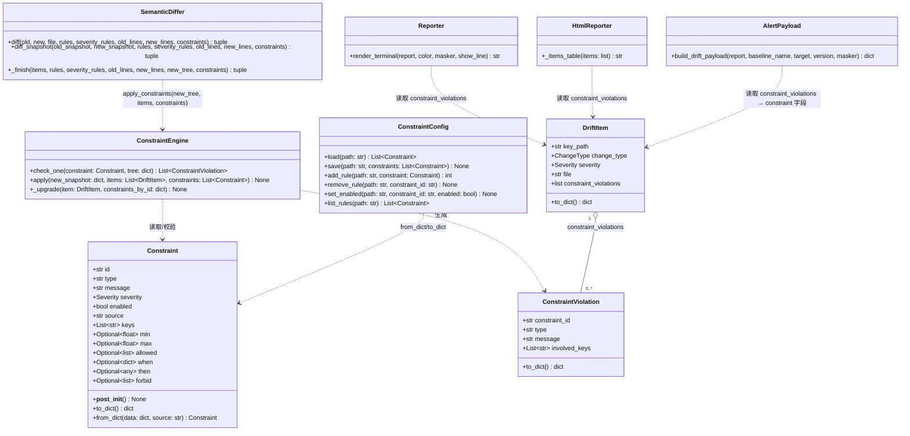
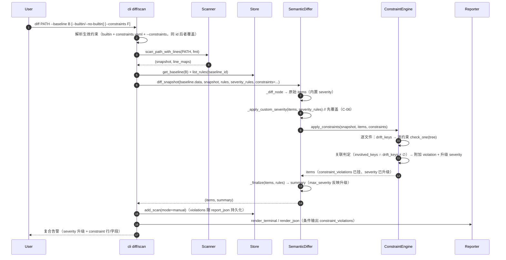
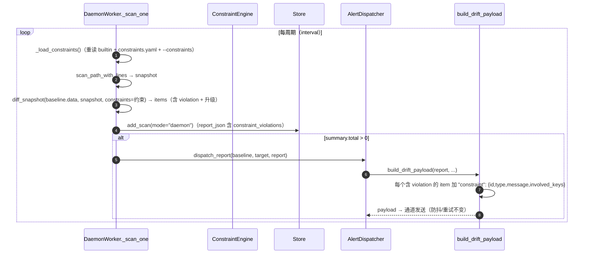
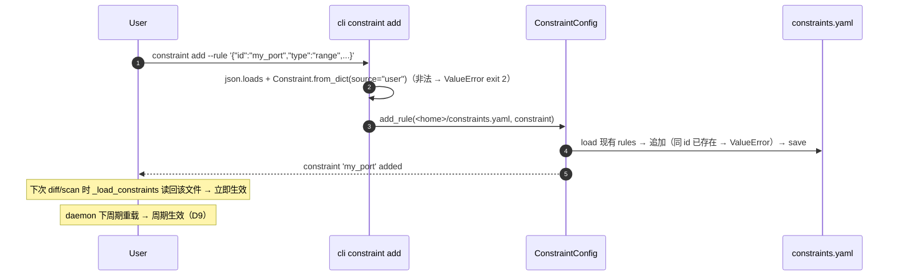
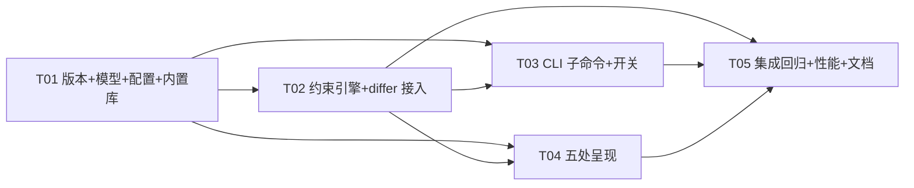

# cfgdrift v0.6.0 增量系统设计 — 配置一致性约束推理（方向 B）

- 版本：v0.6.0（增量）
- 作者：高见远（架构师 / software-architect）
- 状态：待评审 → 转交工程师实现 + QA 测试
- 基线：现有 v0.5.0 代码库（docs/system_design_v050.md；552 passed / 2 skipped）
- 原则：**基于 v0.5.0 最小变更**；不重设计已稳定部分（解析/语义树/diff/存储/报告/Web/daemon/alert/插件）；约束能力以**新模块承载**，既有核心（core/differ.py 语义 diff 逻辑、store.py、scanner、masker、alert 防抖）只复用不改造；differ 仅增加**可选参数**（向后兼容），呈现层仅**条件追加**（零噪音契约）。

---

## 0. 决策摘要（PRD 待确认 5 问拍板 + 架构师新增决策）

| # | 决策项 | 决策内容 | 来源 |
|---|--------|----------|------|
| Q1 | 严重度策略 | **升级制**（复用 `Severity.rank`，+1 封顶 CRITICAL），并同时取「违反约束自身 severity」的 max：`new = min(CRITICAL, max(item.rank+1, max(违反约束.severity.rank)))`；不引入独立 CONSTRAINT 级别 | Q1 拍板 |
| Q2 | 存量违反 | **P0 默认不报**（只报漂移关联破坏；C-07 存量违反推 v0.7，scan 独立 section 默认关闭） | Q2 拍板 |
| Q3 | constraints.yaml | **独立文件 `<home>/constraints.yaml`**（与 severity.yaml 同目录体系，version: 1）；内置库 **20 条**（web server/db/日志/认证四域，range/enum/conditional_required/correlation/mutual_exclusion 五类全覆盖），默认启用，`--builtin off` 整体关闭 | Q3 拍板 |
| Q4 | 自动挖掘 | **C-08 推 v0.7**（共变更统计 + 值域分布 → 候选 → 人工确认）；本版不做 | Q4 拍板 |
| Q5 | Web 视图 | **P0 仅告警列表/报告页展示复合告警**（SPA 变更表渲染 `constraint_violations`），不新增「约束列表/最近违反」视图（C-09 推 v0.7） | Q5 拍板 |
| D1 | 约束类别数 | PRD 正文写「4 类」但列举 5 类（range/enum/conditional_required/correlation/mutual_exclusion）——**以列举的 5 类为准全部实现** | 架构师决策 |
| D2 | Constraint 数据模型 | **单一 dataclass + type 字段 + 校验函数表**（对齐既有 `SeverityRule` 模式），不做基类+子类；新增 `Constraint` / `ConstraintViolation` 放 `core/model.py`（与 SeverityRule 同居） | 架构师决策 |
| D3 | 约束引擎位置 | **引擎放 `core/constraints.py`**（core→core 依赖，不破坏 core→rules 分层）；**配置 CRUD 放 `rules/constraints.py`**（对齐 `rules/severity.py`） | 架构师决策 |
| D4 | differ 接入方式 | **`diff`/`diff_snapshot` 增加 `constraints: Optional[List[Constraint]] = None` 可选参数**（追加在签名末尾，既有调用零变化）；`_finish` 内部扩展 `new_tree`/`constraints` 私有参数，在 `_apply_custom_severity` 之后、`_finalize`（summary）之前执行约束检查与升级（满足 C-06 先覆盖后升级） | 架构师决策 |
| D5 | 关联判定粒度 | **逐文件判定**：new_snapshot 按 relpath 拆分，violation 附加到**所有** `key_path ∈ involved_keys` 的漂移项；`involved_keys ∩ 漂移 keys ≠ ∅` 即关联 | 架构师决策 |
| D6 | 约束消息脱敏 | **P0 不做消息内容脱敏**；内置库消息不含敏感值（不用 `{value}` 实时值模板）；用户自定义消息含 `{value}` 时按原样渲染（用户自担） | 架构师决策 |
| D7 | 零噪音契约 | `DriftItem.to_dict()` **仅当 constraint_violations 非空时输出该字段**；合法变更的 terminal/json 输出与 v0.5.0 逐字节一致；HTML 新增「约束违反」列（空值显示 `-`，不新增告警） | 架构师决策 |
| D8 | 约束去重/覆盖 | 生效约束 = **内置库 + `<home>/constraints.yaml` + `--constraints` 额外文件**（按序合并）；**同 id 后者覆盖前者**（用户可覆盖内置库）；`--builtin off` 移除内置库 | 架构师决策 |
| D9 | daemon 生效时机 | **worker 每周期重载约束文件**（下周期生效，满足 C-03 场景 C）；`severity_rules` 保持启动时加载（既有行为不变） | 架构师决策 |
| D10 | compare 不跑约束 | P0 约束检查仅接入 **diff / scan / daemon**（PRD C-04 原文）；compare（基线间对比）本版不接入，v0.7 评估 | 架构师决策 |
| D11 | P1 裁剪 | 本版纳入 **C-11（`--constraints`）** 与 **C-12（examples/constraints.yaml.example + README）**；**C-07 / C-09 / C-10（SQLite 表）/ C-13（severity 引用 constraint_id）推 v0.7**。理由：C-10 的唯一消费者是 C-09（Web 约束视图），两者耦合推后；report_json 已持久化 violations，历史扫描无需新表即可呈现 | 架构师决策 |

---

## 1. 增量实现方案

### 1.1 模块结构（新增 2 个源模块 + model 扩展）

```
src/cfgdrift/core/model.py        [修改]  + Constraint / ConstraintViolation 数据类
                                         + DriftItem.constraint_violations（默认 []，to_dict 条件输出）
src/cfgdrift/core/constraints.py  [新增]  ConstraintEngine（5 类校验函数表 + 关联 + 升级）
                                         + BUILTIN_CONSTRAINTS（20 条内置库）+ apply_constraints()
src/cfgdrift/rules/constraints.py [新增]  ConstraintConfig（constraints.yaml load/save/add/remove/
                                         list/set_enabled，对齐 SeverityConfig）+ default_path(home)
```

**依赖方向**：`core/differ.py → core/constraints.py → core/model.py`；`rules/constraints.py → core/model.py`；`cli.py / daemon/worker.py → core/constraints.py + rules/constraints.py`。core 不反向依赖 rules，分层保持。

### 1.2 Constraint 数据模型（core/model.py）

```python
@dataclass
class Constraint:
    """一条一致性约束（v0.6.0）。type ∈ range|enum|conditional_required|correlation|mutual_exclusion。"""
    id: str
    type: str
    message: str
    severity: Severity = Severity.WARN
    enabled: bool = True
    source: str = "builtin"                # "builtin" | "user"
    keys: List[str] = field(default_factory=list)     # range/enum/mutual_exclusion
    min: Optional[float] = None                        # range
    max: Optional[float] = None                        # range
    allowed: Optional[List[Any]] = None                # enum
    when: Optional[dict] = None                        # conditional_required/correlation: {"key":..., "value":...}
    then: Optional[Any] = None                         # conditional_required: {"require":[...]}; correlation: [{"key","op","value"},...]
    forbid: Optional[List[list]] = None                # mutual_exclusion: [[v1,v2],...]

    def __post_init__(self): ...   # 按 type 校验必填字段（对齐 SeverityRule.__post_init__ 风格）
    def to_dict(self) -> dict: ...
    @classmethod
    def from_dict(cls, data: dict, source: str = "user") -> "Constraint": ...  # 损坏/缺字段 → ValueError

@dataclass
class ConstraintViolation:
    """一次约束破坏（挂在 DriftItem.constraint_violations 上）。"""
    constraint_id: str
    type: str
    message: str
    involved_keys: List[str]
    def to_dict(self) -> dict:
        return {"constraint_id": self.constraint_id, "type": self.type,
                "message": self.message, "involved_keys": list(self.involved_keys)}
```

- **校验规则（`__post_init__`，损坏即 ValueError → CLI exit 2，与 severity.yaml 同契约）**：
  - 公共：`id` 非空 str；`type` ∈ 五类；`message` 非空 str；`severity` 解析为 `Severity`；`source` ∈ {builtin,user}。
  - `range`：`keys` 长度 1；`min`/`max` 至少给一个；两者均可为数值。
  - `enum`：`keys` 长度 1；`allowed` 非空 list。
  - `conditional_required`：`when` 为 `{"key": str, "value": 标量}`；`then` 为 `{"require": [str,...]}` 且非空。
  - `correlation`：`when` 同上；`then` 为单个 `{"key","op","value"}` 或 list（规范化）；`op` ∈ `>=,>,<=,<,==,!=`。
  - `mutual_exclusion`：`keys` 长度 ≥2；`forbid` 可选（`[[v1,v2],...]`），缺省表示「两键同时存在即冲突」。
- **`DriftItem` 扩展（v0.6.0）**：新增字段 `constraint_violations: List[dict] = field(default_factory=list)`（列表元素为 `ConstraintViolation.to_dict()` 形状）；`to_dict()` **仅非空时输出**该键（D7 零噪音）。
- 既有 `DriftItem` 字段与 `to_dict` 其余部分**零改动**（552 回归不受影响）。

### 1.3 约束引擎（core/constraints.py）

```python
_CONSTRAINT_TYPES = ("range", "enum", "conditional_required", "correlation", "mutual_exclusion")
_SEV_BY_RANK = [Severity.NONE, Severity.INFO, Severity.WARN, Severity.CRITICAL]

def _get_path(tree: dict, key_path: str) -> Any:   # 点分路径查找（含 [i]），缺失返回 _MISSING 哨兵

def _check_range(c, tree) -> List[ConstraintViolation]
def _check_enum(c, tree) -> List[ConstraintViolation]
def _check_conditional_required(c, tree) -> List[ConstraintViolation]  # 每个缺失键生成一条 violation
def _check_correlation(c, tree) -> List[ConstraintViolation]
def _check_mutual_exclusion(c, tree) -> List[ConstraintViolation]

_VALIDATORS = {"range": _check_range, ...}

class ConstraintEngine:
    @staticmethod
    def check_one(constraint: Constraint, tree: dict) -> List[ConstraintViolation]:
        """对单棵（单文件）语义树跑一条约束；缺失键一律跳过（不产生 violation）。"""
    @staticmethod
    def apply(new_snapshot: Optional[dict], items: List[DriftItem],
              constraints: Optional[List[Constraint]]) -> None:
        """原地挂 violation + 升级 severity。逐文件：drift_keys → 逐约束 check_one →
        关联判定（involved_keys ∩ drift_keys ≠ ∅）→ 附加到所有 key_path ∈ involved_keys 的项。
        全部附加完成后，对每个含 violation 的项做一次升级（不叠加多次）。"""
    @staticmethod
    def _upgrade(item: DriftItem, constraints_by_id: dict) -> None:
        """new_rank = min(3, max(item.severity.rank + 1, max(c.severity.rank ...)))
        item.severity = _SEV_BY_RANK[new_rank]"""

def apply_constraints(new_snapshot, items, constraints) -> None:
    """模块级便捷入口（differ._finish 调用）。"""

BUILTIN_CONSTRAINTS: List[Constraint] = [...]   # 20 条，见 §6.3
```

- **跳过语义**：目标键缺失、非数值（range）、值不在判定范围（enum 无键）→ 不产生 violation。这是零噪音的基础。
- **性能**：`check_one` 只做**定向路径查找**（O(深度)），不遍历整树；10k 键 × 20 约束 ≈ 数百次点分查找，增量开销 <10ms（C-验收）。

### 1.4 differ 接入（core/differ.py，最小变更）

```python
def diff(self, old, new, file="", rules=None, severity_rules=None,
         old_lines=None, new_lines=None,
         constraints: Optional[List[Constraint]] = None):   # v0.6.0 追加在末尾
    ...
    return self._finish(items, rules, severity_rules, old_lines, new_lines,
                        new_tree={file: new} if file else {"": new},
                        constraints=constraints)

def diff_snapshot(self, old_snapshot, new_snapshot, rules=None, severity_rules=None,
                  old_lines=None, new_lines=None,
                  constraints: Optional[List[Constraint]] = None):   # v0.6.0 追加在末尾
    ...
    return self._finish(items, rules, severity_rules, old_lines, new_lines,
                        new_tree=new_snapshot, constraints=constraints)

def _finish(self, items, rules, severity_rules=None, old_lines=None, new_lines=None,
            new_tree=None, constraints=None):
    self._apply_custom_severity(items, severity_rules)   # 既有：自定义 severity 覆盖（先覆盖）
    if constraints:
        apply_constraints(new_tree, items, constraints)  # v0.6.0：约束检查 + 升级（后叠加）
    kept, summary = self._finalize(items, rules)         # 既有：ignore 过滤 + summary（用升级后 severity）
    self._attach_lines(kept, old_lines, new_lines)
    return kept, summary
```

- **公开 API 只在签名末尾追加可选参数**（`constraints=None`），既有全部调用（552 测试、compare、scanner.watch、CLI、worker）零变化。
- 顺序满足 **C-06**：自定义 severity 覆盖 → 约束检查 → severity 升级 → summary（`summary.max_severity` 反映升级后 severity，告警阈值自动正确）。
- 升级发生在 ignore 过滤**之前**：被 ignore 的项连同其 violation 一起被丢弃，不污染输出。

### 1.5 constraints.yaml schema（rules/constraints.py）

```yaml
version: 1
rules:
  - id: my_port_range              # 必填，唯一
    type: range                    # range | enum | conditional_required | correlation | mutual_exclusion
    keys: [server.port]
    min: 1
    max: 65535
    message: "server.port 必须在 [1, 65535] 范围内"
    severity: WARN                 # 可选，默认 WARN
    enabled: true                  # 可选，默认 true
  - id: my_log_level
    type: enum
    keys: [logging.level]
    allowed: [debug, info, warn, error]
    message: "logging.level 必须是 debug/info/warn/error 之一"
  - id: my_tls_cert
    type: conditional_required
    when: {key: tls.enabled, value: true}
    then: {require: [tls.cert_path, tls.key_path]}
    message: "{key} 缺失（tls.enabled=true 需要该字段）"   # {key} 在运行时替换为缺失键
  - id: my_cluster_replicas
    type: correlation
    when: {key: mode, value: cluster}
    then: [{key: replicas, op: ">=", value: 3}]
    message: "mode=cluster 时 replicas 必须 >= 3"
  - id: my_http_ssl
    type: mutual_exclusion
    keys: [protocol, ssl]
    forbid: [[http, on]]
    message: "protocol=http 与 ssl=on 冲突"
```

- `ConstraintConfig` API 与 `SeverityConfig` 一一对应：`load(path) -> List[Constraint]`（缺文件返回 []，损坏 ValueError）、`save`、`add_rule`（同 id 已存在 → ValueError）、`remove_rule(id)`、`list_rules`、`set_enabled(id, bool)`；文件权限 0600（POSIX）。
- `default_path(home) = <home>/constraints.yaml`。

### 1.6 CLI constraint 子命令 + 检查开关

```
cfgdrift constraint add --rule '{"id":"...","type":"range","keys":["server.port"],...}' [--disable]
cfgdrift constraint list [--source builtin|user|all] [--all]
cfgdrift constraint remove ID
cfgdrift constraint enable ID
cfgdrift constraint disable ID
```

- `add --rule`：JSON 字符串 → `Constraint.from_dict(..., source="user")` → `ConstraintConfig.add_rule`；非法 JSON/约束 → ValueError → exit 2。`--disable` 创建即禁用。
- `list`：默认展示**生效视角**（builtin + user 合并、同 id 后者覆盖）；`--source builtin` 只列内置库；`--source user` 只列 constraints.yaml；每行含 `id / type / severity / enabled / source`。`--all` 显示禁用项（默认隐藏 disabled，或与 severity list 一致全显——**采用全显 + enabled 字段**，与 severity list 风格统一，`--all` 仅作为显式声明保留）。
- `diff` / `scan` 新增：`--builtin/--no-builtin`（默认 builtin on）、`--constraints PATH`（可重复，追加额外约束文件）。
- `daemon start` 新增：`--builtin/--no-builtin`、`--constraints PATH`（可重复）；foreground argv 与 `opts` 均透传（daemon.py 两处）。
- worker（`python -m cfgdrift.daemon.worker`）新增：`--builtin/--no-builtin`（默认 on）、`--constraints PATH`（可重复）；`build_worker_command` 在 `opts["builtin"] is False` 时追加 `--no-builtin`，每个额外文件追加 `--constraints`。
- **生效约束解析**（D8）：`constraints = []`；builtin on → 追加 `BUILTIN_CONSTRAINTS`；`<home>/constraints.yaml` 存在 → 追加其 rules；每个 `--constraints` 文件 → 追加；按 id 去重（后者覆盖前者）。
- **daemon 生效时机**（D9）：`DaemonWorker` 持有 `builtin_enabled` + `constraints_path` + `extra_constraint_paths`；**每个 `_cycle` 重新 load**（文件读一次，开销可忽略），`_scan_one` 把解析结果传给 `diff_snapshot(constraints=...)` → 下周期生效。

### 1.7 复合告警数据流（C-05 五处呈现）

```
diff/scan/daemon → diff_snapshot(constraints=...) → items[i].constraint_violations=[{constraint_id,type,message,involved_keys}]
                → item.severity 升级（D3 公式）
                → summary.max_severity 反映升级
呈现：
1. terminal   reporter.render_terminal       每个含 violation 的项后追加：
                                             "    constraint <id> [<type>]: <message>"
2. json       reporter.render_json           Report.to_dict → DriftItem.to_dict 条件输出 constraint_violations（自动）
3. html       htmlreport._items_table        新增「约束违反」列，每 violation 一行
                                             "<div class=cv><span class=cv-id>id</span>: message</div>"
4. Web        /api/reports/{id} 自动带 constraint_violations（report_json 直出，app.py 零改动）
             SPA app.js itemRows 渲染约束徽标 + 消息（index.html 加少量样式）
5. alert      alert/models.build_drift_payload 每个含 violation 的 item 增
             "constraint": {"id","type","message","involved_keys"}（取首条，按 constraint_id 排序确定）
```

- `cli._item_from_dict` 增加 `constraint_violations=d.get("constraint_violations", [])` 透传，`report` 命令 terminal 渲染也能显示历史 scan 的约束。
- 数据库：violations 随 `report_json` 持久化（`store.add_scan` 零改动；scan_items 表不存 violations，P0 足够）。

### 1.8 版本规划与依赖

- 版本三处同步：`__init__.py` → `0.6.0`；`pyproject.toml` → `0.6.0`；`src/csrc/parser_core.c` `version()` → `"0.6.0-c"`。
- **无新增第三方依赖**：约束引擎纯 Python + 既有 PyYAML。

---

## 2. 文件列表（变更清单）

> 源文件 **9 个**（新增 2 + 修改 7），版本同步 3 个，测试 4 个，示例 1 个，文档 1 个，Web 静态 2 个。**不改动**：core/{parser,pure_parsers,lines,masker,compare,plugins}.py、storage/store.py、scanner/、rules/{ignore,severity}.py、alert/{config,state,dispatcher,channels}.py、web/app.py、daemon/autostart.py。

| 文件 | 状态 | 职责 |
|------|------|------|
| `src/cfgdrift/core/constraints.py` | 新增 | `ConstraintEngine`（5 类校验函数表 + 关联判定 + severity 升级）+ `BUILTIN_CONSTRAINTS`（20 条）+ `apply_constraints()` |
| `src/cfgdrift/rules/constraints.py` | 新增 | `ConstraintConfig`（constraints.yaml load/save/add/remove/list/set_enabled）+ `default_path(home)`，对齐 SeverityConfig |
| `src/cfgdrift/core/model.py` | 修改 | `+ Constraint` / `+ ConstraintViolation` 数据类；`DriftItem.constraint_violations`（默认 []，to_dict 条件输出） |
| `src/cfgdrift/core/differ.py` | 修改 | `diff`/`diff_snapshot` 签名末尾追加 `constraints` 可选参数；`_finish` 内部扩展 `new_tree`/`constraints`，在自定义 severity 覆盖后、summary 前执行约束检查 |
| `src/cfgdrift/cli.py` | 修改 | `constraint` group（add/list/remove/enable/disable）；`diff`/`scan` 增 `--builtin/--no-builtin`、`--constraints`；`daemon start` 透传；`_item_from_dict` 透传 constraint_violations |
| `src/cfgdrift/daemon/worker.py` | 修改 | `--builtin/--no-builtin`、`--constraints` 参数；`DaemonWorker` 每周期重载约束；`_scan_one` 传 `constraints=`；`build_worker_command` 透传 |
| `src/cfgdrift/daemon/daemon.py` | 修改 | `daemon start` foreground argv 与 `opts` 透传 builtin/constraints（委托 build_worker_command 的路径自动覆盖） |
| `src/cfgdrift/core/reporter.py` | 修改 | `render_terminal` 每项后追加约束行（terminal 呈现） |
| `src/cfgdrift/core/htmlreport.py` | 修改 | `_items_table` 新增「约束违反」列 + 少量 CSS（html 呈现） |
| `src/cfgdrift/alert/models.py` | 修改 | `build_drift_payload` 每项增 `constraint` 字段（首条 violation，id/type/message/involved_keys） |
| `src/cfgdrift/web/static/index.html` | 修改 | 变更表约束徽标/消息样式（少量） |
| `src/cfgdrift/web/static/app.js` | 修改 | `itemRows` 渲染 `constraint_violations`（Web 呈现） |
| `src/cfgdrift/__init__.py` | 修改 | `__version__ = "0.6.0"` |
| `pyproject.toml` | 修改 | `version = "0.6.0"` |
| `src/csrc/parser_core.c` | 修改 | `version()` 返回 `"0.6.0-c"` |
| `tests/test_constraints_engine.py` | 新增 | 引擎单测（5 类型 × 校验/关联/升级/零噪音）+ 万键性能微基准 |
| `tests/test_cli_constraints.py` | 新增 | constraint add/list/remove/enable/disable + diff/scan/daemon 开关 + `--rule` JSON 解析 + 非法输入 exit 2 |
| `tests/test_constraints_present.py` | 新增 | 五处呈现（terminal/json/html/Web SPA/alert payload）+ payload constraint 字段 + 场景 A/B JSON 断言 |
| `tests/test_constraints_integration.py` | 新增 | 端到端（场景 A/B/C、daemon 周期生效、--builtin off、--constraints 文件）+ 零噪音 + 552 回归 |
| `examples/constraints.yaml.example` | 新增 | 约束模板/示例文件（C-12） |
| `README.md` | 修改 | 约束功能说明 + constraints.yaml schema 摘要 + 示例链接 |

---

## 3. 类图 / 接口（Mermaid，简要）



---

## 4. 时序图（Mermaid，简要）

### 4.1 diff/scan 流程（约束检查接入点）



### 4.2 daemon 周期扫描（约束每周期重载）



### 4.3 constraint add 流程（下次 diff 立即生效）



---

## 5. 增量任务列表（≤5 任务，按实现顺序）

| 任务号 | 任务名 | 依赖 | 优先级 | 验收标准 |
|--------|--------|------|--------|----------|
| T01 | 版本 v0.6.0 + 约束模型/配置/内置库 | 无 | P0 | 三处版本号同步 0.6.0 / 0.6.0 / 0.6.0-c；`core/model.py` 新增 `Constraint`/`ConstraintViolation`（五类校验、损坏 ValueError）+ `DriftItem.constraint_violations`（默认 []，to_dict 仅非空输出）；`rules/constraints.py` `ConstraintConfig`（version:1，缺文件 []，add 同 id 报错，remove/set_enabled/list）；`core/constraints.py` `BUILTIN_CONSTRAINTS` **≥15 条**（四域 + 五类全覆盖，本版 20 条）；`constraint` 模型单测；既有 552 passed / 2 skipped 全绿 |
| T02 | 约束引擎 + differ 接入 | T01 | P0 | `core/constraints.py` `ConstraintEngine`：5 类 `check_one`（缺失键跳过）、逐文件关联判定（involved_keys ∩ drift_keys ≠ ∅）、violation 附加到所有关联项、升级公式 `min(CRITICAL, max(item.rank+1, max(违反约束.rank)))`；`core/differ.py` `diff`/`diff_snapshot` 签名末尾追加 `constraints=None`、`_finish` 在自定义 severity 覆盖后、summary 前执行；**不传 constraints 行为与 v0.5.0 逐字节一致**；引擎单测 ≥20 条（五类型 × 命中/跳过/关联/升级/零噪音）+ 万键级增量 <10ms 微基准 |
| T03 | CLI constraint 子命令 + diff/scan/daemon 开关 | T01, T02 | P0 | `constraint add --rule`（JSON 解析、非法 exit 2、同 id 报错）、`list --source builtin/user/all`（来源 + enabled 展示）、`remove`、`enable`/`disable`；`diff`/`scan` `--builtin/--no-builtin` + `--constraints`（可重复）；`daemon start` 与 worker `--builtin/--constraints` + `build_worker_command` 透传；**场景 C**：add 后下次 diff 立即生效；daemon 下周期生效（worker 每周期重载）；`--builtin off` 后内置约束整体关闭 |
| T04 | 五处呈现（terminal/json/html/Web/告警 payload） | T01, T02 | P0 | `render_terminal` 项后追加 `constraint <id> [<type>]: <message>`；`render_json` 经 to_dict 带 `constraint_violations`（仅非空）；`htmlreport._items_table` 新增「约束违反」列；SPA 变更表渲染约束徽标 + 消息；`build_drift_payload` 每项 `constraint` 字段（{id,type,message,involved_keys}，首条）；`_item_from_dict` 透传；**场景 A/B**：tls.enabled false→true 无 cert_path → 复合告警 + WARN→CRITICAL + message 含「tls.cert_path 缺失」；server.port 8080→99999 → JSON 含 constraint 且 severity≥CRITICAL；**合法变更输出与 v0.5.0 一致**（无 constraint 字段、无新增告警） |
| T05 | 集成回归 + 性能基准 + 文档示例 | T02, T03, T04 | P0 | 端到端场景 A/B/C（CLI + JSON + HTML + Web API + daemon + alert payload）；`--constraints` 额外文件生效；`--builtin off` 行为；零噪音验证（合法变更 terminal/json 与 v0.5.0 逐字节一致）；万键级约束检查增量 <10ms 基准；**552 passed / 2 skipped 全绿 + 新增测试全绿**；`examples/constraints.yaml.example` + README 文档 |

**并行度**：T02/T03/T04 均依赖 T01；T03/T04 依赖 T02（引擎产出 violation 后才能端到端验证）；T05 依赖 T02/T03/T04。`cli.py` 为 T03/T04 共享文件，采用**增量追加**（T03 只加 constraint group 与开关参数，T04 只改 `_item_from_dict` 透传），建议按 T02→T03→T04 顺序合并提交避免冲突。



---

## 6. 共享知识（跨文件约定，仅变更部分）

### 6.1 constraints.yaml schema（version: 1）

- 存放 `<home>/constraints.yaml`（与 severity.yaml 同目录体系）；`rules` 为列表，每项 = `Constraint.from_dict(source="user")` 输入。
- 公共字段：`id`（必填唯一）/ `type`（五类之一）/ `message`（必填，支持 `{key}`/`{value}`/`{min}`/`{max}` 占位）/ `severity`（可选默认 WARN）/ `enabled`（可选默认 true）。
- 类型专属：range(`keys`×1 + `min`/`max` 至少其一)；enum(`keys`×1 + `allowed` 非空)；conditional_required(`when:{key,value}` + `then:{require:[...]}`)；correlation(`when:{key,value}` + `then:[{key,op,value}]`，op ∈ `>=,>,<=,<,==,!=`)；mutual_exclusion(`keys`×≥2 + 可选 `forbid:[[v1,v2],...]`)。
- 损坏文件 → `ValueError` → CLI exit 2（与 severity.yaml 同契约，绝不静默忽略）。

### 6.2 DriftItem.constraint_violations 结构

```json
[
  {"constraint_id": "http_ssl_cert_required", "type": "conditional_required",
   "message": "tls.cert_path 缺失（tls.enabled=true 需要该字段）",
   "involved_keys": ["tls.enabled", "tls.cert_path"]}
]
```

- 字段默认 `[]`；**to_dict 仅非空时输出**（零噪音契约 D7）。
- 关联判定（D5）：逐文件，`involved_keys ∩ 该文件漂移 keys ≠ ∅`；violation 附加到**所有** `key_path ∈ involved_keys` 的漂移项；缺失键/不满足 when 的约束一律不产生 violation（跳过语义）。

### 6.3 内置约束库（20 条，四域五类全覆盖）

| id | type | keys / when+then | severity | message |
|----|------|------------------|----------|---------|
| http_port_range | range | [server.port] 1..65535 | WARN | server.port 必须在 [1, 65535] 范围内 |
| http_worker_processes_min | range | [worker_processes] 1..1024 | WARN | worker_processes 必须 >= 1 |
| http_keepalive_timeout_min | range | [keepalive_timeout] 1..86400 | WARN | keepalive_timeout 必须在 [1, 86400] 秒内 |
| http_gzip_enum | enum | [gzip] on/off | WARN | gzip 必须是 on 或 off |
| http_log_level_enum | enum | [logging.level] debug/info/warn/error | WARN | logging.level 必须是 debug/info/warn/error 之一 |
| http_ssl_protocol_enum | enum | [tls.protocol] TLSv1.2/TLSv1.3 | WARN | tls.protocol 必须是 TLSv1.2 或 TLSv1.3 |
| http_ssl_cert_required | conditional_required | when tls.enabled=true → require tls.cert_path/tls.key_path | CRITICAL | {key} 缺失（tls.enabled=true 需要该字段） |
| http_protocol_ssl_conflict | mutual_exclusion | [protocol, ssl] forbid [[http, on]] | CRITICAL | protocol=http 与 ssl=on 冲突 |
| http_mode_replicas_correlation | correlation | when mode=cluster → replicas >= 3 | WARN | mode=cluster 时 replicas 必须 >= 3 |
| db_port_range | range | [db.port] 1..65535 | WARN | db.port 必须在 [1, 65535] 范围内 |
| db_pool_size_min | range | [db.pool_size] 1..1000 | WARN | db.pool_size 必须 >= 1 |
| db_engine_enum | enum | [db.engine] mysql/postgresql/sqlite/oracle | WARN | db.engine 必须是 mysql/postgresql/sqlite/oracle 之一 |
| db_ssl_cert_required | conditional_required | when db.ssl=true → require db.ssl_cert/db.ssl_key | CRITICAL | {key} 缺失（db.ssl=true 需要该字段） |
| db_replica_max_connections | correlation | when db.mode=replica → db.max_connections >= 10 | WARN | db.mode=replica 时 db.max_connections 必须 >= 10 |
| log_level_enum | enum | [log.level] debug/info/warn/error | WARN | log.level 必须是 debug/info/warn/error 之一 |
| log_max_files_min | range | [log.max_files] 1..100 | WARN | log.max_files 必须 >= 1 |
| auth_token_ttl_range | range | [auth.token_ttl] 300..86400 | WARN | auth.token_ttl 必须在 [300, 86400] 秒内 |
| auth_password_min_length | range | [auth.password_min_length] 8..128 | WARN | auth.password_min_length 必须 >= 8 |
| auth_algorithm_enum | enum | [auth.algorithm] HS256/RS256 | WARN | auth.algorithm 必须是 HS256 或 RS256 |
| auth_https_cert_required | conditional_required | when auth.force_https=true → require auth.tls_cert | CRITICAL | {key} 缺失（auth.force_https=true 需要该字段） |

- 分类计数：range 7 / enum 6 / conditional_required 4 / correlation 2 / mutual_exclusion 1；web(1-9) db(10-14) log(15-16) auth(17-20)。
- **内置消息不含敏感实时值**（D6），`{key}` 仅替换为键路径。

### 6.4 severity 升级规则（D3）

- rank 表：`NONE=0, INFO=1, WARN=2, CRITICAL=3`（复用 `Severity.rank`）。
- 公式：`new_rank = min(3, max(item.severity.rank + 1, max(violated_constraints.severity.rank)))`；`item.severity = _SEV_BY_RANK[new_rank]`。
- 每个 item 只升级一次（全部 violation 附加完成后统一计算，不逐条叠加）。
- 顺序（C-06）：自定义 severity 覆盖（severity.yaml）→ 约束检查 → 升级 → summary（max_severity 用升级后值）。

### 6.5 生效约束解析（D8）

- 顺序：`内置库（若 --builtin on）` → `<home>/constraints.yaml`（若存在） → `--constraints` 额外文件（可重复，按出现顺序）。
- 合并后**按 id 去重，后者覆盖前者**（用户可同 id 覆盖内置库；`constraint list --source user` 只显示用户条目，不因覆盖而隐藏）。
- 解析入口统一为 `rules/constraints.py` 的 `resolve(home, extra_paths, builtin_enabled) -> List[Constraint]`（engine 模块提供便捷函数或放 cli/worker 各调一次——**放 rules/constraints.py**，cli 与 worker 复用）。

### 6.6 payload constraint 字段（alert/models.py）

```json
{
  "key": "tls.enabled",
  "baseline": false,
  "current": true,
  "severity": "CRITICAL",
  "file": "nginx.conf",
  "change_type": "modified",
  "masked": false,
  "constraint": {
    "id": "http_ssl_cert_required",
    "type": "conditional_required",
    "message": "tls.cert_path 缺失（tls.enabled=true 需要该字段）",
    "involved_keys": ["tls.enabled", "tls.cert_path"]
  }
}
```

- 仅当该 item 有 violation 时出现；取首条（按 constraint_id 排序保证确定性）。
- 防抖/重试/去重键零变化（fingerprint 不含 constraint 字段）。

### 6.7 零噪音与回归保护

- **零噪音契约**：无 violation 时 `constraint_violations` 不出现在任何 JSON；terminal 不新增行；HTML 新列空值显示 `-`；alert payload 无 constraint 字段。
- **552 回归保护**（工程师实现时务必验证）：既有测试均不传 `constraints`（库级 API）→ 引擎不执行；CLI 级测试 fixture（server.port 8080→9090 在范围内、tls.enabled true→false 不满足 when）不会触发内置约束。若个别 fixture 意外触发，先确认是否为「合法新检出」，若是测试 fixture 恰好越界，与 QA 协商调整 fixture 值（而非关闭功能）。
- **性能**：`check_one` 定向路径查找（不遍历整树）；万键级（10k 键 / 20 约束）增量 <10ms。

### 6.8 其他约定

- Web P0：`/api/reports/{id}` 通过 report_json 自动携带 constraint_violations，`app.py` 零改动；SPA 变更表渲染即可。
- `_item_from_dict` 必须透传 `constraint_violations`，否则 `report` 命令 terminal 渲染丢失历史约束信息。
- masking 不作用于约束消息（D6）；数据库仍存原始值。

---

## 7. 待明确事项（Q1-Q5 结论 + 实现期假设）

| # | 问题 | 结论 |
|---|------|------|
| Q1 | 严重度策略？ | 升级制：`min(CRITICAL, max(item.rank+1, max(违反约束.rank)))`；不引入独立 CONSTRAINT 级别 |
| Q2 | 存量违反？ | P0 默认不报（只报漂移关联破坏）；C-07 推 v0.7 |
| Q3 | constraints.yaml？ | 独立 `<home>/constraints.yaml`（version:1）；内置库 20 条见 §6.3 |
| Q4 | 自动挖掘？ | C-08 推 v0.7（共变更统计 + 值域分布 → 候选 → 人工确认） |
| Q5 | Web 范围？ | P0 仅报告页/告警列表展示复合告警；C-09 约束视图推 v0.7 |

实现期假设（低风险，工程师可直接采用，QA 可据此设计用例）：

1. PRD 正文「4 类」以列举的 **5 类**为准（D1），五类全部实现。
2. `--rule` JSON 中 `message` 必填；缺省 message 不自动生成（用户约束必须自带 message；内置库自带）。
3. correlation 的 `then` 支持单条 dict 或 list（内部规范化为 list）。
4. `constraint list` 默认展示所有（含禁用，带 enabled 字段，与 severity list 风格一致）；`--source builtin|user|all` 过滤来源。
5. daemon worker 每周期重载约束文件（D9），severity_rules 维持启动时加载（既有行为）。
6. compare（基线间对比）本版不跑约束检查（D10）；若后续需要，直接在 `compare_snapshots` 追加同一可选参数即可，diff_snapshot 已支持。
7. `--constraints` 文件 schema 与 constraints.yaml 一致（version:1 + rules）；文件缺失 → exit 2（显式指定却找不到属于配置错误），与 severity.yaml 显式加载语义对齐。
8. 约束消息模板占位符 `{key}`/`{value}`/`{min}`/`{max}` 在引擎渲染；未知占位符原样保留（不做告警）。
