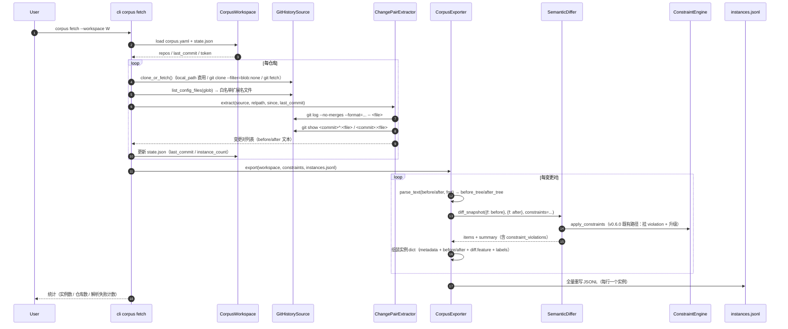
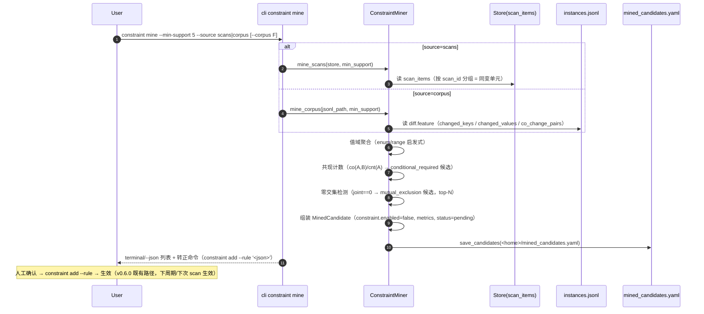
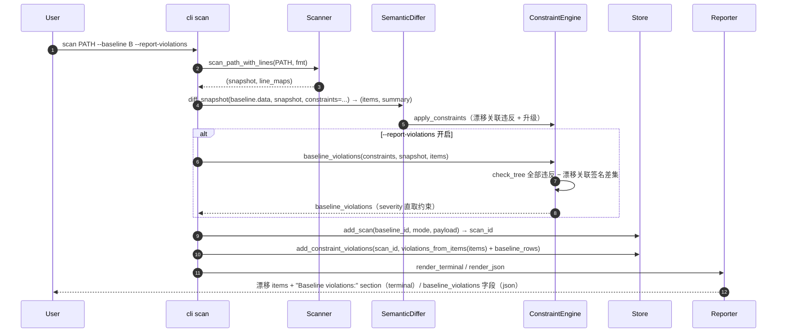
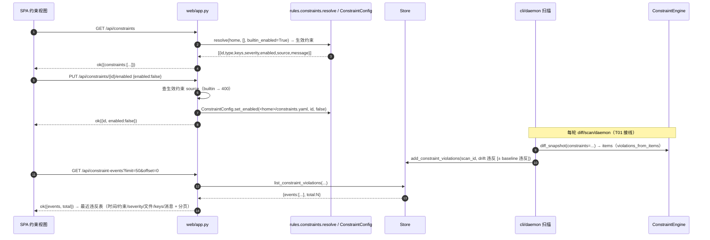
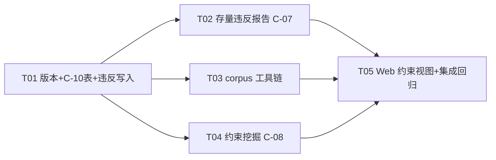

# cfgdrift v0.7.0 增量系统设计 — corpus 基准语料 / 约束自动挖掘 / Web 约束视图 + C-10 / 存量违反报告

- 版本：v0.7.0（增量）
- 作者：高见远（架构师 / software-architect）
- 状态：待评审 → 转交工程师实现 + QA 测试
- 基线：现有 v0.6.0 代码库（docs/system_design_v060.md；681 passed / 6 skipped）
- 原则：**基于 v0.6.0 最小变更**；不重设计已稳定部分（解析/语义树/diff/存储/报告/Web/daemon/alert/插件/约束引擎 v0.6.0 五类校验）。四项功能全部以**新模块承载 + 既有接口可选参数/条件输出**接入，**core/differ.py 零改动**（保持纯函数、不写库），违反持久化由**调用层**完成。

---

## 0. 决策摘要（PRD 待确认 6 问拍板 + 架构师新增决策）

| # | 决策项 | 决策内容 | 来源 |
|---|--------|----------|------|
| Q1 | corpus GitHub 访问 | **git 历史用 subprocess `git clone --filter=blob:none --no-checkout` + `git log/show`**（走 git 协议，无 API 限速、天然支持增量 `git fetch`、可离线 fixture）；**star 过滤用 urllib GitHub API `GET /repos/{owner}/{repo}`**（每仓库每轮 1 请求；无 token 60 req/h 足够；token 读取优先级 `GITHUB_TOKEN` env > corpus.yaml `token` 字段）；**API 失败/限速/离线 → 跳过 star 检查并 warning（best-effort）**；`repositories[].local_path` 支持直接使用本地 git 仓库（**离线可测/CI 安全**） | Q1 拍板 |
| Q2 | 语料规模与配额 | 首版目标 **100–300 实例**；`max_instances` 默认 **200**（全局 + 每仓库双上限，均匀配额）；GitHub API 仅用于 star 检查，配额瓶颈不在 API；若某仓库 star 检查失败不阻塞采集 | Q2 拍板 |
| Q3 | 挖掘阈值 | `--min-support` 默认 **5**；共现 confidence = P(B 同变 \| A 同变) ≥ **0.8**；互斥每侧样本下限 = min-support（5）；枚举 distinct 值数 ∈ [2, 8]；每键对互斥候选 top-N（默认 5） | Q3 拍板 |
| Q4 | C-10 表 schema 与保留 | 见 §6.4；**保留 90 天可配**（`CFGDRIFT_CV_RETENTION_DAYS` env，默认 90），沿用 alert_events 惰性清理模式（每 200 次插入触发 + 行数上限 20000） | Q4 拍板 |
| Q5 | Web 视图 P0 范围 | **只读列表 + 用户规则启用/禁用切换**（PUT 只写 `<home>/constraints.yaml`，走 `ConstraintConfig.set_enabled`）；内置约束不可切换（400，提示可用同 id 用户规则覆盖）；无编辑/删除 UI | Q5 拍板 |
| Q6 | 存量违反严重度 | **直接展示约束自身 severity**（不改 item 升级逻辑）；terminal/json 每条 violation 带 severity 字段 | Q6 拍板 |
| D1 | differ 纯函数不写库 | **违反写入由调用层完成**：`cli._perform_scan` / `daemon.worker._scan_one` 在 `add_scan` 之后统一调 `store.add_constraint_violations(...)`；`core/differ.py` 与 `core/constraints.py` 引擎零 DB 依赖 | 架构师决策 |
| D2 | baseline_violations 计算 | 新增纯函数 `ConstraintEngine.check_tree`（对 new_snapshot 逐文件跑全部启用约束）+ `ConstraintEngine.baseline_violations`（与漂移关联 violation 签名差集去重）；severity 直取约束 | 架构师决策 |
| D3 | Report 扩展零噪音 | `Report.baseline_violations: List[dict]`，`to_dict()` **仅非空时输出**（与 `constraint_violations` 同契约） | 架构师决策 |
| D4 | corpus 拉取架构 | 三层：`GitHistorySource` 抽象（`GitCloneSource` subprocess 实现 + `LocalRepoSource` 离线实现）→ `ChangePairExtractor`（git log/show 提取 before/after 变更对）→ `CorpusExporter`（`parse_text` → `diff_snapshot` → 约束特征 → JSONL） | 架构师决策 |
| D5 | 挖掘候选不自动生效 | 输出 `<home>/mined_candidates.yaml`（version:1，候选 `constraint.enabled: false`，status: pending）；转正 = 人工复制候选 constraint JSON 执行 `constraint add --rule '<json>'`（复用 v0.6.0 CRUD），候选区永不自动生效 | 架构师决策 |
| D6 | Web 约束列表口径 | 与 CLI `constraint list --source all` 一致：`resolve(home, [], builtin_enabled=True)` 生效视角（builtin + user 合并、同 id 后者覆盖） | 架构师决策 |
| D7 | HTML 报告不渲染存量违反 | P0 terminal/json 输出 baseline_violations；`htmlreport.py` **零改动**（离线 HTML 不渲染该 section，文档注明） | 架构师决策 |
| D8 | corpus 特征防膨胀 | `diff.feature` 只含**变更相关键**（changed_keys + 每 changed key 的 before/after 值 + co_change_pairs），不做全树值统计（防 JSONL 膨胀）；全树值分布由挖掘阶段跨实例聚合 | 架构师决策 |

---

## 1. 增量实现方案

### 1.1 总览与依赖方向

```
新增包：src/cfgdrift/corpus/        （功能 1：语料工具链）
新增模块：src/cfgdrift/rules/mining.py （功能 2：约束自动挖掘）
修改：storage/store.py（C-10 表）→ core/constraints.py（check_tree/baseline_violations/violations_from_items）
      → core/model.py（Report.baseline_violations）→ core/reporter.py（baseline section）
      → cli.py（corpus group / constraint mine / scan --report-violations / 违反写入）
      → daemon/worker.py（违反写入）→ web/app.py + static（3 端点 + 约束视图）
```

依赖方向：`corpus/* → core/{parser,differ,constraints}`、`rules/mining.py → storage/store + corpus`、`cli.py / worker.py → storage/store`。**core 不反向依赖 storage/web/rules**；`core/differ.py` 零改动（约束检查接入点仍是 v0.6.0 的 `constraints=` 可选参数）。

### 1.2 功能 1：corpus 基准语料工具链（方向 E，P0）

#### 1.2.1 模块结构（新增包 `src/cfgdrift/corpus/`）

| 文件 | 职责 |
|------|------|
| `__init__.py` | 空包（版本号复用 `cfgdrift.__version__`） |
| `config.py` | `CorpusConfig` dataclass + `load/save/validate` + `default_path(workspace)`（corpus.yaml） |
| `workspace.py` | `CorpusWorkspace`：`init()` 目录结构；`state.json` 读写（增量拉取状态）；仓库路径解析 |
| `fetcher.py` | `GitHistorySource`（抽象）/ `GitCloneSource`（subprocess git）/ `LocalRepoSource`（本地仓库离线）；`ChangePairExtractor`（git log/show → before/after 变更对）；`GitHubApi`（star 检查，urllib） |
| `exporter.py` | `CorpusExporter`：变更对 → parse_text → diff_snapshot → 实例 dict → JSONL 全量重写 |
| `validator.py` | `CorpusValidator`：逐行校验 instances.jsonl schema + 统计输出；`validate` 子命令入口 |

#### 1.2.2 corpus.yaml schema（version: 1）

```yaml
version: 1
since: "2023-01-01"            # 可选：只取该日期之后的提交（ISO 日期）
min_stars: 1000                # 可选：star 下限（GitHub API 检查；失败跳过）
max_instances: 200             # 可选：本次 fetch 最大实例数（全局；默认 200）
token: ""                      # 可选：GitHub token（优先读 GITHUB_TOKEN env）
repositories:
  - owner: nginx
    repo: nginx
    glob: "conf/*.conf"        # 可选：只匹配该 glob 的配置文件（默认全仓五类扩展名）
    since: "2022-01-01"        # 可选：仓库级 since（覆盖全局）
    local_path: ""             # 可选：本地 git 仓库路径（离线/测试；跳过 clone 与 API）
```

- 文件类型白名单：`*.json / *.yaml / *.yml / *.toml / *.ini`（五类，`parse_text` 原生支持）。
- 损坏文件 → `ValueError` → CLI exit 2（与 severity.yaml/constraints.yaml 同契约）。

#### 1.2.3 workspace 目录结构（`corpus init --workspace <dir>`）

```
<workspace>/
  corpus.yaml          # 配置（init 生成模板）
  state.json           # 增量拉取状态
  repos/               # 克隆的 git 仓库（<owner>__<repo>/）
  instances.jsonl      # 标准化语料（export 产物，每行一个变更实例）
```

#### 1.2.4 state.json schema（增量拉取状态）

```json
{
  "version": 1,
  "fetched_at": "2026-08-04T12:00:00+00:00",
  "repos": {
    "nginx/nginx": {
      "local_path": "/abs/path",       // 若配置 local_path 则记录之
      "last_commit": "abc123...",      // 上次已处理的最新 commit（增量起点）
      "stars": 18000,                  // 缓存 star 数（避免重复 API）
      "star_checked": true,            // star 检查是否完成（失败为 false）
      "instance_count": 47
    }
  }
}
```

#### 1.2.5 fetch 实现（GitCloneSource + ChangePairExtractor）

1. 解析每个 repository 条目；目标目录 `repos/<owner>__<repo>`。
2. `local_path` 提供 → 直接用（跳过 clone + star 检查）→ **离线可测**。
3. 否则：目录不存在 → `git clone --filter=blob:none --no-checkout https://github.com/<owner>/<repo>.git <dir>`（partial clone，仅元数据 + 按需 blob，省流量）；已存在 → `git -C <dir> fetch --filter=blob:none origin`（增量）。
4. star 检查（仅 clone 路径、配置了 min_stars、且 `star_checked != true`）：`urllib.request` GET `https://api.github.com/repos/{owner}/{repo}`（必带 `User-Agent`；有 token 加 `Authorization: Bearer <token>`）；失败/429/离线 → `logger.warning` + `star_checked=false` 记录后**继续**（best-effort）。
5. 列出候选文件：`git -C <dir> ls-tree -r --name-only HEAD` 过滤白名单扩展名 + glob。
6. 提取变更对：
   - `git -C <dir> log --no-merges --format=%H%x09%ct%x09%an <%ae>%x09%s --since=<since> -- <file>`（逐文件）。
   - 对每个 commit：`before = git show <commit>^:<file>`（新增时为空）、`after = git show <commit>:<file>`（删除时为空）。
   - 只保留 before/after **至少一方非空** 且 **双方均能 parse_text 成功** 的变更对（解析失败跳过并计数，防垃圾实例）。
7. 增量：仅处理 `last_commit` 之后（按时间倒序）的 commit；处理完更新 `last_commit` 为最新已处理 sha。
8. 实例上限：全局 `max_instances` + 每仓库 `max_instances/len(repos)` 双上限，达到即停。

#### 1.2.6 与引擎打通（CorpusExporter）

每个变更对 → 一个实例：
1. `fmt = 扩展名映射`（json/yaml/yml→yaml/toml/ini）；`before_tree = parse_text(before, fmt)`、`after_tree = parse_text(after, fmt)`（**parse_text 需显式 fmt**，`parse_file` 路径版不适用 git blob 文本）。
2. `SemanticDiffer().diff_snapshot({relpath: before_tree}, {relpath: after_tree}, constraints=有效约束)` → `(items, summary)`。constraints 走 `rules.constraints.resolve(home, extra_paths, builtin_enabled)`（复用 CLI 选项 `--builtin/--no-builtin`、`--constraints`，默认 builtin on）——**语料既是"基准真值"也是"评测输入"**。
3. 组装实例 dict → JSONL 一行（`json.dumps(ensure_ascii=False)`）。

#### 1.2.7 JSONL 条目 schema（instances.jsonl，每行一个变更实例）

```json
{
  "schema_version": 1,
  "instance_id": "nginx-nginx-3f2a1b-0",
  "metadata": {
    "owner": "nginx", "repo": "nginx", "path": "conf/nginx.conf",
    "commit": "3f2a1b9c...", "commit_time": "2023-05-01T10:00:00Z",
    "author": "name <email>", "message": "tune worker processes"
  },
  "file": {"relpath": "conf/nginx.conf", "format": "yaml"},
  "before": {"tree": {...}, "parse_ok": true, "present": true},
  "after":  {"tree": {...}, "parse_ok": true, "present": true},
  "diff": {
    "items": [{"key_path": "worker_processes", "change_type": "modified",
               "severity": "WARN", "old_value": 1, "new_value": 4,
               "file": "conf/nginx.conf"}],
    "summary": {"added": 0, "removed": 0, "modified": 1, "type_changed": 0,
                "ignored": 0, "total": 1, "max_severity": "WARN"},
    "constraint_violations": [{"constraint_id": "...", "type": "...",
                               "message": "...", "involved_keys": [...]}],
    "feature": {
      "changed_keys": ["worker_processes"],
      "changed_values": {"worker_processes": {"before": 1, "after": 4}},
      "co_change_pairs": [["worker_processes", "worker_connections"]],
      "co_change_capped": false
    }
  },
  "labels": {"severity": "WARN", "annotation": null, "annotator": null}
}
```

- `labels.annotation / annotator`：P1 双人标注 + kappa 预留字段（v0.7 恒为 null）。
- `diff.feature`（D8）：只含变更相关键；`changed_keys` 超过 50 时 co_change_pairs 截断并置 `co_change_capped: true`。
- 四类变更（added/removed/modified/type_changed）体现在 `diff.items[].change_type`。
- **text 原文不落 JSONL**（防膨胀）；tree 落盘供挖掘直接消费。

#### 1.2.8 export / validate

- `corpus export --workspace <dir> [--output instances.jsonl] [--builtin/--no-builtin] [--constraints PATH]`：从 state.json 已知已处理变更对 → 重新生成实例 → **全量重写** JSONL（幂等、确定性；无本地缓存依赖）。
- `corpus validate --workspace <dir> [--input instances.jsonl]`：逐行校验 schema（必填字段/类型/parse_ok 一致性/diff 结构与引擎输出一致）；输出统计（实例数/仓库数/格式分布/四类变更分布/约束违反数）；损坏 → exit 2。
- `corpus stats / annotate`：P1，本版**不实现不占位**。

### 1.3 功能 2：约束自动挖掘（C-08，P0）

#### 1.3.1 模块（新增 `src/cfgdrift/rules/mining.py`）

```python
@dataclass
class MinedCandidate:
    id: str                    # "mined_enum_1" / "mined_range_2" / ...
    kind: str                  # enum | range | conditional_required | mutual_exclusion
    constraint: dict           # Constraint.to_dict() 形状（可直接喂 constraint add --rule）
    metrics: dict              # {support, confidence, samples, source}
    status: str = "pending"    # pending|accepted|rejected（P0 恒 pending）

class ConstraintMiner:
    @staticmethod
    def mine_scans(store, min_support=5) -> List[MinedCandidate]        # source=scans
    @staticmethod
    def mine_corpus(jsonl_path, min_support=5) -> List[MinedCandidate]  # source=corpus
    @staticmethod
    def save_candidates(path, candidates) -> None   # mined_candidates.yaml
    @staticmethod
    def load_candidates(path) -> List[MinedCandidate]
```

#### 1.3.2 数据准备

- `source=scans`：读 `scan_items`（scan_id, key_path, change_type, old_value, new_value）——**按 scan_id 分组作为"同变单元"**；键值统计取 `new_value`（漂移后值）。
- `source=corpus`：读 instances.jsonl 的 `diff.feature`（changed_keys + changed_values + co_change_pairs），**避免二次解析**。

#### 1.3.3 三类候选算法

1. **值域（enum / range）**：按键聚合出现过的值集合。
   - enum 候选：去重后 distinct 值数 ∈ [2, 8] 且 support（出现该键的实例数）≥ min_support → `{type: enum, keys:[k], allowed:[v1..vn]}`；confidence = 允许集覆盖率（=1.0）。
   - range 候选：值全为数值（int/float，排除 bool）且 support ≥ min_support → 启发式：键名含 `port` 且值均在 [1, 65535] → 建议 `[1, 65535]`；否则 → `[observed_min, observed_max]`（metrics 标注 `observed: true` 提醒人工微调）。
   - 每键只出一个候选（enum 优先于 range）。
2. **共现联动（conditional_required）**：统计键对 (A, B) 同变次数 co(A,B)、A 同变次数 cnt(A)。
   - `support = co(A,B)`；`confidence = co(A,B)/cnt(A)`。
   - 候选条件：support ≥ min_support 且 confidence ≥ 0.8。
   - 输出 `{type: conditional_required, when: {key: A, value: <A 主导值>}, then: {require: [B]}}`（when.value 必填：A 为 bool 取主导 true/false；A 为枚举取出现最多值；其他类型取主导值并在 message 注明"挖掘候选，待人工确认"）。
3. **互斥（mutual_exclusion）**：两键值组合零交集检测。
   - 对每对 (A, B) 的每个 (va, vb)：`joint(va,vb) == 0` 且 `cnt(va) ≥ min_support` 且 `cnt(vb) ≥ min_support` → 候选。
   - 输出 `{type: mutual_exclusion, keys: [A, B], forbid: [[va, vb]]}`；`support = min(cnt(va), cnt(vb))`；confidence = 1.0（采样口径警示见 §7）。
   - 每键对按 support 降序取 top-N（默认 5）防组合爆炸。

#### 1.3.4 mined_candidates.yaml schema（version: 1）

```yaml
version: 1
generated_at: "2026-08-04T12:00:00+00:00"
source: scans              # scans | corpus
min_support: 5
candidates:
  - id: mined_enum_1
    kind: enum
    constraint: {
      id: "mined_enum_1", type: "enum", keys: ["logging.level"],
      allowed: ["debug", "info", "warn", "error"],
      message: "logging.level 必须是 debug/info/warn/error 之一（挖掘候选，待人工确认）",
      severity: "WARN", enabled: false
    }
    metrics: {support: 23, confidence: 1.0, samples: 23, source: "scans"}
    status: pending
```

- 候选 `constraint.enabled: false`（即使误 add 也不立即生效；转正后 `constraint enable` 再启用）。
- **候选区不自动生效**（D5）；`constraint mine` 输出转正命令提示：
  `cfgdrift constraint add --rule '<constraint JSON>'`。

#### 1.3.5 CLI

```
cfgdrift constraint mine [--min-support N] [--source scans|corpus]
                          [--corpus PATH] [--output PATH] [--json]
```

- 默认 `--source scans`（读当前 store）；`--source corpus` 需 `--corpus instances.jsonl`。
- 默认输出路径 `<home>/mined_candidates.yaml`；`--json` 输出完整 JSON（含 metrics）。
- terminal 列表：`# mined_enum_1 kind=enum keys=logging.level support=23 conf=1.00 status=pending` + 转正命令。

### 1.4 功能 3：C-10 constraint_violations 表 + Web 约束视图（P0）

#### 1.4.1 C-10 表（storage/store.py，幂等进 `_SCHEMA`）

```sql
CREATE TABLE IF NOT EXISTS constraint_violations (
    id            INTEGER PRIMARY KEY AUTOINCREMENT,
    constraint_id TEXT NOT NULL,
    scan_id       INTEGER,
    kind          TEXT NOT NULL DEFAULT 'drift',   -- drift | baseline
    file          TEXT NOT NULL DEFAULT '',
    keys          TEXT NOT NULL DEFAULT '[]',      -- JSON array（involved_keys）
    severity      TEXT NOT NULL DEFAULT 'WARN',
    detail        TEXT NOT NULL DEFAULT '',        -- violation message
    created_at    TEXT NOT NULL
);
CREATE INDEX IF NOT EXISTS idx_cv_created ON constraint_violations(created_at DESC);
CREATE INDEX IF NOT EXISTS idx_cv_constraint ON constraint_violations(constraint_id);
CREATE INDEX IF NOT EXISTS idx_cv_scan ON constraint_violations(scan_id);
```

- 新表 `CREATE TABLE IF NOT EXISTS` 直接进 `_SCHEMA`（无需 ALTER 迁移）；与既有表风格一致（TEXT 时间戳、TEXT JSON）。
- **保留策略（Q4）**：`_CV_PRUNE_EVERY = 200`（每 200 次插入触发惰性清理）、`_CV_RETENTION_DAYS = 90`（env `CFGDRIFT_CV_RETENTION_DAYS` 可配）、`_CV_MAX_ROWS = 20000`；`prune_constraint_violations(days, max_rows)` 按年龄 + 行数双清理（对齐 alert_events）。

#### 1.4.2 Store 新方法

- `add_constraint_violations(scan_id: Optional[int], violations: List[dict]) -> int`：批量 INSERT（元素含 constraint_id/kind/file/keys/severity/detail/created_at），触发惰性清理。
- `list_constraint_violations(constraint_id=None, kind=None, limit=50, offset=0) -> {"events": [...], "total": N}`（对齐 `list_alert_events` 契约）。
- `prune_constraint_violations(days=90, max_rows=20000) -> int`。

#### 1.4.3 违反写入时机（D1，differ 纯函数不动）

- 新增辅助 `core/constraints.py: violations_from_items(items) -> List[dict]`：从 `DriftItem.constraint_violations` 提取 C-10 行（补 file/severity=item.severity/detail/kind='drift'）。
- `cli._perform_scan`：`diff_snapshot` 返回 → `add_scan` → `add_constraint_violations(scan_id, violations_from_items(items) + baseline_rows)`（baseline_rows 见 1.5，仅 `--report-violations` 开启时有）。
- `daemon/worker._scan_one`：`add_scan` 后写 `violations_from_items(items)`（kind='drift'；daemon 不接 baseline 报告）。
- 引擎/differ 零 DB 依赖；既有 add_scan 行为零变化。

#### 1.4.4 Web API（web/app.py 新增 3 端点）

| 端点 | 方法 | 请求 | 响应 | 错误 |
|------|------|------|------|------|
| `/api/constraints` | GET | — | `ok({"constraints":[{id,type,keys,severity,enabled,source,message}]})`（生效视角，D6） | — |
| `/api/constraints/{id}/enabled` | PUT | `{"enabled": true}` | `ok({"id": "...", "enabled": true})` | user 约束不存在 → 404；builtin 约束 → 400 "内置约束不可直接切换；可添加同 id 用户规则覆盖" |
| `/api/constraint-events` | GET | `constraint_id / kind / limit / offset` | `ok({"events":[...],"total":N})` | — |

- PUT 实现：`ConstraintConfig.set_enabled(<home>/constraints.yaml, id, enabled)`；先查生效约束判断 source（builtin → 400）。
- 沿用 `ok/err` 助手 + `ValueError` 全局 handler。

#### 1.4.5 SPA 新视图「约束」

- `index.html`：nav 加 `<button data-view="constraints">约束</button>`；main 加 `<section id="view-constraints" class="hidden"></section>`。
- `app.js`：`renderConstraints()`（拉 `/api/constraints` 渲染表格：id/type/keys/severity badge/source/enabled + user 规则启用/禁用按钮 → PUT 后刷新）；`renderConstraintEvents()`（拉 `/api/constraint-events` 渲染最近违反：时间/约束/severity/文件/keys/消息 + 分页）；注册到既有 showView 路由。
- 样式复用既有 `.card/.table/.badge/.pager`，少量新增。

### 1.5 功能 4：存量违反报告（C-07，P0）

#### 1.5.1 核心纯函数（core/constraints.py 新增）

```python
class ConstraintEngine:
    @staticmethod
    def check_tree(constraints, new_snapshot) -> List[dict]:
        """对 new_snapshot 逐文件跑全部启用约束，返回 ALL violations。
        每条: {constraint_id, type, message, involved_keys, file, severity}
        severity 直取约束自身 severity（Q6）。"""

    @staticmethod
    def baseline_violations(constraints, new_snapshot, drift_items) -> List[dict]:
        """存量违反 = check_tree 全部违反 − 已与漂移关联的违反。
        去重签名: (constraint_id, file, frozenset(involved_keys))。"""
```

- 复用 v0.6.0 `check_one`（定向路径查找），无性能问题（10k 键 × 20 约束 <10ms）。
- **与漂移关联的违反不重复报**：diff 已挂到 item 的 violation 在差集中被排除；"当前配置树中不依赖漂移的违反"（含基线中已存在、当前仍存在的）被列出。

#### 1.5.2 Report/model 扩展（零噪音 D3）

- `Report.baseline_violations: List[dict] = field(default_factory=list)`；`to_dict()` 仅非空时输出 `"baseline_violations": [...]`。
- `_item_from_dict` 不涉及（baseline violations 不是 items）。

#### 1.5.3 CLI 与呈现

- `scan` 新增 `--report-violations/--no-report-violations`（**默认 off**，守零噪音契约）。
- `_perform_scan` 增参 `report_violations: bool = False`；开启且 constraints 非空：`bv = ConstraintEngine.baseline_violations(constraints, snapshot, items)`；写入 `Report(..., baseline_violations=bv)`；同时写 C-10（kind='baseline'）。
- terminal（Reporter.render_terminal，在 items 之后、Summary 之前）：
  ```
  Baseline violations:
    [CRITICAL] constraint http_ssl_cert_required [conditional_required]: tls.cert_path 缺失（tls.enabled=true 需要该字段） (conf/app.yaml: tls.enabled, tls.cert_path)
  ```
- json：`Report.to_dict()` 自动带 `baseline_violations`（仅非空）。
- HTML：**不渲染**（D7，htmlreport.py 零改动）。

### 1.6 版本规划与依赖

- 三处同步：`__init__.py` → `0.7.0`；`pyproject.toml` → `0.7.0`；`src/csrc/parser_core.c` `version()` → `"0.7.0-c"`。
- **无新增第三方依赖**：GitHub API 用 `urllib.request`（stdlib）、git 操作用 `subprocess`（stdlib）、JSONL 用 `json`（stdlib）；现有依赖（click/PyYAML/tomli）不变。

---

## 2. 文件列表（变更清单）

> 源文件 **17 个**（新增 7 + 修改 10），版本同步 3 个，测试 5 个，示例 2 个，文档 1 个。**不改动**：core/{parser,pure_parsers,lines,masker,compare,plugins,differ,htmlreport}.py、scanner/、rules/{ignore,severity,constraints}.py、alert/*、daemon/{daemon,autostart}.py。

| 文件 | 状态 | 职责 |
|------|------|------|
| `src/cfgdrift/corpus/__init__.py` | 新增 | corpus 包 |
| `src/cfgdrift/corpus/config.py` | 新增 | `CorpusConfig`（corpus.yaml load/save/validate）+ default_path |
| `src/cfgdrift/corpus/workspace.py` | 新增 | `CorpusWorkspace`：init 目录结构 + state.json 读写 |
| `src/cfgdrift/corpus/fetcher.py` | 新增 | `GitHistorySource`/`GitCloneSource`/`LocalRepoSource` + `ChangePairExtractor` + `GitHubApi` |
| `src/cfgdrift/corpus/exporter.py` | 新增 | `CorpusExporter`：变更对 → parse_text → diff_snapshot → 实例 → JSONL |
| `src/cfgdrift/corpus/validator.py` | 新增 | `CorpusValidator`：JSONL schema 校验 + 统计 |
| `src/cfgdrift/rules/mining.py` | 新增 | `MinedCandidate` + `ConstraintMiner`（mine_scans/mine_corpus/save/load）+ 三类候选算法 |
| `src/cfgdrift/storage/store.py` | 修改 | C-10 `constraint_violations` 表（幂等）+ `add_constraint_violations`/`list_constraint_violations`/`prune_constraint_violations`（90 天可配惰性清理） |
| `src/cfgdrift/core/constraints.py` | 修改 | `+ violations_from_items(items)`、`+ ConstraintEngine.check_tree`、`+ ConstraintEngine.baseline_violations`（纯函数，引擎零 DB） |
| `src/cfgdrift/core/model.py` | 修改 | `Report.baseline_violations: List[dict]`（to_dict 仅非空输出） |
| `src/cfgdrift/core/reporter.py` | 修改 | `render_terminal` 增「Baseline violations」section（条件输出） |
| `src/cfgdrift/cli.py` | 修改 | `corpus` group（init/fetch/export/validate）；`constraint mine`；`scan --report-violations`；`_perform_scan` 违反写入；`--builtin/--constraints` 透传给 corpus export |
| `src/cfgdrift/daemon/worker.py` | 修改 | `_scan_one` 在 add_scan 后写 drift 违反到 C-10 |
| `src/cfgdrift/web/app.py` | 修改 | `GET /api/constraints`、`PUT /api/constraints/{id}/enabled`、`GET /api/constraint-events` |
| `src/cfgdrift/web/static/index.html` | 修改 | nav「约束」按钮 + `#view-constraints` section |
| `src/cfgdrift/web/static/app.js` | 修改 | `renderConstraints` / `renderConstraintEvents` + showView 注册 |
| `src/cfgdrift/__init__.py` | 修改 | `__version__ = "0.7.0"` |
| `pyproject.toml` | 修改 | `version = "0.7.0"` |
| `src/csrc/parser_core.c` | 修改 | `version()` 返回 `"0.7.0-c"` |
| `tests/test_c10_store.py` | 新增 | C-10 表：写入/查询/分页/清理/索引 + 保留策略 env 覆盖 |
| `tests/test_baseline_violations.py` | 新增 | check_tree/baseline_violations 去重 + scan --report-violations terminal/json + 零噪音 + C-10 kind=baseline |
| `tests/test_corpus.py` | 新增 | init/fetch（本地 git fixture 离线）/export/validate + JSONL schema + 增量 state + 实例 diff 特征 |
| `tests/test_mining.py` | 新增 | 三类候选算法（合成 scan_items + fixture JSONL）+ 阈值 + mined_candidates.yaml |
| `tests/test_web_constraints.py` | 新增 | 3 端点契约（列表/切换/事件）+ builtin 400 + SPA 静态挂载 |
| `examples/corpus.yaml.example` | 新增 | corpus.yaml 模板 |
| `examples/mined_candidates.yaml.example` | 新增 | mined_candidates.yaml 模板 |
| `README.md` | 修改 | 四项功能说明 + schema 摘要 |

---

## 3. 类图 / 接口（Mermaid，简要）

```mermaid
classDiagram
    class CorpusConfig {
        +int version
        +str since
        +int min_stars
        +int max_instances
        +str token
        +List~dict~ repositories
        +load(path) CorpusConfig
        +save(path, cfg) None
        +validate() None
    }
    class CorpusWorkspace {
        +str root
        +init(root) None
        +read_state() dict
        +write_state(state) None
        +repo_dir(owner, repo) str
    }
    class GitHistorySource {
        <<abstract>>
        +clone_or_fetch() None
        +list_config_files(glob) List~str~
        +commit_log(path, since) List~dict~
        +show(commit, path) Optional~str~
    }
    class GitCloneSource {
        +str url
        +str dir
        +clone_or_fetch() None
    }
    class LocalRepoSource {
        +str dir
        +clone_or_fetch() None
    }
    class ChangePairExtractor {
        +extract(source, relpath, since) List~ChangePair~
    }
    class ChangePair {
        +str relpath
        +str commit
        +str commit_time
        +str author
        +str message
        +Optional~str~ before_text
        +Optional~str~ after_text
    }
    class GitHubApi {
        +fetch_repo(owner, repo, token) Optional~dict~
    }
    class CorpusExporter {
        +export(workspace, constraints, output) int
        +_build_instance(pair, fmt, differ, constraints) dict
    }
    class CorpusValidator {
        +validate(path) dict
    }
    class MinedCandidate {
        +str id
        +str kind
        +dict constraint
        +dict metrics
        +str status
    }
    class ConstraintMiner {
        +mine_scans(store, min_support) List~MinedCandidate~
        +mine_corpus(jsonl_path, min_support) List~MinedCandidate~
        +save_candidates(path, candidates) None
        +load_candidates(path) List~MinedCandidate~
    }
    class ConstraintEngine {
        +check_one(constraint, tree) List~ConstraintViolation~
        +apply(new_snapshot, items, constraints) None
        +check_tree(constraints, new_snapshot) List~dict~
        +baseline_violations(constraints, new_snapshot, drift_items) List~dict~
    }
    class Store {
        +add_scan(baseline_id, mode, report) int
        +add_constraint_violations(scan_id, violations) int
        +list_constraint_violations(constraint_id, kind, limit, offset) dict
        +prune_constraint_violations(days, max_rows) int
    }
    class Report {
        +List~dict~ baseline_violations
        +to_dict() dict
    }
    class WebApp {
        +GET /api/constraints
        +PUT /api/constraints/{id}/enabled
        +GET /api/constraint-events
    }

    GitCloneSource ..|> GitHistorySource
    LocalRepoSource ..|> GitHistorySource
    ChangePairExtractor ..> GitHistorySource : 读取
    ChangePairExtractor ..> ChangePair : 生成
    CorpusExporter ..> ChangePair : 消费
    CorpusExporter ..> ConstraintEngine : 经 diff_snapshot 复用
    CorpusWorkspace ..> CorpusConfig : 读写 corpus.yaml/state.json
    ConstraintMiner ..> MinedCandidate : 生成
    ConstraintMiner ..> Store : mine_scans(scan_items)
    ConstraintMiner ..> CorpusExporter : mine_corpus(instances.jsonl)
    ConstraintEngine ..> Store : violations_from_items → add_constraint_violations（调用层）
    Store ..> Report : C-10 行（scan_id 关联）
    WebApp ..> ConstraintEngine : resolve 生效约束（D6）
    WebApp ..> Store : constraint-events
```

---

## 4. 时序图（Mermaid，简要）

### 4.1 corpus fetch → export 流程



### 4.2 constraint mine 流程



### 4.3 scan --report-violations 流程



### 4.4 Web 约束视图数据流（含违反写入）



---

## 5. 增量任务列表（≤5 任务，按实现顺序）

| 任务号 | 任务名 | 依赖 | 优先级 | 验收标准 |
|--------|--------|------|--------|----------|
| T01 | 版本 v0.7.0 + C-10 constraint_violations 表 + 违反写入 | 无 | P0 | 三处版本号同步 `0.7.0 / 0.7.0 / 0.7.0-c`；`store.py` `_SCHEMA` 幂等新增 `constraint_violations` 表（三索引）+ `add_constraint_violations`/`list_constraint_violations`（分页契约对齐 alert-events）/`prune_constraint_violations`（默认 90 天、`CFGDRIFT_CV_RETENTION_DAYS` 可配、每 200 插入惰性触发）；`core/constraints.py` `violations_from_items`；`cli._perform_scan` 与 `daemon.worker._scan_one` 在 `add_scan` 后批量写入 drift 违反（differ/engine 零 DB 依赖）；**既有 681 passed / 6 skipped 全绿**；`test_c10_store.py`（写入/查询/清理/env 覆盖） |
| T02 | 存量违反报告 C-07 | T01 | P0 | `core/constraints.py` `check_tree`/`baseline_violations`（severity 直取约束 Q6；签名 `(constraint_id, file, frozenset(involved_keys))` 差集去重）；`model.Report.baseline_violations`（仅非空输出，零噪音 D3）；`scan --report-violations/--no-report-violations`（默认 off）；terminal「Baseline violations:」section（items 后、Summary 前）+ json `baseline_violations` 字段；开启时写 C-10（kind='baseline'）；**默认关闭时 terminal/json 与 v0.6.0 逐字节一致**；与漂移关联违反不重复报；`htmlreport.py` 零改动 |
| T03 | corpus 基准语料工具链 | T01 | P0 | `corpus` 包（config/workspace/fetcher/exporter/validator）+ `corpus init/fetch/export/validate` 子命令；corpus.yaml/state.json/instances.jsonl schema 齐备；**fetch 支持本地 git fixture（`local_path`，离线）** + GitHub API star 检查 best-effort（失败 warning 不阻塞）；增量拉取（state.json `last_commit`，`git fetch` 续拉）；每条实例含 metadata + before/after 树 + diff（items/summary/constraint_violations/feature）+ labels 预留；export 全量重写幂等；validate schema 损坏 exit 2 + 统计输出；支持 100–300 实例规模（max_instances 双上限） |
| T04 | 约束自动挖掘 C-08 | T01 | P0 | `rules/mining.py` `MinedCandidate` + `ConstraintMiner`（`mine_scans`/`mine_corpus`/`save_candidates`/`load_candidates`）；三类候选（enum/range/conditional_required/mutual_exclusion）+ support/confidence/samples metrics；mined_candidates.yaml（version:1，候选 `enabled:false`、`status: pending`，**不自动生效**）；`constraint mine --min-support(默认5)/--source scans|corpus/--corpus/--output/--json` + terminal 转正命令提示；合成 scan_items + fixture JSONL 挖掘单测（阈值/枚举上限/互斥 top-N） |
| T05 | Web 约束视图 C-09 + 集成回归 | T01, T02, T03, T04 | P0 | `web/app.py` 3 端点：`GET /api/constraints`（生效视角 D6）、`PUT /api/constraints/{id}/enabled`（user 规则切换、builtin → 400、404）、`GET /api/constraint-events`（分页）；SPA 新增「约束」视图（nav + section + `renderConstraints`/`renderConstraintEvents`，user 规则启用/禁用切换后刷新）；`/api/reports/{id}` 自动带 `baseline_violations`（report_json 直出，验证字段）；**全量回归：681 + 全部新增测试全绿**；`examples/corpus.yaml.example` + `examples/mined_candidates.yaml.example` + README 更新 |

**并行度与合并顺序**：T01 为公共地基（store/cli/worker 三处接线）；T02/T03/T04 均只依赖 T01，**可并行开发**（T04 的 corpus 源依赖 T03 产出的 instances.jsonl schema——该 schema 已由本文档 §1.2.7 锁定，可用 fixture JSONL 先行实现）；T05 为聚合任务（依赖 T01/T02/T03/T04，做集成回归）。共享文件 `cli.py` 为 T01–T04 共改，按 **T01 → T02 → T03 → T04 → T05 顺序合并**（各任务只增量追加自己的 group/选项，避免冲突）。



---

## 6. 共享知识（跨文件约定，仅变更部分）

### 6.1 corpus.yaml schema（version: 1）

- 顶层：`version`(1) / `since`(ISO 日期，可选) / `min_stars`(可选) / `max_instances`(默认 200) / `token`(可选，优先级低于 `GITHUB_TOKEN` env) / `repositories`(列表)。
- 每仓库：`owner` / `repo`（或 `local_path` 二选一；local_path 时跳过 clone 与 API）/ `glob`(可选) / `since`(可选，覆盖全局)。
- 文件白名单：`*.json / *.yaml / *.yml / *.toml / *.ini`；损坏文件 → `ValueError` → exit 2。
- token 读取优先级：`GITHUB_TOKEN` env > corpus.yaml `token`。

### 6.2 instances.jsonl 条目 schema（version: 1）

- `schema_version` / `instance_id`（`<owner>-<repo>-<commit短>-<n>`）/ `metadata{owner,repo,path,commit,commit_time,author,message}` / `file{relpath,format}` / `before{tree,parse_ok,present}` / `after{tree,parse_ok,present}` / `diff{items,summary,constraint_violations,feature{changed_keys,changed_values,co_change_pairs,co_change_capped}}` / `labels{severity,annotation,annotator}`。
- `diff.items[].change_type` ∈ added/removed/modified/type_changed；`constraint_violations` 形状与 v0.6.0 `DriftItem.to_dict` 一致。
- **text 原文不落盘**；`labels.annotation/annotator` P0 恒 null（P1 双人标注 + kappa 预留）。
- `co_change_pairs` 在 changed_keys > 50 时截断并置 `co_change_capped: true`。

### 6.3 mined_candidates.yaml schema（version: 1）

- `version` / `generated_at` / `source`(scans|corpus) / `min_support` / `candidates[]`。
- 每候选：`id`(mined_<kind>_<n>) / `kind`(enum|range|conditional_required|mutual_exclusion) / `constraint`(Constraint.to_dict 形状，**enabled:false**) / `metrics{support,confidence,samples,source}` / `status`(pending)。
- 候选区**永不自动生效**；转正 = `constraint add --rule '<constraint JSON>'` + `constraint enable`。

### 6.4 constraint_violations 表 schema + 保留策略

```sql
CREATE TABLE IF NOT EXISTS constraint_violations (
    id INTEGER PRIMARY KEY AUTOINCREMENT,
    constraint_id TEXT NOT NULL,
    scan_id INTEGER,
    kind TEXT NOT NULL DEFAULT 'drift',   -- drift | baseline
    file TEXT NOT NULL DEFAULT '',
    keys TEXT NOT NULL DEFAULT '[]',      -- JSON array（involved_keys）
    severity TEXT NOT NULL DEFAULT 'WARN',
    detail TEXT NOT NULL DEFAULT '',
    created_at TEXT NOT NULL
);
```

- 索引：`idx_cv_created(created_at DESC)` / `idx_cv_constraint(constraint_id)` / `idx_cv_scan(scan_id)`。
- 保留：`_CV_PRUNE_EVERY=200`（每 200 次插入触发）、`_CV_RETENTION_DAYS=90`（env `CFGDRIFT_CV_RETENTION_DAYS` 可配）、`_CV_MAX_ROWS=20000`；`prune_constraint_violations` 按年龄 + 行数双清理（对齐 alert_events）。
- **写入时机**：调用层（cli._perform_scan / worker._scan_one）在 `add_scan` 后调用；differ/engine 纯函数零 DB。

### 6.5 baseline_violations 输出约定

- terminal（`scan --report-violations` 开启时）：
  ```
  Baseline violations:
    [SEV] constraint <id> [<type>]: <message> (<file>: <key1>, <key2>)
  ```
- json：`data.baseline_violations: [{constraint_id, type, message, involved_keys, file, severity}]`，**仅非空时输出**。
- severity = 约束自身 severity（Q6）；默认关闭（零噪音）；与漂移关联违反不重复报（签名差集）。

### 6.6 Web API 契约

| 端点 | 契约 |
|------|------|
| `GET /api/constraints` | `ok({"constraints":[{id,type,keys,severity,enabled,source,message}]})`；生效视角 `resolve(home,[],True)` |
| `PUT /api/constraints/{id}/enabled` | body `{"enabled": bool}`；user 规则 → `ok({id,enabled})`；不存在 → 404；builtin → 400"内置约束不可直接切换；可添加同 id 用户规则覆盖" |
| `GET /api/constraint-events` | 参数 `constraint_id / kind / limit(≤500) / offset`；`ok({"events":[...],"total":N})`；事件含 `{id,constraint_id,scan_id,kind,file,keys,severity,detail,created_at}` |

### 6.7 版本三处同步

- `src/cfgdrift/__init__.py` `__version__ = "0.7.0"`；`pyproject.toml` `version = "0.7.0"`；`src/csrc/parser_core.c` `version()` → `"0.7.0-c"`。

### 6.8 零噪音与回归保护

- 无 baseline_violations、无违反时：terminal 不出现「Baseline violations」section、json 不出现 `baseline_violations` 键、C-10 不写行。
- `scan` 不带 `--report-violations` 时输出与 v0.6.0 逐字节一致。
- **681 回归保护**：既有测试均不传 `--report-violations`；C-10 写入是 add_scan 后的**附加调用**，不改变既有 payload；`_perform_scan` 只在 violations 非空时调用 `add_constraint_violations`。
- corpus/挖掘模块**不改变**既有 diff/scan/daemon 默认路径。

### 6.9 其他约定

- corpus export 的 constraints 解析复用 `cli._load_constraints`（`--builtin/--constraints`）；导出确定性（全量重写）。
- `parse_text(text, fmt)` 需显式 fmt（git blob 无文件系统路径）；fmt 由扩展名映射（yml→yaml）。
- Web 约束切换只写用户文件；内置约束覆盖手段 = 添加同 id 用户规则（v0.6.0 D8 同 id 后者覆盖，天然支持）。
- daemon 本版不接 `--report-violations`（PRD 仅 scan）；daemon drift 违反照写 C-10。

---

## 7. 待明确事项（Q1–Q6 结论 + 实现期假设）

| # | 问题 | 结论 |
|---|------|------|
| Q1 | corpus GitHub 访问？ | git 历史 = subprocess git（`--filter=blob:none` partial clone + log/show）；star = urllib GitHub API（失败跳过，best-effort）；`local_path` 离线直用 |
| Q2 | 语料规模与配额？ | 100–300 实例；`max_instances` 默认 200（全局 + 每仓库双上限） |
| Q3 | 挖掘阈值？ | min-support 默认 5；共现 confidence ≥ 0.8；互斥每侧样本下限 5；枚举 distinct ∈ [2,8]；互斥 top-N 5 |
| Q4 | C-10 schema 与保留？ | §6.4；默认 90 天，`CFGDRIFT_CV_RETENTION_DAYS` 可配；惰性清理（每 200 插入） |
| Q5 | Web 视图 P0？ | 只读列表 + 用户规则启用/禁用切换；builtin 400 |
| Q6 | 存量违反严重度？ | 直接展示约束自身 severity（不改升级逻辑） |

实现期假设（低风险，工程师可直接采用，QA 可据此设计用例）：

1. **differ 保持纯函数**（D1）：所有 C-10 写入在调用层完成；任何"在 differ/engine 内写库"的改法视为违规。
2. corpus fetch 的 git 操作依赖 `git` 可执行文件存在于 PATH；CI/沙箱无网络时一律用 `local_path` fixture（测试不得依赖外网）。
3. GitHub API star 检查失败仅 warning，不 exit；`--offline` 不需要（local_path 即离线路径）。
4. 挖掘的互斥候选 confidence 恒 1.0 是**采样零交集**口径，message 注明"挖掘候选，待人工确认"（人工判断是否真互斥）。
5. range 候选默认 `[observed_min, observed_max]` 并标 `observed: true`；键名含 port 且值在 [1,65535] 时建议标准端口范围。
6. `constraint mine --source corpus` 依赖 instances.jsonl schema（§1.2.7）；T04 可用 fixture JSONL 先行开发，不阻塞 T03。
7. Web 约束视图 P0 不做"最近违反"跳转详情页/筛选联动；分页即足够。
8. HTML 报告（`--html` / `/api/reports/{id}/html`）本版**不渲染** baseline_violations（D7）。
9. corpus `stats`/`annotate`（P1）本版不实现不占位。
10. 版本号三处同步以 T01 为唯一入口；后续任务不得再改版本号。
