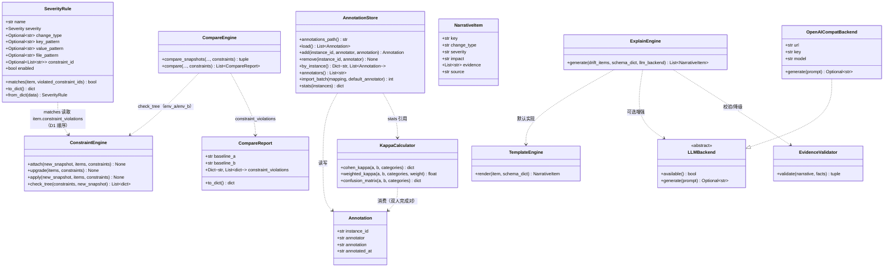
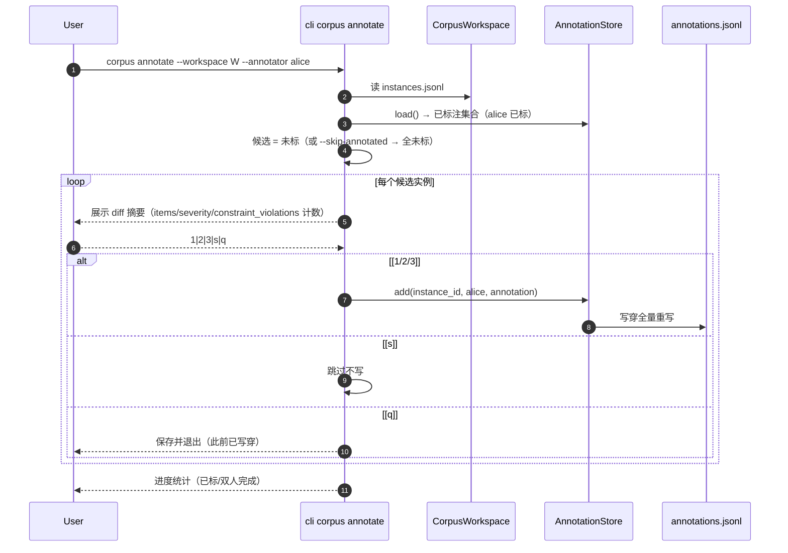
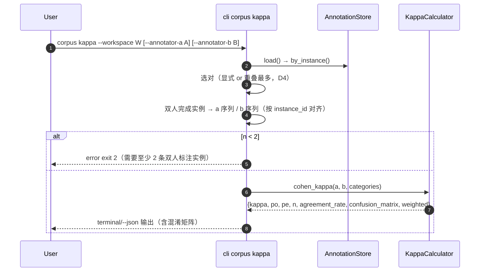
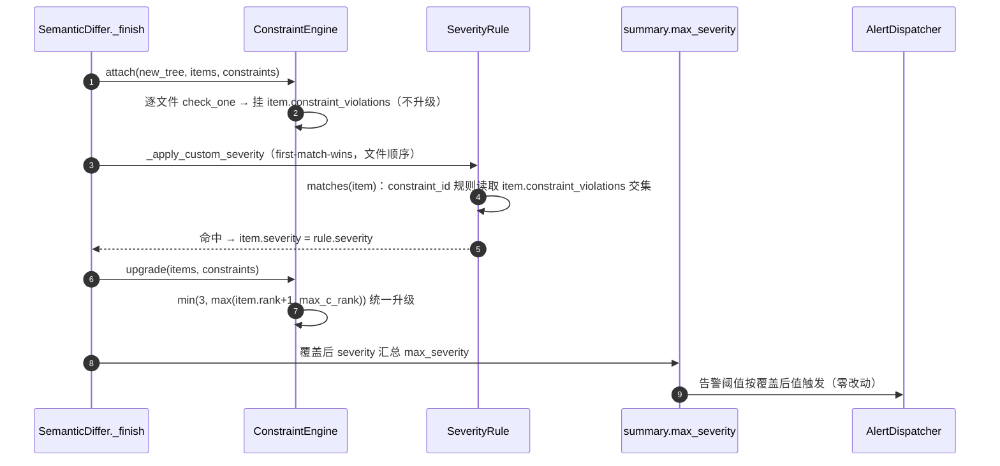
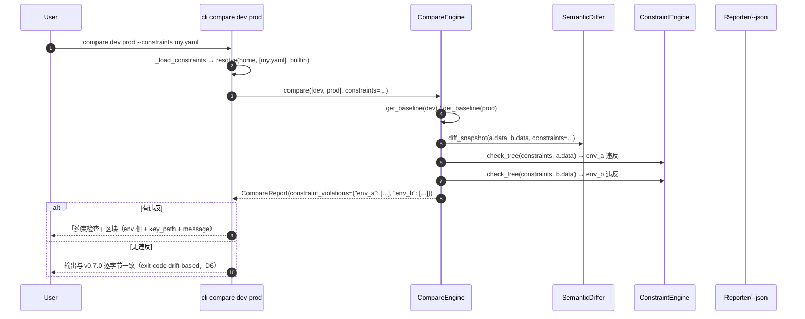
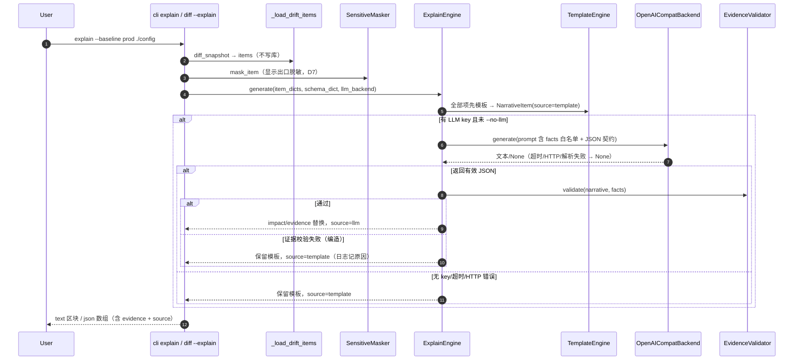
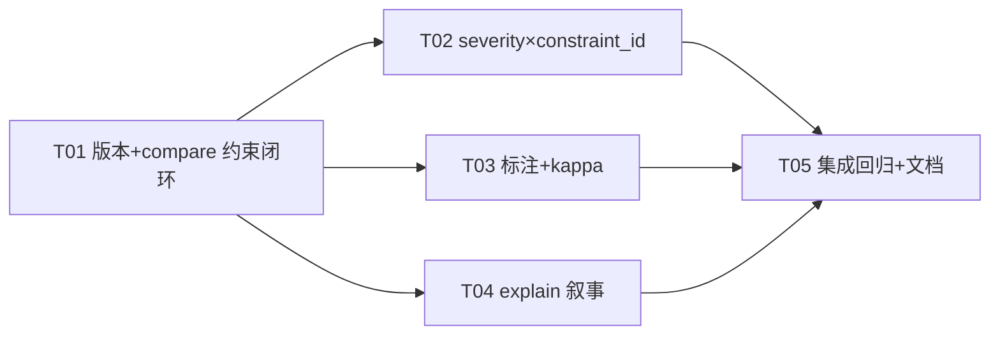

# cfgdrift v0.8.0 增量系统设计 — 双人标注+kappa / severity×constraint_id / compare 约束闭环 / LLM 业务影响叙事

- 版本：v0.8.0（增量）
- 作者：高见远（架构师 / software-architect）
- 状态：待评审 → 转交工程师实现 + QA 测试
- 基线：现有 v0.7.0 代码库（docs/system_design_v070.md；840 passed / 6 skipped；Python 3.8+ 双后端）
- 原则：**基于 v0.7.0 最小变更**；不重设计已稳定部分（解析/语义树/diff/存储/报告/Web/daemon/alert/插件/约束引擎/语料工具链/挖掘）。四项功能全部以**新模块承载 + 既有接口可选参数/条件输出**接入；**core/differ.py 仅调整 `_finish` 内部顺序（行为等价证明见 §1.2.2），不改 diff 遍历逻辑**；版本号三处同步以 T01 为唯一入口。

---

## 0. 决策摘要（PRD 待确认 Q1–Q6 拍板 + 架构师新增决策 D1–D9）

| # | 决策项 | 决策内容 | 来源 |
|---|--------|----------|------|
| Q1 | annotations 存储 | **独立 `annotations.jsonl` + export 合并**（instances.jsonl 由 fetch/export 重导会覆盖，独立存储防丢失；validate 对合并结果仍通过） | Q1 拍板（采纳 PRD 默认） |
| Q2 | kappa 口径 | 标注字段 = `labels.annotation` 3 分类序数（severe/minor/normal）；`corpus kappa` 输出 Cohen's kappa + 一致率 + 样本数；P1 `--weighted linear/quadratic` + 混淆矩阵 | Q2 拍板 |
| Q3 | constraint_id 优先级 | 保持文件顺序 **first-match-wins**；`constraint_id` 仅是额外匹配条件（AND 语义），不引入独立优先级层级；与 key_pattern 等同时命中时按文件顺序；`severity list` 展示命中的 constraint_id | Q3 拍板 |
| Q4 | compare 约束呈现 | 结构化字段 `CompareReport.constraint_violations` + CLI 文本区块 + `--json` 同步输出；**exit code 不因约束违反改变**（保持 0 无差异/1 有差异/2 错误，drift-based） | Q4 拍板 + D6 |
| Q5 | LLM 后端 | P0 仅 OpenAI 兼容 REST（urllib，无 openai 依赖）；**无 key / 超时 / HTTP 错误 / 证据校验失败 四类统一降级模板并标记 `source: template`**；本地模型留 P1 接口扩展 | Q5 拍板 |
| Q6 | explain 与 diff | 独立 `explain` 子命令为主（复用 diff 摘要），`diff --explain` 为同一管线的便捷入口；共享 `ExplainEngine` | Q6 拍板 |
| D1 | `_finish` 顺序调整 | 改为「约束 attach（不升级）→ severity 覆盖（可读 item.constraint_violations）→ 统一升级」；新增 `ConstraintEngine.attach/upgrade` 拆分，保留 `apply`（=attach+upgrade）后向兼容；**证明与 v0.7.0 输出等价**（升级公式 min(3, max(rank+1, max_c_rank)) 关于 item.severity 单调，顺序无关） | 架构师决策 |
| D2 | SeverityRule.constraint_id | 归一化为 `List[str]`；`matches(item, violated_constraint_ids=None)` 可选参数，None 时从 `item.constraint_violations` 推导；`to_dict()` 仅非空时输出（零噪音） | 架构师决策 |
| D3 | 标注唯一事实源 | `annotations.jsonl` 为标注唯一事实源（含全部标注人记录）；export 合并取该实例**最新一条标注**（按 annotated_at 排序，同刻按 annotator 字典序）写入 labels 单槽；多标注细节保留在 annotations.jsonl 供 kappa 使用 | 架构师决策 |
| D4 | kappa 自动配对 | `corpus kappa` 无参时自动选择「重叠样本数最多的标注人对」；`--annotator-a/--annotator-b` 可显式指定；不足 2 人 → exit 2 明确报错 | 架构师决策 |
| D5 | annotate 非交互测试路径 | `--batch FILE`（P1 功能提前到 P0）同时承担批量导入与非交互测试路径（labels.yaml/json：`{instance_id: {annotation, annotator?, note?}}`）；交互循环经 stdin 驱动（click CliRunner 可喂 `input=`） | 架构师决策 |
| D6 | compare exit code | 约束违反为**信息性输出**，不改变 exit code（0/1/2 语义不变）；仅漂移（summary.total>0）驱动 exit 1 | 架构师决策 |
| D7 | explain 脱敏 | explain 是显示出口 → 复用 `SensitiveMasker` 先脱敏再叙事；evidence 与 impact 只含脱敏后值，防敏感值泄漏 | 架构师决策 |
| D8 | 键语义字典 | 内置 24 条键语义（port/tls/image/level/worker_processes/replicas/timeout/retries/keepalive/password/token/cert/protocol/mode/url/max_connections/pool_size/enabled/engine/algorithm/version/tag/log/threads 等）；`explain --schema FILE` 用户字典 merge（用户覆盖内置）；模板按 change_type + 键语义 + 约束违反组合 | 架构师决策 |
| D9 | 版本同步 | `0.8.0 / 0.8.0 / "0.8.0-c"` 三处，仅 T01 修改 | 架构师决策 |

---

## 1. 增量实现方案（四项功能独立小节）

### 1.1 功能 1：corpus 双人标注 + kappa（C-C5，P0）

#### 1.1.1 模块结构（新增 `src/cfgdrift/corpus/annotations.py`）

| 组件 | 职责 |
|------|------|
| `Annotation` dataclass | `instance_id / annotator / annotation / annotated_at` |
| `AnnotationStore` | `annotations.jsonl` 读写（upsert 按 (instance_id, annotator) 去重覆盖）、按实例聚合、导入批表、统计 |
| `KappaCalculator` | 纯函数：Cohen's kappa / 加权 kappa（linear/quadratic）/ 混淆矩阵 / 一致率 |

**annotations.jsonl schema（version 隐含于字段，无头）**：
```json
{"instance_id": "docker-compose-7e20f3b-0", "annotator": "alice", "annotation": "minor", "annotated_at": "2026-08-04T12:00:00Z"}
```
- `annotation` 枚举：`severe | minor | normal`（3 分类序数，Q2）。
- `annotated_at`：ISO 8601 UTC（`utcnow_iso()`，复用 store 的时钟函数）。
- 写入策略：**写穿（write-through）全量重写**（规模 100–300，全量重写足够且幂等）；`add()` 先过滤同 (instance_id, annotator) 旧记录再 append → 同标注人重复标注 = 覆盖（最后写入胜出）。
- 文件缺省 → 空列表；损坏行 → `ValueError`（CLI exit 2，对齐 corpus.yaml/state.json 契约）。

#### 1.1.2 关键 API

```python
@dataclass
class Annotation:
    instance_id: str
    annotator: str
    annotation: str          # severe|minor|normal
    annotated_at: str

class AnnotationStore:
    def __init__(self, workspace: CorpusWorkspace) -> None
    def annotations_path(self) -> str                 # <workspace>/annotations.jsonl
    def load(self) -> List[Annotation]
    def add(self, instance_id: str, annotator: str, annotation: str) -> Annotation  # upsert
    def remove(self, instance_id: str, annotator: str) -> None
    def by_instance(self) -> Dict[str, List[Annotation]]
    def annotators(self) -> List[str]
    def import_batch(self, mapping: Dict[str, dict], default_annotator: Optional[str]) -> int
    def stats(self, instances: List[dict]) -> dict    # 见 §6.3

class KappaCalculator:
    @staticmethod
    def cohen_kappa(a: List[str], b: List[str],
                    categories=("severe", "minor", "normal")) -> dict
        # -> {kappa, po, pe, n, agreement_rate, confusion_matrix,
        #     weighted: {"linear": k, "quadratic": k}}
    @staticmethod
    def weighted_kappa(a, b, categories, weight: str = "linear") -> float
    @staticmethod
    def confusion_matrix(a, b, categories) -> dict    # {cat_a: {cat_b: n}}
```

**Cohen's kappa 公式（口径，§6.2 共享知识）**：
- `po = Σ_i n_ii / n`（观测一致率）；`pe = Σ_i (row_i/n)·(col_i/n)`（期望一致率）。
- `κ = (po − pe) / (1 − pe)`；`1 − pe == 0` 时：`po == 1 → κ=1.0`，否则 `κ=0.0`（对齐 sklearn 行为）。
- 加权：`κw = 1 − Σ w_ij·o_ij / Σ w_ij·e_ij`，`o_ij=n_ij/n`、`e_ij=(row_i·col_j)/n²`；`linear w=|i−j|/(k−1)`、`quadratic w=((i−j)/(k−1))²`。
- `n < 2` 或某侧类别全集为空 → `ValueError`（CLI exit 2，明确提示"需要至少 2 条双人标注实例"）。
- 混淆矩阵行 = 标注人 A、列 = 标注人 B。

#### 1.1.3 CLI 设计

```
cfgdrift corpus annotate --workspace W --annotator NAME
                         [--skip-annotated] [--batch FILE] [--format yaml|json]
cfgdrift corpus kappa    --workspace W [--annotator-a A] [--annotator-b B]
                         [--weighted none|linear|quadratic] [--json]
cfgdrift corpus stats    --workspace W [--json]
```

**annotate 遍历口径（D5）**：
- 默认：遍历「当前标注人（--annotator）尚未标注」的实例（含他人已标但本人未标 → 支持第二人独立标注）。
- `--skip-annotated`：仅遍历「无任何标注」的实例。
- 交互循环：每次展示 diff 摘要（`diff.items` 变更项 + `summary.max_severity` + `constraint_violations` 计数）→ 提示 `[1] severe [2] minor [3] normal [s] 跳过 [q] 保存并退出` → 输入解析；非法输入重提示。
- `[q]` 不写当前实例（此前已保存的写穿落盘，天然保留）；`[s]` 跳过不写。
- `--batch FILE`：labels.yaml/json 形状 `{instance_id: {annotation, annotator?, note?}}`；`annotator` 缺省用 `--annotator`；`note` 记录（P1 预留，annotations.jsonl 本版不落 note，仅日志提示）。

**stats 输出（§6.3 字段）**：实例总数 / 未标注 / 单标注（按人拆分）/ 双人完成 / 一致率 / kappa 可计算数。

#### 1.1.4 export 合并（修改 `corpus/exporter.py`）

- `export()` 在 `_build_instance` 产出 `labels.annotation=None, annotator=None` 后，读取 `AnnotationStore(workspace).load()` 按 instance_id 聚合，取**最新一条**（D3）合并进 labels。
- fetch 路径也调用 export → 自动带上标注 → **重复 export 不丢失标注**（验收标准 2）。
- `CorpusValidator` **零改动**：其只校验 labels 键存在，annotation 非 null 天然合法（§6.3 注明可加枚举校验，P0 不加）。

### 1.2 功能 2：severity 引用 constraint_id（C-13，P0）

#### 1.2.1 SeverityRule 扩展（`core/model.py`）

```python
@dataclass
class SeverityRule:
    name: str
    severity: Severity
    change_type: Optional[str] = None
    key_pattern: Optional[str] = None
    value_pattern: Optional[str] = None
    file_pattern: Optional[str] = None
    constraint_id: Optional[List[str]] = None   # v0.8.0: 新增，归一化 List[str]
    enabled: bool = True

    def matches(self, item: DriftItem,
                violated_constraint_ids: Optional[set] = None) -> bool:
        # ...既有条件不变...
        # v0.8.0: constraint_id 是额外 AND 条件
        if self.constraint_id:
            ids = violated_constraint_ids
            if ids is None:
                ids = {v.get("constraint_id")
                       for v in (getattr(item, "constraint_violations", None) or [])}
            if not (set(self.constraint_id) & ids):
                return False
        return True

    def to_dict(self) -> dict:
        # 仅当 constraint_id 非空时输出 "constraint_id": [...]（零噪音，旧规则字节不变）
    @classmethod
    def from_dict(cls, data):  # str -> [str]；list -> [str]；缺省 None
```

- `__post_init__` 校验：constraint_id 元素必须非空 str；`make_rule` 增参 `constraint_id`（str 或 list，归一化）。
- **签名向后兼容**：`matches(item)` 调用不变（violated_constraint_ids 可选）。

**severity.yaml schema 示例**：
```yaml
version: 1
rules:
  - name: port-range-critical
    enabled: true
    severity: CRITICAL
    constraint_id: http_port_range      # 新增：单个
  - name: tls-critical
    enabled: true
    severity: CRITICAL
    constraint_id: [http_ssl_cert_required, db_ssl_cert_required]  # 列表
  - name: legacy-key-rule
    enabled: true
    severity: WARN
    key_pattern: '.*tls\.enabled'       # 既有：无 constraint_id 行为不变
```

#### 1.2.2 决策管线（`core/differ.py` `_finish` 顺序调整 + `core/constraints.py` 拆分）

**现状**：`_finish` = `_apply_custom_severity`（severity 覆盖，先于约束）→ `apply_constraints`（attach + 升级）→ `_finalize` → `_attach_lines`。

**v0.8.0（D1）**：
```
_finish:
    if constraints:  ConstraintEngine.attach(new_tree, items, constraints)   # 只挂 violation，不升级
    _apply_custom_severity(items, severity_rules)                            # 可读 item.constraint_violations → constraint_id 规则可命中
    if constraints:  ConstraintEngine.upgrade(items, constraints)            # 统一升级一次
    _finalize / _attach_lines
```

- `core/constraints.py`：把 `ConstraintEngine.apply` 拆为 `attach`（逐文件关联挂 violation，原 apply 前半）+ `upgrade`（原 `_upgrade` 循环，需 constraints_by_id）；`apply = attach + upgrade` 保持不变（后向兼容，测试直接调用 apply 不受影响）。
- **行为等价证明（840 不回归的依据）**：v0.7.0 最终 severity = min(3, max(rule_rank+1, max_c_rank))（有规则覆盖）或 min(3, max(default_rank+1, max_c_rank))（无规则）。v0.8.0 中 attach 不改 severity，覆盖后 severity = rule 值，upgrade 同公式 → 结果逐项相同。升级公式关于 item.severity 单调 → 顺序无关。**唯一行为差异**：带 constraint_id 的规则现在能命中（PRD 期望新增），无 constraint_id 规则行为逐字节不变。
- 升级后 `_finalize` 计算 summary.max_severity → 告警阈值/alert 全链路自动取覆盖后值（验收标准 3）。

#### 1.2.3 CLI（`cli.py`）

- `severity add` 新增 `--constraint-id`（multiple，可传多个；或逗号分隔）→ `make_severity_rule(constraint_id=...)`。
- `severity list` 输出追加 `constraint=<ids>`（空则 `-`）。
- `severity remove/enable/disable` 不变（按 name）。

### 1.3 功能 3：compare 跑约束（D10 补全，P0）

#### 1.3.1 CompareEngine / CompareReport 扩展

```python
# core/model.py
@dataclass
class CompareReport:
    ...
    constraint_violations: Dict[str, List[dict]] = field(default_factory=dict)
    # {"env_a": [check_tree dict...], "env_b": [...]}；to_dict 仅非空时输出（零噪音）

# core/compare.py
class CompareEngine:
    def compare_snapshots(self, baseline_a_name, baseline_b_name,
                          snapshot_a, snapshot_b,
                          rules=None, severity_rules=None,
                          old_lines=None, new_lines=None,
                          constraints=None):                    # 新增
        return self._differ.diff_snapshot(snapshot_a, snapshot_b,
                                          rules=rules, severity_rules=severity_rules,
                                          old_lines=old_lines, new_lines=new_lines,
                                          constraints=constraints)

    def compare(self, environments, env_map=None, rules=None,
                severity_rules=None, masker=None,
                constraints=None):                              # 新增
        ...
        items, summary = self.compare_snapshots(..., constraints=constraints)
        violations = {}
        if constraints:
            violations["env_a"] = ConstraintEngine.check_tree(constraints, baseline_a.data)
            violations["env_b"] = ConstraintEngine.check_tree(constraints, baseline_b.data)
        CompareReport(..., constraint_violations=violations)
```

- `check_tree` 已存在（v0.7.0），每条 `{constraint_id, type, message, involved_keys, file, severity}`（severity 直取约束）；env_a 侧即参考环境基线数据（注意语义：env_a = 参考，env_b = 被比较，与 UI 线框一致）。

#### 1.3.2 CLI（`cli.py` `_run_compare` + `compare` 命令 + `diff --compare`）

- `compare` 新增 `--builtin/--no-builtin`（默认 on）与 `--constraints FILE`（repeatable）→ `_load_constraints` → `engine.compare(constraints=...)`。
- `_run_compare` 增参 `constraints`；terminal 渲染在 items 之后、Summary 之前输出「约束检查」区块（**仅非空**）：
  ```
  --- 约束检查 (D10 补全) ---
  [env_b: prod] CRITICAL http_port_range
      key_path: services.web.ports[0]  value: "9090:80"
      message: 端口 9090 超出允许范围 8000-9000
  ```
- `--json`：`rep.to_dict()` 自动带 `constraint_violations`（仅非空）。
- `diff --compare` 路径：diff 命令已有 `--builtin/--constraints`，透传给 `_run_compare`。
- **exit code（D6）**：仍由 `any_drift`（summary.total>0）驱动；违反不改变 exit code。
- 无违反时（默认场景）：无新增区块、无新增 json 键 → 与 v0.7.0 逐字节一致（验收标准 3）。

### 1.4 功能 4：方向 A LLM 业务影响叙事（P0 基础版）

#### 1.4.1 模块结构（新增包 `src/cfgdrift/explain/`）

| 文件 | 职责 |
|------|------|
| `__init__.py` | 空包（版本复用 `cfgdrift.__version__`） |
| `engine.py` | `NarrativeItem` dataclass + `ExplainEngine.generate(drift_items, schema_dict=None, llm_backend=None) -> List[NarrativeItem]`（模板默认 + LLM 增强 + 证据校验降级编排） |
| `templates.py` | `KEY_SEMANTICS`（24 条内置键语义）+ `CHANGE_TEMPLATES`（四类变更模板）+ `TemplateEngine.render(item, schema_dict) -> NarrativeItem`（确定性） |
| `llm.py` | `LLMBackend` 抽象 + `OpenAICompatBackend`（urllib POST，OpenAI chat completions 形状） |
| `validator.py` | `build_facts(drift_items) -> Facts` + `EvidenceValidator.validate(narrative_dict, facts) -> (ok, reasons)` |

**NarrativeItem 输出 JSON schema（P0，每条漂移一项）**：
```json
{
  "key": "services.web.ports[0]",
  "change_type": "modified",
  "severity": "CRITICAL",
  "impact": "服务监听端口从 8080 改为 9090，且暴露端口超出约束 http_port_range(8000-9000) 允许范围，可能导致外部访问中断与安全组策略失配。",
  "evidence": [
    "key: services.web.ports[0]",
    "value: \"8080:80\" -> \"9090:80\"",
    "constraint: http_port_range 违反"
  ],
  "source": "template"
}
```

#### 1.4.2 内置键语义字典（D8，24 条）

| 键模式（正则，大小写不敏感） | 语义描述 |
|---|---|
| `port` | 监听端口 |
| `tls` / `ssl` | 传输安全（TLS/SSL） |
| `image` | 容器镜像 |
| `tag` | 镜像/版本标签 |
| `version` | 软件/配置版本 |
| `level` | 日志级别 |
| `worker_processes` | 工作进程数 |
| `worker_connections` | 单进程最大连接数 |
| `replicas` | 副本数 |
| `timeout` | 超时时间 |
| `retries` | 重试次数 |
| `keepalive` | 连接保活 |
| `max_connections` | 最大连接数 |
| `pool_size` | 连接池大小 |
| `password` / `passwd` | 口令（敏感） |
| `token` / `secret` / `api_key` | 令牌/密钥（敏感） |
| `cert` / `key_path` | 证书与私钥路径 |
| `protocol` | 通信协议 |
| `mode` | 运行模式 |
| `url` / `endpoint` / `host` | 服务地址 |
| `enabled` | 功能开关 |
| `engine` | 存储引擎 |
| `algorithm` | 加密/签名算法 |
| `threads` | 线程数 |
| `log` | 日志配置 |
| `gzip` | 压缩开关 |
| `cookie` / `authorization` / `credential` | 鉴权相关（敏感） |

- 匹配：对 key_path 逐条正则 `re.search`，**首条命中**（字典顺序即优先级，`port` 放前）。
- `explain --schema FILE`：YAML `{patterns: {regex: 描述}}`，merge 后用户条目覆盖内置同 regex。

#### 1.4.3 模板生成逻辑（`TemplateEngine`，确定性）

- 按 change_type 套主句：`modified` = 「{语义} 从 {old} 改为 {new}」；`added` = 「新增{语义}（值 {new}）」；`removed` = 「移除{语义}（原值 {old}）」；`type_changed` = 「{语义} 类型由 {old_type} 变为 {new_type}（{old} → {new}）」。
- 影响后缀组合：
  1. **约束违反**（优先）：「且违反约束 {cid}（{message 摘要}），可能导致{语义相关风险}」。
  2. 值特判：`image`/`tag` 且 new 含 `latest` → 「使用 latest 标签可能导致部署不可复现、升级不受控」。
  3. severity 兜底：CRITICAL → 「可能导致服务不可用或安全风险，需立即确认」；WARN → 「可能影响运行稳定性，建议确认」；INFO → 「属于常规变更，影响有限」；NONE → 「无显著影响」。
- **确定性**：同输入必同输出；evidence 恒为输入事实字符串（key/value/constraint 三型，见 §6.5）。
- 模板不引入输入之外的值；敏感键（D7）先经 `SensitiveMasker.mask_item` 脱敏再渲染（值显示 `******`）。

#### 1.4.4 LLM 后端与证据校验（`llm.py` + `validator.py`）

- `OpenAICompatBackend`：env `CFGDRIFT_LLM_URL`（默认 `https://api.openai.com/v1/chat/completions`）/ `CFGDRIFT_LLM_KEY` / `CFGDRIFT_LLM_MODEL`（默认 `gpt-4o-mini`）/ `CFGDRIFT_LLM_TIMEOUT`（默认 10s）。POST `{model, messages:[{role:system,content:...},{role:user,content:...}], temperature:0}`；解析 `choices[0].message.content` 为 JSON。
- `build_facts(drift_items)` → Facts = 每项 `{key_path, old_value, new_value, change_type, severity, constraints:[cid...]}`。
- `EvidenceValidator.validate(narrative_dict, facts)`：
  1. `evidence` 非空且每元素 ∈ 该 item 的**允许证据串集合**（`key: <key_path>` / `value: <old> -> <new>` / `constraint: <cid> 违反`，均取自输入事实，脱敏后值）；
  2. `impact` 或 `evidence` 中出现的 constraint_id 必须 ∈ facts.constraints；
  3. 出现任何 facts 之外的 key_path 形态 token（正则 `[\w.\-\[\]]+` 且含 `.` 或 `[`）→ 判定编造。
  - 任一不满足 → `(False, reasons)`。
- `ExplainEngine.generate` 编排（P0 双路径）：
  1. 全部项先走模板 → `source: template`；
  2. 若 `llm_backend` 可用（有 key）且未 `--no-llm`：构造提示词（含 facts 白名单 + 输出 JSON 契约）→ 调 LLM → 解析 → **逐项证据校验** → 通过则替换 impact/evidence 并置 `source: llm`；
  3. 失败（无 key / 超时 / HTTP 错误 / JSON 解析失败 / 证据校验失败）→ 保留模板并 `source: template`（日志记原因，不报错）。

#### 1.4.5 CLI 接线（`cli.py`）

```
cfgdrift explain PATH --baseline B [--format text|json] [--schema FILE]
                      [--llm/--no-llm] [--builtin/--no-builtin]
                      [--constraints FILE] [--sensitive-keys ...] [--no-line]
```

- 新增只读辅助 `_load_drift_items(ctx, path, fmt, baseline_name, constraints) -> List[DriftItem]`：开 store → scanner → diff_snapshot（不写库）→ 关 store；explain 与 `diff --explain` 共用。
- `explain`：取 items → `SensitiveMasker` 脱敏 → `ExplainEngine.generate([it.to_dict() for it in items], schema_dict, llm_backend)` → `--format text`（§4.3 线框样式）或 `--format json`（`{"code":0,"data":[...],"message":"ok"}`）。
- `diff --explain`：`_perform_scan` 增可选 `explain: bool = False`；正常渲染 terminal 后追加「漂移业务影响分析」区块（同一管线）。exit code 与既有 diff 一致（不因 explain 改变）。
- 默认 LLM 策略：`CFGDRIFT_LLM_KEY` 存在 → 尝试 LLM；否则纯模板（离线可用，验收标准 2）。

### 1.5 版本规划与依赖

- 三处同步（D9）：`__init__.py` → `0.8.0`；`pyproject.toml` → `0.8.0`；`src/csrc/parser_core.c` `version()` → `"0.8.0-c"`。
- **无新增第三方依赖**：kappa 纯 Python；LLM 用 `urllib.request`（stdlib）；YAML 复用既有 PyYAML；交互输入用 click（既有）。

---

## 2. 文件列表（变更清单）

> 源文件 **24 个**（新增 10 + 修改 14），版本同步 3 个，测试 6 个，示例 2 个，文档 1 个。**不改动**：core/{parser,pure_parsers,lines,masker,htmlreport,plugins,reporter}.py、scanner/、rules/{ignore,constraints,mining}.py、storage/、alert/*、daemon/*、web/*、corpus/{config,workspace,fetcher,validator}.py。

| 文件 | 状态 | 职责 |
|------|------|------|
| `src/cfgdrift/corpus/annotations.py` | 新增 | `Annotation` + `AnnotationStore`（annotations.jsonl 读写/upsert/批量导入/统计）+ `KappaCalculator`（Cohen's kappa/加权/混淆矩阵） |
| `src/cfgdrift/explain/__init__.py` | 新增 | explain 包 |
| `src/cfgdrift/explain/engine.py` | 新增 | `NarrativeItem` + `ExplainEngine.generate`（模板/LLM 双路径 + 证据校验降级编排） |
| `src/cfgdrift/explain/templates.py` | 新增 | `KEY_SEMANTICS`（24 条）+ `CHANGE_TEMPLATES` + `TemplateEngine`（确定性叙事） |
| `src/cfgdrift/explain/llm.py` | 新增 | `LLMBackend` 抽象 + `OpenAICompatBackend`（urllib） |
| `src/cfgdrift/explain/validator.py` | 新增 | `build_facts` + `EvidenceValidator`（防幻觉） |
| `src/cfgdrift/core/model.py` | 修改 | `SeverityRule.constraint_id`（from_dict/to_dict/matches 扩展）；`CompareReport.constraint_violations`（to_dict 仅非空） |
| `src/cfgdrift/core/constraints.py` | 修改 | `ConstraintEngine.apply` 拆分为 `attach` + `upgrade`（apply 保持 = attach+upgrade） |
| `src/cfgdrift/core/differ.py` | 修改 | `_finish` 顺序：attach → severity 覆盖 → upgrade（行为等价 D1） |
| `src/cfgdrift/core/compare.py` | 修改 | `compare_snapshots`/`compare` 增 `constraints` 参数 + 对 env_a/env_b `check_tree` 组装 `constraint_violations` |
| `src/cfgdrift/rules/severity.py` | 修改 | `make_rule` 增 `constraint_id` |
| `src/cfgdrift/corpus/exporter.py` | 修改 | `export` 读 annotations.jsonl 合并 labels（D3 最新一条） |
| `src/cfgdrift/cli.py` | 修改 | `compare --builtin/--constraints`；`severity add --constraint-id` + `severity list` 展示；`corpus annotate/kappa/stats`；`explain` 命令；`diff --explain`；`_load_drift_items` 辅助 |
| `src/cfgdrift/__init__.py` | 修改 | `__version__ = "0.8.0"` |
| `pyproject.toml` | 修改 | `version = "0.8.0"` |
| `src/csrc/parser_core.c` | 修改 | `version()` → `"0.8.0-c"` |
| `tests/test_annotations.py` | 新增 | AnnotationStore upsert/导入/损坏文件 + stats 口径 |
| `tests/test_kappa.py` | 新增 | Cohen's kappa 公式（已知答案用例）+ 加权 linear/quadratic + 混淆矩阵 + 边缘（pe==1、n<2） |
| `tests/test_compare_constraints.py` | 新增 | compare 约束检查（env 侧拆分/零噪音/exit code 不变/--json 字段）+ CLI 透传 |
| `tests/test_severity_constraint_id.py` | 新增 | SeverityRule.constraint_id 匹配 + `_finish` 管线（覆盖后升级）+ 与 v0.7.0 等价性（无 constraint_id 时逐字节一致）+ severity add/list |
| `tests/test_explain.py` | 新增 | 模板确定性 + evidence⊆facts + LLM 编造回退 + 四类降级 + CLI text/json + diff --explain |
| `tests/test_corpus_annotate_cli.py` | 新增 | annotate 交互（CliRunner stdin）+ --batch 非交互 + export 合并 + 重复 export 不丢标注 + kappa/stats CLI |
| `examples/annotations.jsonl.example` | 新增 | annotations.jsonl 模板 |
| `examples/explain_schema.yaml.example` | 新增 | 用户键语义字典模板 |
| `README.md` | 修改 | 四项功能说明 + schema 摘要 |

---

## 3. 类图 / 接口（Mermaid，简要）



---

## 4. 时序图（Mermaid，简要）

### 4.1 corpus annotate 交互流程



### 4.2 corpus kappa 计算流程



### 4.3 severity × constraint_id 联动管线



### 4.4 compare 约束检查流程



### 4.5 explain 模板 / LLM 双路径



---

## 5. 增量任务列表（≤5 任务，按实现顺序）

| 任务号 | 任务名 | 依赖 | 优先级 | 验收标准 |
|--------|--------|------|--------|----------|
| T01 | 基础设施：版本 v0.8.0 + compare 约束闭环（D10） | 无 | P0 | 版本三处同步 `0.8.0 / 0.8.0 / 0.8.0-c`；`core/model.py` `CompareReport.constraint_violations: Dict[str,List[dict]]`（to_dict 仅非空）；`core/compare.py` `compare_snapshots`/`compare` 增 `constraints` 参数 + env_a/env_b `check_tree` 组装；`cli.py` `compare --builtin/--no-builtin` + `--constraints` 透传（`diff --compare` 同步）；terminal「约束检查」区块仅非空渲染；**exit code 保持 drift-based（D6）**；无违反时输出与 v0.7.0 逐字节一致；`test_compare_constraints.py` 全绿；**既有 840 passed / 6 skipped 不回归** |
| T02 | severity 引用 constraint_id（C-13） | T01 | P0 | `SeverityRule.constraint_id`（str/list 归一化 + `matches(item, violated_constraint_ids=None)` 可选参数 + from_dict/to_dict 零噪音）；`core/constraints.py` `apply` 拆 `attach`/`upgrade`（apply 语义不变）；`core/differ.py` `_finish` 顺序 attach → 覆盖 → upgrade；**无 constraint_id 规则时与 v0.7.0 逐字节一致（等价性证明 §1.2.2）**；severity.yaml 配 `constraint_id: http_port_range → CRITICAL` 后 scan/diff 违反项输出 CRITICAL 且 max_severity/告警链路生效；`severity add --constraint-id` + `severity list` 展示；`test_severity_constraint_id.py` 全绿 |
| T03 | corpus 双人标注 + kappa（C-C5） | T01 | P0 | `corpus/annotations.py`（AnnotationStore upsert/import_batch/stats + KappaCalculator 公式/加权/混淆矩阵/边缘）；`corpus annotate` 交互（[1]/[2]/[3]/[s]/[q]）+ `--annotator` + `--skip-annotated` + `--batch` 非交互路径（D5）；`corpus kappa`（自动配对 D4 + `--weighted` + `--json`）；`corpus stats`；`corpus/exporter.py` export 合并 labels（D3 最新一条）；**重复 export 不丢失标注**；30 实例双人标注后 kappa n=30、stats 双人完成=30；`test_annotations.py`/`test_kappa.py`/`test_corpus_annotate_cli.py` 全绿 |
| T04 | explain 业务影响叙事（方向 A） | T01 | P0 | `explain/` 包（engine/templates/llm/validator）；内置 24 条键语义字典 + 四类变更模板（确定性）；`EvidenceValidator`（evidence⊆facts / constraint_id 白名单 / 编造 key 检测）；四类降级（无 key/超时/HTTP/校验失败 → template + source）；`explain --format text|json` + `diff --explain` 共享管线；`--schema` 用户字典 merge；显示出口脱敏（D7）；真实漂移每条非空 impact+evidence 且无编造（脚本校验）；离线可用；`test_explain.py` 全绿 |
| T05 | 集成回归 + 文档 | T01, T02, T03, T04 | P0 | `README.md` 四项功能说明；`examples/annotations.jsonl.example` + `examples/explain_schema.yaml.example`；跨功能联调：compare 约束违反 → explain 叙事含约束证据、severity 覆盖 → explain severity 取覆盖后值；**全量回归：840 + 全部新增测试全绿（Python 3.8+ 双后端）**；无新增第三方依赖 |

**并行度与合并顺序**：T01 为公共地基（版本 + compare + model 扩展）；T02/T03/T04 均只依赖 T01，**可并行开发**（文件交集仅 `cli.py`，各任务只增量追加自己的 group/选项，按 T01 → T02 → T03 → T04 顺序合并避免冲突）；T05 为聚合任务（集成回归）。`core/model.py` 由 T01（CompareReport）与 T02（SeverityRule）共改 → 合并顺序 T01 先行，T02 在其后追加字段。



---

## 6. 共享知识（跨文件约定，仅变更部分）

### 6.1 annotations.jsonl schema

- 每行一个 JSON 对象：`{instance_id: str, annotator: str, annotation: "severe"|"minor"|"normal", annotated_at: ISO8601 UTC}`。
- `instance_id` 与 instances.jsonl 的 `instance_id` 一致；`annotation` 非法值 → `ValueError`（exit 2）。
- 文件缺省 = 空；损坏行 = exit 2；同 (instance_id, annotator) 重复写 = 覆盖（最后写入胜出）。
- **唯一事实源**：标注细节（多标注人记录）只存于此；instances.jsonl 的 labels 是 export 合并的投影（D3）。

### 6.2 Cohen's kappa 口径

- 3 分类序数：severe/minor/normal（类别序 = 0/1/2）。
- `po = Σ n_ii / n`；`pe = Σ (row_i·col_i) / n²`；`κ = (po − pe)/(1 − pe)`。
- 边缘：`1 − pe == 0` → `κ = 1.0 if po == 1 else 0.0`；`n < 2` → 报错。
- 加权：`κw = 1 − Σw·o / Σw·e`；linear `|i−j|/(k−1)`、quadratic `((i−j)/(k−1))²`；`--weighted none` 只输出 Cohen's kappa。
- 混淆矩阵：行 = annotator-a、列 = annotator-b；无参时自动配对 = 重叠样本数最多的对（D4）。

### 6.3 corpus stats 字段

```json
{"instances": 112, "unannotated": 40,
 "single": {"annotator1": 42, "annotator2": 0},
 "double": 30, "agreement_rate": 0.867,
 "kappa_ready": 30}
```

- `single` 按标注人拆分；`double` = 至少两名不同标注人完成的实例数；`agreement_rate` = 双人完成实例中最新两条标注一致的比例；`kappa_ready` = 可参与 kappa 的实例数（= double）。

### 6.4 SeverityRule.constraint_id schema + 管线顺序

- severity.yaml 规则可带 `constraint_id: <str>` 或 `constraint_id: [<str>, ...]`（归一化 `List[str]`）；与 change_type/key_pattern/value_pattern/file_pattern **AND** 语义；多条件规则命中需全部满足。
- `matches(item, violated_constraint_ids=None)`：None 时从 `item.constraint_violations[].constraint_id` 推导。
- **管线顺序（D1）**：约束 attach（只挂不升）→ severity 覆盖（first-match-wins，文件顺序）→ 统一升级 `min(3, max(item.rank+1, max_c_rank))` → summary.max_severity → 告警阈值。**与 v0.7.0 输出等价**（无 constraint_id 规则时逐字节一致）。
- `to_dict` 仅当 constraint_id 非空时输出该键（旧规则 yaml 字节不变）。

### 6.5 CompareReport.constraint_violations 结构

- `{"env_a": [dict...], "env_b": [dict...]}`；每个 dict 为 `check_tree` 输出形状 `{constraint_id, type, message, involved_keys, file, severity}`（severity 直取约束自身）。
- env_a = 参考环境基线（environments[0]），env_b = 被比较环境。
- `to_dict()` 仅非空时输出该键；CLI 区块仅非空渲染；exit code 不因违反改变（D6）。

### 6.6 explain 输出 JSON schema + 键语义字典 + evidence 校验规则

- NarrativeItem（每条漂移一项）：`{key, change_type, severity, impact, evidence[], source}`；`source ∈ template|llm`。
- evidence 三型（全部取自输入事实，脱敏后值）：`key: <key_path>` / `value: <old> -> <new>` / `constraint: <cid> 违反`。
- 内置键语义字典 24 条（§1.4.2），正则首条命中；`explain --schema` 用户条目覆盖内置。
- 证据校验规则：evidence 非空且 ⊆ 该 item 允许证据串集合；impact/evidence 中 constraint_id ∈ facts.constraints；出现 facts 外 key_path 形态 token → 判编造 → 回退模板。
- 降级四类：无 key / 超时 / HTTP 错误 / 证据校验失败 → `source: template`（不报错，日志记原因）。
- **explain 是显示出口**：先 `SensitiveMasker.mask_item` 再叙事（D7）；`--format text|json`；`diff --explain` 复用同一管线。

### 6.7 版本三处同步

- `src/cfgdrift/__init__.py` `__version__ = "0.8.0"`；`pyproject.toml` `version = "0.8.0"`；`src/csrc/parser_core.c` `version()` → `"0.8.0-c"`（仅 T01 改）。

### 6.8 零噪音与回归保护

- compare 无违反 / severity 无 constraint_id 规则 / labels 无标注：均不出现新字段/新区块（与 v0.7.0 逐字节一致）。
- `_finish` 顺序调整经等价性证明（§1.2.2）；`ConstraintEngine.apply` 保留（attach+upgrade）供既有测试直接调用。
- 840 回归保护：既有测试不传 `--constraints` 到 compare（默认空 → 无违反区块）；severity 既有规则无 constraint_id → matches 行为不变；corpus 既有 export 在无 annotations.jsonl 时 labels 仍为 null。

### 6.9 其他约定

- `_load_drift_items`（explain/diff --explain 共用）只读不写库；explain 不产生 scan 记录、不改 exit code。
- `annotate --batch` 形状 `{instance_id: {annotation, annotator?, note?}}`（yaml/json 均可，`--format` 显式指定，缺省按扩展名猜）。
- kappa/stats 的实例清单来自 instances.jsonl（`instance_id` 全集）；annotations 中出现但 instances 中不存在的 instance_id → 忽略并 warning（防孤儿标注污染统计）。

---

## 7. 待明确事项（Q1–Q6 结论 + 新增决策）

| # | 问题 | 结论 |
|---|------|------|
| Q1 | annotations 存储？ | 独立 `annotations.jsonl` + export 合并（D3） |
| Q2 | kappa 口径？ | `labels.annotation` 3 分类（severe/minor/normal）；Cohen's kappa；P1 `--weighted` |
| Q3 | constraint_id 优先级？ | 文件顺序 first-match-wins；constraint_id 是 AND 附加条件 |
| Q4 | compare 违反呈现？ | 结构化字段 + CLI 区块 + --json；exit code 不变（D6） |
| Q5 | LLM 后端与降级？ | P0 仅 OpenAI 兼容 REST；四类降级统一 template + source |
| Q6 | explain 与 diff？ | 独立 explain 为主 + diff --explain 便捷入口，共享 ExplainEngine |

实现期假设（低风险，工程师可直接采用，QA 可据此设计用例）：

1. **`_finish` 顺序调整的行为等价性**已证明（升级公式单调，顺序无关）；若 QA 发现任何"无 constraint_id 规则但输出变化"的用例，视为实现缺陷（不是设计变更）。
2. annotate 交互测试两条路径都可用：`--batch`（推荐，CI）与 click CliRunner `input=` 喂 stdin；不得依赖 TTY。
3. `--batch` 本为 P1（C5-P1-1），提前到 P0 承担非交互测试路径（D5），不增加额外工作量（复用 AnnotationStore.import_batch）。
4. kappa 的"标注人"= annotations.jsonl 中的 `annotator` 字段值；同一 annotator 对同一实例的最新标注生效（upsert 语义）。
5. compare 的约束检查对 env_a/env_b 基线 data 各跑一次 `check_tree`；违反为信息性，不改 exit code（D6）；若后续产品要求违反驱动 exit 1，属独立变更。
6. explain 的 LLM 输出契约：必须返回 JSON 数组 `[{key, impact, evidence[]}]`；evidence 校验失败即回退模板，绝不部分采用 LLM 结果。
7. explain 默认 LLM 策略 = `CFGDRIFT_LLM_KEY` 存在即尝试；`--no-llm` 强制模板（离线确定性）；CI 一律 `--no-llm` 或未设 key。
8. `corpus stats`/`kappa` 依赖 instances.jsonl 存在；缺失 → exit 2 明确报错。
9. 版本号三处同步以 T01 为唯一入口；后续任务不得再改版本号。
10. 新增模块均保持"core 不反向依赖 storage/web/rules"的既有依赖方向：explain 只依赖 core.model 数据结构（dict），corpus/annotations 只依赖 workspace + json/yaml。
