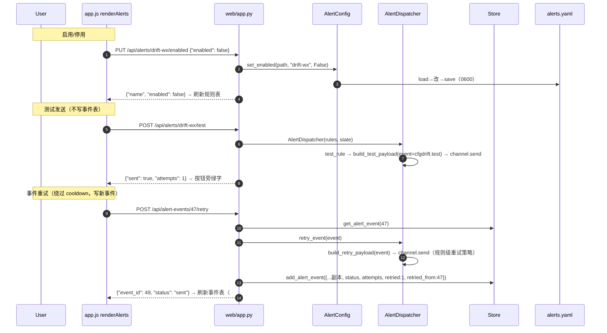
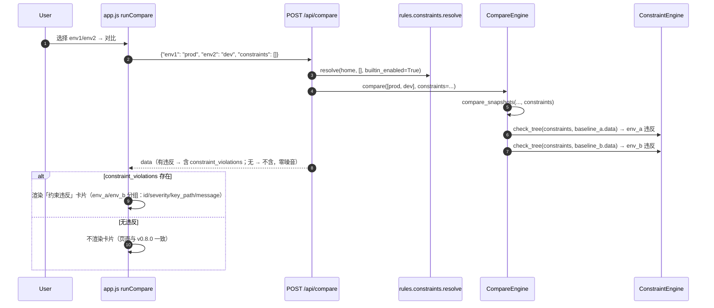
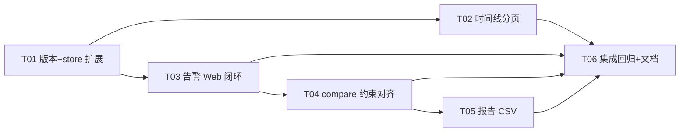

# cfgdrift v0.9.0 增量系统设计 — 时间线分页 / 告警 Web 闭环 / Web compare 对齐 CLI / 报告导出 CSV

- 版本：v0.9.0（增量）
- 作者：高见远（架构师 / software-architect）
- 状态：待评审 → 转交工程师实现 + QA 测试
- 基线：现有 v0.8.0 代码库（883 test_*；Python 3.8+ 双后端；9 个 Web 视图 + 3 通道告警 + corpus/约束/explain 全链路）
- 原则：**基于 v0.8.0 最小变更**；不重设计已稳定部分。四项 P0 全部以「既有接口可选参数/新方法/新渲染函数」增量接入；**不新增第三方依赖**（CSV 用 stdlib `csv`，前端保持原生 JS）；**零噪音契约**——`diff`/`scan` 输出与既有 API 响应不因本次改动变化（除非 P0 明确要求）。

---

## 0. 决策摘要（PRD 待确认 Q1–Q3 拍板 + 架构师新增决策 D1–D8）

| # | 决策项 | 决策内容 | 来源 |
|---|--------|----------|------|
| Q1 | 告警重试记录口径 | **绕过 cooldown 投递 + 写一条新事件（`retried=true`）+ 原事件保留**；新增 `retried` / `retried_from` 两列承载（审计链完整、不重复计数） | Q1 拍板（采纳 PRD 默认）+ D4 |
| Q2 | 时间线搜索字段范围 | P0 仅扫描元数据（scan_id / 基线名 / mode）模糊匹配；**key_path 全文检索留 P1** 再评估索引 | Q2 拍板（采纳 PRD 默认） |
| Q3 | 告警静默载体与粒度 | 属 P1-3，本版不实现；采纳 PRD 默认：规则级 `mute_until` 窗口（daemon 跳过、不产生事件）+ 事件级 ack（仅展示语义），窗口到期自动恢复，不引入定时清理任务 | Q3 拍板（P1 范围） |
| D1 | 分页参数约定 | 沿用既有 `limit`/`offset`（与 `alert-events` / `constraint-events` 一致），**不引入** `page/page_size`；`limit` 钳制到 [1,500]、`offset ≥ 0` | 架构师决策 |
| D2 | `/api/scans` 响应形状 | `{"scans": [与 list_scans 相同的紧凑 dict], "total": N}`；`q` 的 LIKE 元字符（`\` `%` `_`）先转义再模糊匹配，避免用户输入意外通配 | 架构师决策 |
| D3 | CSV 渲染唯一入口 | 新增 `core/csvreport.py::CsvReporter.render_csv(data)`；CLI `report --csv` 与 Web `GET /api/reports/{id}/csv` 共用同一函数；UTF-8 BOM + `\r\n`；`masked:true` 项的值单元格追加 `(已脱敏)` 标记（与 HTML/JSON 口径一致）；约束违反 id 以 `;` 分隔 | 架构师决策 |
| D4 | 重试投递实现 | 重试不校验规则 enabled/baseline/severity 阈值、不读 `alert_state.json` cooldown、不写 cooldown；用事件行元数据重建 payload（`alert/models.py::build_retry_payload`），走通道 `_send_with_retry`（规则级重试策略生效）；新事件 `retried=1, retried_from=原 id` | 架构师决策 |
| D5 | Web compare 约束来源 | `/api/compare` 请求体新增可选 `constraints: [文件路径...]`（等价 CLI `--constraints`，缺省 `[]`）；约束解析统一走 `rules.constraints.resolve(home, constraints, builtin_enabled=True)` | 架构师决策 |
| D6 | 告警启停单写路径 | CLI `alert enable/disable` 与 Web `PUT /api/alerts/{name}/enabled` 共用 `AlertConfig.set_enabled`（load→改→save，镜像 `SeverityConfig.set_enabled` 风格） | 架构师决策 |
| D7 | 零噪音 | compare 无违反时响应不出现 `constraint_violations` 键、前端不渲染卡片；CSV 无漂移项时输出仅表头；既有 9 个视图与全部既有 API 不动 | 架构师决策 |
| D8 | 版本同步 | `0.9.0 / 0.9.0 / "0.9.0-c"` 三处，仅 T01 修改 | 架构师决策 |

---

## 1. 增量实现方案（四项 P0 独立小节）

### 1.1 P0-1 时间线视图增强：搜索 / 筛选 / 分页

**现状缺口**：时间线视图（`renderTimeline`）直接复用 `/api/overview` 的 `timeline`（最近 50 条），无搜索/筛选/分页；store 仅有 `list_scans(limit=50)`。

**方案**（FastAPI + 原生 JS，无新依赖）：

1. **store 层**（`storage/store.py`）新增 `list_scans_paged(q=None, severity=None, mode=None, limit=50, offset=0) -> {"scans": [...], "total": N}`：
   - `q`：`LIKE '%q%'`（转义元字符后），匹配三字段之一——`CAST(s.id AS TEXT)`、`s.mode`、`b.name`（`LEFT JOIN baselines b ON b.id = s.baseline_id`）；大小写不敏感（`LOWER` 两侧）。
   - `severity`：`s.max_severity = ?`；`mode`：`s.mode = ?`。
   - 排序沿用 `ORDER BY s.id DESC`（现有 list_scans 口径）；`LIMIT ? OFFSET ?` + `COUNT(*)` 两查询。
   - 返回的扫描 dict 与 `list_scans` **逐字段一致**（复用其组装逻辑，抽私有 `_scan_row_to_dict`），保证前端兼容。
   - **不动** `list_scans(limit=50)`（/api/overview 与 daemon status 依赖，保回归）。
2. **索引**：`_SCHEMA` 追加 `idx_scans_severity ON scans(max_severity)`、`idx_scans_mode ON scans(mode)`（`CREATE INDEX IF NOT EXISTS`，幂等）；`id` 为主键天然覆盖 `ORDER BY id DESC`。daemon 60s 扫描年量级 ~50 万行，单列索引 + 本地 SQLite 足够。
3. **API**（`web/app.py`）：新增 `GET /api/scans`，参数 `q` / `severity` / `mode` / `limit` / `offset`，`limit` 钳制 `[1,500]`、`offset ≥ 0`。
4. **前端**（`static/app.js`）：
   - 模块级 `const timelineState = { q: "", severity: "", mode: "", page: 0 }`（模块只加载一次 → 视图切换后状态天然保留，验收④）。
   - `renderTimeline` 改为：搜索框 + 严重度下拉（全部/CRITICAL/WARN/INFO/NONE）+ 模式下拉（全部/daemon/watch/manual）+ 分页表格；每行可点击 → 跳报告视图（`reportPreselect` 机制，见 §1.4）。
   - 空态：`scans.length === 0` → 「无匹配扫描」提示（验收⑤），不做抛错。
   - 概览视图仍走 `/api/overview`，不受影响。

### 1.2 P0-2 告警规则 Web 操作闭环：启用 / 停用 / 测试发送 / 重试

**现状缺口（PM 侦察确认）**：`AlertConfig` 无 `set_enabled`；CLI 无 `alert enable/disable`；Web 无操作端点；`alert_events` 表无 retried 标记。

**方案**：

1. **`alert/config.py`**：新增 `AlertConfig.set_enabled(path, name, enabled)`——load→按 name 找→置 `rule.enabled`→save；未找到 `raise ValueError`（镜像 `SeverityConfig.set_enabled`，D6）。
2. **CLI**（`cli.py`）：`alert group` 新增 `enable NAME` / `disable NAME` 两个子命令（与 `constraint enable/disable`、`severity enable/disable` 同风格），调 `AlertConfig.set_enabled`；成功输出 `alert rule %r enabled/disabled`，失败经 `ValueError` → exit 2。
3. **`alert/models.py`**：新增 `build_retry_payload(event, version)`——从事件行重建投递 payload（`event=cfgdrift.drift`、severity/baseline/target/drift_count 原样、`drift_items=[]`、summary 重写）。重试不携带原值，天然无敏感泄漏。
4. **`alert/dispatcher.py`**：新增 `retry_event(event) -> DispatchResult`——按 `event["rule"]` 从 rules 解析规则（缺失 → `raise ValueError`），`build_channel` + 规则级 `effective_retry` + `retry_with_backoff` 直接投递；**不触碰** cooldown 状态、不校验阈值、不写事件（事件由调用方写，D4）。
5. **`storage/store.py`**：
   - `alert_events` 表增列 `retried INTEGER NOT NULL DEFAULT 0`、`retried_from INTEGER`（`_SCHEMA` 建表语句同步 + `init_schema` 内 `PRAGMA table_info` 守卫的 ALTER 迁移，镜像 v0.4.0 `line_maps` 模式）。
   - `add_alert_event` INSERT 补两列。
   - 新增 `get_alert_event(event_id) -> dict`（缺失 `raise ValueError`）。
   - `list_alert_events` 返回 `dict(r)` 自动带新列（前端据此渲染「重试」徽标）。
6. **API**（`web/app.py`）：
   - `PUT /api/alerts/{name}/enabled` body `{"enabled": bool}` → `AlertConfig.set_enabled` → `{"name", "enabled"}`；未找到 → 404。
   - `POST /api/alerts/{name}/test` → 构造 `AlertStateStore` + `AlertDispatcher`（**不设 event_sink**，保证不写事件表）→ `test_rule`（event=cfgdrift.test）→ `{sent, attempts, error}`；同步返回，按钮旁即时反馈。
   - `POST /api/alert-events/{id}/retry` → `store.get_alert_event`（404）→ 解析 rule → `dispatcher.retry_event` → `store.add_alert_event({...事件行副本..., status: sent/failed, attempts, error, retried: 1, retried_from: id})` → `{event_id, status, sent, error}`。
7. **前端**（`static/app.js` renderAlerts）：
   - 规则表加「操作」列：启用/停用切换按钮（PUT）+「测试发送」按钮（POST，按钮旁绿字「已发送 cfgdrift.test」/ 红字错误）。
   - 事件表 failed 行加「重试」按钮（POST retry）；`retried` 行显示「重试」徽标；操作后刷新事件表。

### 1.3 P0-3 Web 环境对比对齐 CLI 约束检查

**现状缺口（PM 侦察确认）**：`CompareEngine.compare` 已支持 `constraints`（v0.8.0 D10），但 Web `/api/compare` 未传入 → Web 结果无约束违反区块。

**方案**：

1. **`web/app.py` `/api/compare`**：请求体新增可选 `constraints: List[str]`（文件路径，等价 CLI `--constraints`）；解析统一走 `rules.constraints.resolve(home, body_constraints, builtin_enabled=True)`（D5）；`engine.compare(..., constraints=constraints)`。响应已含 `CompareReport.to_dict()` 的 `constraint_violations`（**仅非空时输出**，零噪音）；`snippet_root` 注入逻辑不动。
2. **前端**（`static/app.js` runCompare / renderCompareResult）：
   - 请求体透传 `constraints: []`（本版不暴露自定义文件选择 UI——复用默认库即可满足验收①；自定义文件路径留作 API 扩展能力）。
   - `renderCompareResult` 新增「约束违反」卡片：有 `data.constraint_violations` 才渲染；按 `env_a` / `env_b` 分组（标题 `[env_a: {baseline_a}]` / `[env_b: {baseline_b}]`），每违反渲染 约束 id、severity 徽标、`key_path`（`involved_keys` 逗号拼接）、message。
   - item 级违反沿用既有 `constraintCell`（`constraint_violations` 列，零改动）。
   - 无违反时 `constraint_violations` 键缺失 → 不渲染卡片（验收③，与 v0.8.0 页面一致）。
   - 违反信息不改变漂移统计与布局（卡片插在统计/柱状图之后、表格之前）。

### 1.4 P0-4 报告导出 CSV（脱敏）

**方案**：

1. **新增 `core/csvreport.py`**：`CsvReporter.render_csv(data) -> str`（D3）：
   - 输入为 **已脱敏** 的 7.6 `data` 文档（`store.get_scan` → `masker.mask_payload` 之后）。
   - 表头：`scan_id,severity,key_path,change_type,file,line,old_value,new_value,rule,constraint_violations`。
   - 每漂移项一行：`line` 空则留空；`old_value`/`new_value` 经 `json.dumps(ensure_ascii=False)`（None→`null` 或留空——取 `json.dumps(None)`=`null`，与终端口径一致）；`rule` 为 `rule_id`；`constraint_violations` = 去重排序后的 constraint_id 以 `;` 连接（无则空）。
   - `masked:true` 项：值单元格已是 mask 值（`******`），追加 `(已脱敏)` 后缀（与 HTML/JSON 的「已脱敏」标记同口径）。
   - 输出 `\ufeff`（UTF-8 BOM）+ `csv.writer` + `lineterminator="\r\n"`（Excel/WPS 直接打开）。
   - 无漂移项 → 仅表头。
2. **CLI**（`cli.py` report）：新增 `--csv PATH`（与 `--json`/`--html` 互斥校验）；`store.get_scan` → `masker.mask_payload` → `CsvReporter.render_csv(data)` → 写文件（`encoding="utf-8"`），输出 `report written to PATH`，exit 0。
3. **API**（`web/app.py`）：新增 `GET /api/reports/{scan_id}/csv` → `store.get_scan` → mask → `render_csv` → `Response(content=csv, media_type="text/csv; charset=utf-8")` + `Content-Disposition: attachment; filename="report-{scan_id}.csv"`。
4. **前端**（`static/app.js` renderReports）：报告正文卡片新增「导出 CSV」按钮，fetch CSV → Blob 下载 `report-{scan_id}.csv`（镜像既有 `exportReportHtml` 实现）。
5. **报告视图跳转联动（P0-1 行点击）**：模块级 `let reportPreselect = null;`——时间线行点击时置 `reportPreselect = scan_id` 并 `switchView("reports")`；`renderReports` 构建下拉后，若 `reportPreselect` 不在选项中则补一项并选中，随后 `loadReport()`；同时清除 `reportPreselect`，避免二次跳转污染。

---

## 2. 文件列表（变更清单）

> 源文件 **11 个**（新增 1 + 修改 10），版本同步 3 个，测试 5 个，文档 1 个。**不改动**：`core/{parser,differ,constraints,model,masker,reporter,htmlreport,plugins,compare_snapshots 依赖链之外}.py`、`scanner/`、`rules/{ignore,constraints,severity,mining}.py`、`corpus/*`、`daemon/*`、`alert/{channels,state}.py`、`web/static/index.html`。

| 文件 | 状态 | 职责 |
|------|------|------|
| `src/cfgdrift/core/csvreport.py` | **新增** | `CsvReporter.render_csv(data)`：脱敏后 7.6 data → UTF-8 BOM CSV（`;` 约束违反、`(已脱敏)` 标记、`\r\n`） |
| `src/cfgdrift/alert/config.py` | 修改 | `AlertConfig.set_enabled(path, name, enabled)`（D6） |
| `src/cfgdrift/alert/models.py` | 修改 | `build_retry_payload(event, version)`（D4） |
| `src/cfgdrift/alert/dispatcher.py` | 修改 | `retry_event(event) -> DispatchResult`（绕过 cooldown/阈值，不写事件/状态） |
| `src/cfgdrift/storage/store.py` | 修改 | `list_scans_paged(...)`；`alert_events` 增 `retried`/`retried_from` 列（建表 + 迁移 + INSERT + `get_alert_event`）；`idx_scans_severity`/`idx_scans_mode` 索引；私有 `_scan_row_to_dict` 抽取 |
| `src/cfgdrift/web/app.py` | 修改 | 新增 `GET /api/scans`、`PUT /api/alerts/{name}/enabled`、`POST /api/alerts/{name}/test`、`POST /api/alert-events/{id}/retry`、`GET /api/reports/{scan_id}/csv`；`/api/compare` 传 constraints |
| `src/cfgdrift/cli.py` | 修改 | `alert enable/disable`；`report --csv`（与 --json/--html 互斥） |
| `src/cfgdrift/web/static/app.js` | 修改 | 时间线分页/搜索/筛选 + 行跳转；告警规则开关/测试/重试；compare 约束违反卡片；报告「导出 CSV」 |
| `src/cfgdrift/__init__.py` | 修改 | `__version__ = "0.9.0"` |
| `pyproject.toml` | 修改 | `version = "0.9.0"` |
| `src/csrc/parser_core.c` | 修改 | `version()` → `"0.9.0-c"` |
| `tests/test_scans_paged.py` | 新增 | store `list_scans_paged`（q/severity/mode/分页/total/LIKE 转义/回归 list_scans 不变）+ `/api/scans` 端点（limit 钳制）+ SPA wiring |
| `tests/test_alert_web_ops.py` | 新增 | `AlertConfig.set_enabled` + CLI enable/disable + PUT enabled（持久化跨重启）+ POST test（不写事件表）+ retry（新事件 retried=1/retried_from、原事件保留、failed→sent/failed 两态） |
| `tests/test_compare_web_constraints.py` | 新增 | `/api/compare` 默认内置约束生效、用户 constraints.yaml 生效、无违反零噪音（无卡片/无键）、违反不改漂移统计 |
| `tests/test_report_csv.py` | 新增 | `CsvReporter.render_csv`（表头/BOM/`;` 约束 id/`(已脱敏)` 标记/无项仅表头）+ CLI `report --csv` + Web csv 端点一致性 + Excel 字节（BOM 前缀） |
| `README.md` | 修改 | 四项功能说明 + `/api/scans` 与告警操作端点摘要 |

---

## 3. 数据结构与接口

### 3.1 新增 API

| 方法 | 路径 | 请求 | 响应（`{code, data, message}` 包装） | 错误 |
|------|------|------|--------------------------------------|------|
| GET | `/api/scans` | query：`q`（可选，模糊）、`severity`（可选，精确）、`mode`（可选，精确）、`limit`（默认 50，钳 [1,500]）、`offset`（默认 0，≥0） | `{"scans": [ScanCompact...], "total": int}` | 400 参数非法 |
| PUT | `/api/alerts/{name}/enabled` | body `{"enabled": bool}` | `{"name": str, "enabled": bool}` | 404 规则不存在；400 配置非法 |
| POST | `/api/alerts/{name}/test` | 无 body | `{"sent": bool, "attempts": int, "error": str\|null}`（不写事件表） | 404 规则不存在；400 通道配置非法 |
| POST | `/api/alert-events/{id}/retry` | 无 body | `{"event_id": int, "status": "sent"\|"failed", "sent": bool, "error": str\|null}` | 404 事件/规则不存在 |
| GET | `/api/reports/{scan_id}/csv` | 无 | `text/csv; charset=utf-8`，UTF-8 BOM，`Content-Disposition` 附件 `report-{scan_id}.csv` | 404 扫描不存在 |

### 3.2 变更 API

| 方法 | 路径 | 变更 |
|------|------|------|
| POST | `/api/compare` | 请求体新增可选 `constraints: List[str]`（文件路径）；约束解析 = `resolve(home, constraints, builtin_enabled=True)`；行为与 CLI `compare` 对齐（D5） |

### 3.3 `ScanCompact` 形状（与 `list_scans` 逐字段一致）

```json
{
  "scan_id": 1293,
  "baseline_id": 3,
  "mode": "daemon",
  "created_at": "2026-08-05T09:00:00+00:00",
  "baseline": {"name": "prod", "version": 12},
  "summary": {"added": 0, "removed": 1, "modified": 2, "type_changed": 0,
              "ignored": 0, "total": 3, "max_severity": "CRITICAL"}
}
```

### 3.4 存储层变更

**`scans` 表**（无新列）——仅新增索引：
```sql
CREATE INDEX IF NOT EXISTS idx_scans_severity ON scans(max_severity);
CREATE INDEX IF NOT EXISTS idx_scans_mode ON scans(mode);
```

**`alert_events` 表**——新增两列（建表语句 + 幂等迁移）：
```sql
retried      INTEGER NOT NULL DEFAULT 0,   -- 1 = 该事件为重试产生的新事件
retried_from INTEGER,                       -- 原事件 id（retried=1 时）
```

**新 store 方法**：
```python
def list_scans_paged(self, q=None, severity=None, mode=None,
                     limit=50, offset=0) -> Dict[str, Any]:
    # -> {"scans": [ScanCompact...], "total": int}
def get_alert_event(self, event_id: int) -> Dict[str, Any]:  # 缺失 raise ValueError
```

**`add_alert_event`**：INSERT 列扩展（`retried` / `retried_from`），调用方不传时默认 0/None，既有调用零改动。

---

## 4. 程序调用流程（Mermaid）

### 4.1 P0-1 时间线搜索/筛选/分页

```mermaid
sequenceDiagram
    autonumber
    participant U as User
    participant FE as app.js renderTimeline
    participant API as GET /api/scans
    participant ST as Store.list_scans_paged
    participant DB as SQLite

    U->>FE: 输入 q/severity/mode + 翻页
    FE->>FE: 更新 timelineState（模块级，视图切换保留）
    FE->>API: /api/scans?q=prod&severity=CRITICAL&mode=daemon&limit=20&offset=40
    API->>API: limit 钳制 [1,500]
    API->>ST: list_scans_paged(q, severity, mode, 20, 40)
    ST->>DB: COUNT(*) + SELECT ... ORDER BY id DESC LIMIT 20 OFFSET 40
    ST-->>API: {"scans": [...], "total": 1204}
    API-->>FE: ok({scans, total})
    FE->>FE: 渲染表格 + 页码（共 61 页，显示 41-60）；空列表 → 空态提示
    U->>FE: 点击行 #1293
    FE->>FE: reportPreselect=1293; switchView("reports")
```

### 4.2 P0-2 告警规则 Web 操作闭环



### 4.3 P0-3 Web compare 对齐 CLI 约束检查



### 4.4 P0-4 报告导出 CSV（CLI 与 Web 同源）

```mermaid
sequenceDiagram
    autonumber
    participant U as User
    participant CLI as cli report --csv
    participant API as GET /api/reports/{id}/csv
    participant ST as Store
    participant MK as SensitiveMasker
    participant CR as CsvReporter.render_csv

    alt CLI
        U->>CLI: report --scan-id 1293 --csv out.csv
        CLI->>ST: get_scan(1293)
        CLI->>MK: mask_payload(payload)  # 显示出口脱敏
        CLI->>CR: render_csv(payload["data"])
        CR-->>CLI: "\ufeff" + 表头 + 漂移项行（`;` 约束 id、`(已脱敏)`）
        CLI->>CLI: 写文件（utf-8）→ "report written to out.csv"
    else Web
        U->>API: GET /api/reports/1293/csv
        API->>ST: get_scan(1293)
        API->>MK: mask_payload(payload)
        API->>CR: render_csv(payload["data"])
        API-->>U: text/csv（附件 report-1293.csv）
    end
```

---

## 5. 任务列表（按实现顺序，含依赖与验收要点）

> 全部四个 P0 都触碰 `web/app.py` 与 `static/app.js`，故按 T01→T02→T03→T04→T05 **顺序合并**避免冲突；T04（仅 app.py+app.js）与 T05（cli.py+新模块+app.py）技术依赖最小，可在 T03 后并行，但合并仍按序。

| 任务号 | 任务名 | 依赖 | 验收要点 |
|--------|--------|------|----------|
| T01 | 基础设施：版本 v0.9.0 + store 层扩展 | 无 | 版本三处同步 `0.9.0 / 0.9.0 / 0.9.0-c`（D8）；`list_scans_paged`（q 元字符转义、severity/mode 精确过滤、`ORDER BY id DESC`、total、limit/offset）且 **`list_scans` 行为与返回形状逐字节不变**；`alert_events` 增列迁移幂等（新建库与旧库均可重入）；`idx_scans_severity`/`idx_scans_mode` 幂等；`get_alert_event` 缺失 raise ValueError；`add_alert_event` 旧调用零改动；`test_scans_paged.py`/`test_alert_web_ops.py` 的 store 侧全绿；**883 用例不回归** |
| T02 | P0-1 时间线搜索/筛选/分页 | T01 | `GET /api/scans`（limit 钳 [1,500]、offset≥0、非法参数 400）；前端时间线 = 搜索框+严重度下拉+模式下拉+分页表格+空态；≥100 条时任意页可浏览、页码与 total 正确；`q=#123`/基线名过滤命中；CRITICAL 只显示 max_severity=CRITICAL；状态视图切换保留；行点击跳报告视图（reportPreselect）；概览仍走 `/api/overview`；`test_scans_paged.py` 全绿 |
| T03 | P0-2 告警规则 Web 闭环 | T01 | `AlertConfig.set_enabled`；CLI `alert enable/disable`（exit 0/2，与 Web 互操作）；`PUT /api/alerts/{name}/enabled` 写穿 alerts.yaml 且跨重启保持；`POST /api/alerts/{name}/test` 发 event=cfgdrift.test、返回 `{sent,attempts,error}`、**不写 alert_events**；`POST /api/alert-events/{id}/retry` 绕过 cooldown 投递、新事件 `retried=1`/`retried_from`、状态 sent/failed、原事件保留；规则表开关+测试按钮、事件表重试按钮+徽标；`test_alert_web_ops.py` 全绿 |
| T04 | P0-3 Web compare 对齐 CLI 约束检查 | T03 | `/api/compare` 默认 `resolve(home, [], True)` + 请求体 `constraints` 透传；存在内置约束违反时响应含 `constraint_violations` 且与 CLI `compare` 一致（env 侧 + involved_keys + message）；用户 constraints.yaml 生效；无违反时响应无该键、前端无卡片（与 v0.8.0 页面一致）；违反不改漂移统计与布局；`test_compare_web_constraints.py` 全绿 |
| T05 | P0-4 报告导出 CSV | T04 | `core/csvreport.py`（UTF-8 BOM、`\r\n`、表头 10 列、`;` 约束 id、`(已脱敏)` 标记、无项仅表头）；CLI `report --csv`（与 --json/--html 互斥、exit 0）；Web `GET /api/reports/{id}/csv`（text/csv + 附件头）；前端「导出 CSV」按钮下载；**Web 与 CLI 文件内容逐字节一致**；`test_report_csv.py` 全绿 |
| T06 | 集成回归 + 文档 | T02, T03, T04, T05 | README 四项说明；跨功能联调：时间线点击 → 报告 → 导出 CSV（脱敏一致）、compare 约束违反 → 卡片、告警停用后 daemon 不触发（复用既有 alert 链路断言）；**全量回归：883 + 全部新增测试全绿（Python 3.8+ 双后端）**；无新增第三方依赖；零噪音抽查（diff/scan 输出、既有 API 响应无变化） |



---

## 6. 依赖包列表

**无新增第三方依赖**：
- CSV：stdlib `csv` / `io`（`\ufeff` BOM 手工前缀）。
- 约束解析 / 告警 / 存储 / Web：全部复用既有模块（PyYAML、click、FastAPI + uvicorn 均已在 v0.8.0 [web] extra）。
- 前端：保持原生 JS 零依赖。

---

## 7. 共享知识（跨文件约定）

### 7.1 分页参数约定（D1）
- 一律 `limit` / `offset`（与既有 `alert-events`、`constraint-events` 一致），**不引入** `page/page_size`。
- 统一钳制：`limit = min(max(1, int(limit)), 500)`；`offset = max(0, int(offset))`。
- 分页响应统一 `{"<items>": [...], "total": N}`；列表按 `id DESC`（新→旧）。

### 7.2 `/api/scans` 搜索口径（D2）
- `q` 对 `CAST(scans.id AS TEXT)`、`scans.mode`、`baselines.name`（LEFT JOIN）三字段 `LOWER(...) LIKE '%q%'`。
- 用户输入先转义 LIKE 元字符：`\` → `\\`，`%` → `\%`，`_` → `\_`（`ESCAPE '\'`）。
- `severity` / `mode` 为精确等值过滤；`severity` 取值 `CRITICAL|WARN|INFO|NONE`，非法值返回空结果（不报错）。
- 返回字段与 `list_scans` 逐字段一致（`_scan_row_to_dict` 私有组装，杜绝双口径漂移）。

### 7.3 CSV 导出口径（D3）
- 唯一渲染入口 `CsvReporter.render_csv(data)`；CLI 与 Web 同源，内容逐字节一致。
- 输入必须是 **已脱敏** data（调用方先 `masker.mask_payload`）；库内原值不动。
- 输出 `\ufeff` + 表头 + `\r\n`；值单元格 `json.dumps(ensure_ascii=False)`。
- `constraint_violations` 列 = 去重排序后的 `constraint_id` 以 `;` 连接（空 → 空串）。
- `masked:true` 项值已是 mask 值，追加 `(已脱敏)` 后缀；与 HTML「已脱敏」徽标、JSON `masked:true` 同一脱敏层（`SensitiveMasker.mask_payload`）。
- 无漂移项 → 仅表头（仍含 BOM）。

### 7.4 告警重试口径（Q1 + D4）
- 重试 = 绕过 cooldown 直接投递；**不** 写 `alert_state.json`（不产生新 cooldown）、不校验规则 enabled/阈值（事件既然已存在即代表当时已触发）。
- 新事件 `retried=1`、`retried_from=原事件 id`；原事件行不变。
- payload 经 `build_retry_payload(event, version)` 从事件元数据重建（severity/baseline/target/drift_count），不携带原值 → 无敏感泄漏。
- 测试发送（`POST /api/alerts/{name}/test`）经 `AlertDispatcher.test_rule`，`event_sink` 不设 → **永不写事件表**。

### 7.5 compare 约束区块口径（D5 + D7）
- Web `/api/compare` 约束解析 = `rules.constraints.resolve(home, body_constraints or [], builtin_enabled=True)`，与 CLI `_load_constraints` 同源。
- 违反形状 = `CompareReport.constraint_violations`：`{"env_a": [check_tree dict], "env_b": [...]}`，dict 含 `constraint_id/type/message/involved_keys/file/severity`。
- `to_dict()` 仅非空输出该键；前端仅当键存在才渲染卡片（两环境均无违反 → 与 v0.8.0 逐字节一致）。
- 违反为信息性，不改漂移统计/exit code/布局。

### 7.6 零噪音与回归保护
- `list_scans`（/api/overview、daemon status 依赖）**不改**；`add_alert_event` 旧签名不传新列时行为不变。
- compare 无违反 / CSV 无项 / 报告无约束违反：均不产生新字段/新区块/新行（除 CSV 表头本身）。
- 新端点全部为增量（`/api/scans`、三个告警操作端点、`/api/reports/{id}/csv`），既有 API 路径与方法不变。
- `index.html` 零改动（视图结构已具备）。

### 7.7 版本三处同步
- `src/cfgdrift/__init__.py` `0.9.0`；`pyproject.toml` `0.9.0`；`src/csrc/parser_core.c` `"0.9.0-c"`（仅 T01 改）。

---

## 8. 待明确事项（Q1–Q3 结论 + 新增决策）

| # | 问题 | 结论 |
|---|------|------|
| Q1 | 告警重试的记录口径？ | 绕过 cooldown 投递 + 写一条新事件（`retried=true`）+ 原事件保留（PRD 默认采纳）；落列为 `retried` / `retried_from`，重试不写 cooldown（D4） |
| Q2 | 时间线搜索字段范围？ | P0 仅扫描元数据（scan_id/基线名/mode）模糊匹配；key_path 全文检索留 P1 再评估索引（PRD 默认采纳） |
| Q3 | 告警静默的载体与粒度？ | P1-3 范围，本版不实现；采纳 PRD 默认：规则级 `mute_until` 窗口（daemon 跳过、不产生事件）+ 事件级 ack（仅展示语义），窗口到期自动恢复，不引入定时任务 |

实现期假设（低风险，工程师可直接采用，QA 可据此设计用例）：

1. **`q` 匹配三字段用 LIKE + 转义**；扫描量级（daemon 60s → 年 ~50 万行）下单列索引 + `id DESC` 分页足够，不做全文索引（Q2 裁决）。
2. **重试 payload 为事件元数据重建**（无原值）；若后续要求「重试发送与原始 payload 完全一致」，需在 `alert_events` 增存 payload 快照列，属独立变更（本版不采纳——事件行无该数据）。
3. **测试发送与重试都同步执行**（本地仪表盘场景，超时由通道 timeout 兜底）；不做异步任务队列。
4. **Web compare 本版不暴露自定义 constraints 文件选择 UI**，但 API 已支持 `constraints` 数组透传（能力先于 UI）；默认行为即满足验收①。
5. **CSV 的 `(已脱敏)` 标记**追加在值单元格内（不新增列），与 PRD 列清单一致；若产品后续要求独立「已脱敏」列，属展示层微调。
6. `/api/scans` 的 `severity` 过滤针对**扫描最高严重度**（`scans.max_severity`），非漂移项粒度。
7. 时间线行点击跳转仅在 scan_id 可解析时生效；`reportPreselect` 一次性消费（防止二次进入视图重复跳转）。
8. 新增模块依赖方向不变：`core/csvreport.py` 仅依赖 stdlib + 传入的 data dict；`alert/*` 不反向依赖 web/storage。
