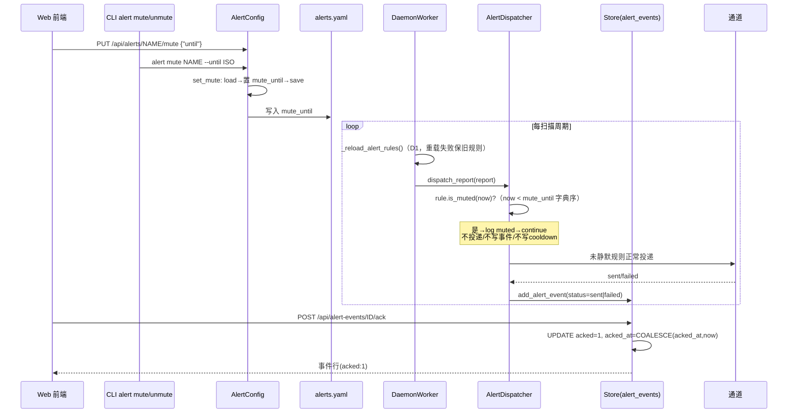
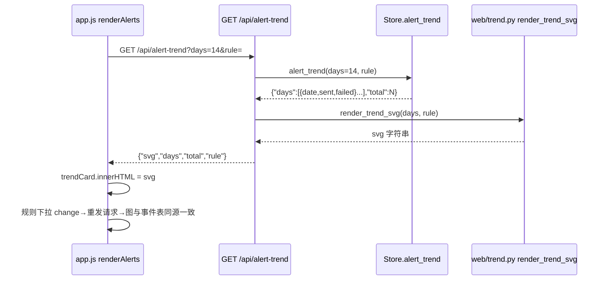
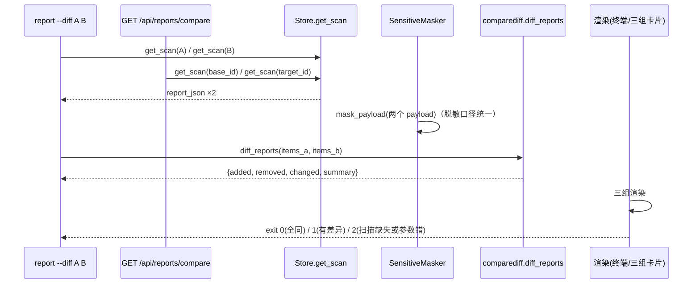
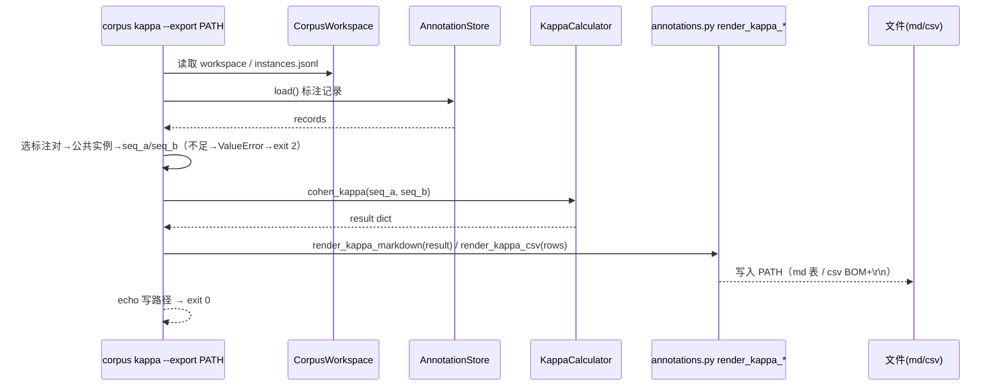

# cfgdrift v0.10.0 增量系统设计 — 告警静默 / 告警趋势 / 报告对比 / corpus kappa 导出

- 版本：v0.10.0（增量）
- 作者：高见远（架构师 / software-architect）
- 状态：待评审 → 转交工程师实现 + QA 测试
- 基线：现有 v0.9.0 代码库（894 test_*；Python 3.8+ 双后端；时间线分页 + 告警 Web 闭环 + compare 约束对齐 + 报告 CSV 导出）
- 原则：**基于 v0.9.0 最小变更**；不重设计已稳定部分。四项 P0 全部以「既有接口可选字段 / 新方法 / 新渲染函数」增量接入；**不新增第三方依赖**（趋势图纯 SVG 用字符串拼接、markdown/CSV 用 stdlib）；**零噪音契约**——既有 API 响应、`report` 单次输出、`corpus kappa` 终端输出不因本次改动变化。

---

## 0. 决策摘要（PRD 待确认 Q1–Q3 拍板 + 架构师新增决策 D1–D9）

| # | 决策项 | 决策内容 | 来源 |
|---|--------|----------|------|
| Q1 | 静默载体与 CLI 范围 | 规则级 `mute_until` 写入 `alerts.yaml`（`AlertRule` 可选字段，旧文件无需迁移）+ 事件级 ack 持久化到 `alert_events` 新列 `acked`/`acked_at`（仅展示语义）；CLI 支持 `alert mute/unmute`，与 Web 共用 `AlertConfig.set_mute/clear_mute` 写路径；ack 仅 Web（`POST /api/alert-events/{id}/ack`） | Q1 拍板（采纳 PRD 默认） |
| Q2 | 趋势图聚合口径 | 默认 14 天按天×status 聚合（sent/failed），`rule` 为空=全部规则；时间范围参数留 P1，本版仅 `days`（钳制 [1,30]，默认 14） | Q2 拍板（采纳 PRD 默认） |
| Q3 | 报告对比分组与 exit code | 仅「新增/消失/变化」三组（值变化并入变化组明细，不单列第四组）；有差异 exit=1、无差异 exit=0、参数/扫描错误 exit=2；Web 入口放报告视图「对比」按钮 | Q3 拍板（采纳 PRD 默认） |
| D1 | 静默生效机制 | **daemon 每周期重载 alerts.yaml 并更新 `dispatcher.rules`**（镜像 v0.9.0 D9 约束每周期重载模式）。不做则运行中 Web/CLI 写入的 `mute_until` 要等 daemon 重启才生效，直接违反验收①。重载失败（文件损坏）→ 记日志并保留上一周期规则，不 crash | 架构师决策（新缺口） |
| D2 | 静默拦截点 | `dispatcher.dispatch_report` 规则筛选循环**最前**（先于 `_rule_matches` / cooldown / payload / 事件表）：`rule.is_muted(now)` → log + continue。不投递、不产生事件、不写 cooldown（验收①⑦） | 架构师决策（PRD 侦察修正 5） |
| D3 | mute 检查口径 | `mute_until` 与 `now` 均以 ISO-8601 UTC 字符串**字典序比较**（`now_iso < mute_until`）；入参先经 `datetime.fromisoformat` 严格校验（容错结尾 `Z`→`+00:00`，兼容 JS `toISOString()`），避免 aware/naive 混比 TypeError | 架构师决策 |
| D4 | test/retry 与静默关系 | `alert test`（连通性）与 `retry_event`（人工重发）**绕过 mute**——均为显式人工操作，mute 只约束 daemon 周期触发路径 | 架构师决策 |
| D5 | 趋势渲染模块 | 新增 `web/trend.py::render_trend_svg(days, rule)` 纯函数（stdlib 字符串拼接）；`/api/alert-trend` 返回 `{svg, days, total}` 双字段——svg 供前端 `innerHTML` 直嵌，days 供同源校验/测试。**不引入图表库** | 架构师决策（PRD「无新模块」仅指 core 层共用代码） |
| D6 | report diff 不复用 compare_snapshots | `CompareEngine.compare_snapshots` / `SemanticDiffer.diff_snapshot` 作用于**原始语义快照树**（环境间配置值对比）；`report --diff` 作用于**两次扫描已产出的漂移项集合**（`store.get_scan` 的 `data.items`）。对象层次不同，复用需反序列化原始树且丢失已存 severity/change_type 语境 → **新建 `core/comparediff.py::diff_reports`** | 架构师决策（PRD 需评估点） |
| D7 | kappa 渲染归属 | 新增渲染函数放 `corpus/annotations.py`（`KappaCalculator` 结果 dict 与标注数据模型同源，模块零新增依赖）；不塞入 `corpus/exporter.py`（其为 change-pair→instances.jsonl 专属） | 架构师决策 |
| D8 | `report --diff` 参数形态 | `--diff` 为 `nargs=2` 的 int 元组（`cfgdrift report --diff 1293 1281`）；与 `--scan-id` / `--json` / `--html` / `--csv` **互斥**（同时给出 exit 2）；diff 走独立渲染路径，不影响单次 report 三个导出 | 架构师决策 |
| D9 | 版本三处同步 + QA 断言 | `0.10.0 / 0.10.0 / "0.10.0-c"` 三处（`__init__.py` / `pyproject.toml` / `parser_core.c`）；同时更新既有版本契约断言 `tests/test_qa_v090.py`（4 处）与 `tests/test_qa_v110.py`（3 处），**避免 v0.9.0 教训：只改源码不改断言导致回归测试挂红** | 架构师决策（吸取 v0.9.0 教训，T01 首做） |

---

## 1. 增量实现方案（四项 P0 独立小节）

### 1.1 P0-1 告警静默（规则级 mute_until + 事件级 ack）

**现状缺口（PM 侦察确认）**：`alert_events` 无 `acked`/`acked_at` 列（仅有 v0.9.0 `retried`/`retried_from`）；`AlertRule` 无 `mute_until`；daemon 启动时一次性构建 dispatcher，运行中不重载 alerts.yaml。

**方案**：

1. **`alert/models.py`**：
   - `AlertRule` 新增可选字段 `mute_until: Optional[str] = None`（ISO-8601 UTC）。
   - 新增模块级 `parse_iso_utc(value)`：容错结尾 `Z`→`+00:00`，`datetime.fromisoformat` 校验，返回规范化字符串；失败 `raise ValueError`。`__post_init__` 中 `mute_until` 非 None 时校验并规范化。
   - 新增 `AlertRule.is_muted(now: Optional[str] = None) -> bool`：`mute_until is None → False`；否则 `now_iso < mute_until` 字典序比较（D3）。边界：`now == mute_until` 不静默。
   - `to_dict`：`mute_until` 仅当非 None 时写出（保 v1 schema 往返干净，与 retry 字段同款）；`from_dict`：可选读入，缺省 None。
2. **`alert/config.py`**：新增 `set_mute(path, name, until)`（校验 until → 置 `rule.mute_until` → save）与 `clear_mute(path, name)`（置 None → save），镜像 `set_enabled` 的 load→改→save 写路径；未知规则 `raise ValueError`。
3. **`alert/dispatcher.py`**：`dispatch_report` 规则循环内、`_rule_matches` 之前插入 `if rule.is_muted(): log + continue`（D2）。`test_rule` / `retry_event` 不动（D4）。
4. **`daemon/worker.py`**：
   - `DaemonWorker.__init__` 增参 `alerts_config: Optional[str]`；`run_with_opts` 传入 `opts["alerts_config"]`。
   - 新增 `_reload_alert_rules()`：`AlertConfig.load(alerts_config)` 成功 → `dispatcher.rules = new_rules`；`ValueError` → warning 并保留旧规则；dispatcher 为 None 或未配 alerts_config → no-op。
   - `_cycle` 开头调用（镜像 D9 约束重载位置），保证运行中 mute/unmute/增删规则下一周期生效（D1）。
5. **`storage/store.py`**：
   - `_SCHEMA` 建表语句补 `acked INTEGER NOT NULL DEFAULT 0`、`acked_at TEXT`；`init_schema` 内以 `PRAGMA table_info` 守卫的 ALTER 迁移（镜像 v0.9.0 retried 模式，幂等）。
   - 新增 `ack_alert_event(event_id) -> dict`：`UPDATE alert_events SET acked=1, acked_at = COALESCE(acked_at, ?) WHERE id = ?`（保留首次 ack 时间）；rowcount==0 → `raise ValueError`；返回 `get_alert_event`。
   - `list_alert_events` / `get_alert_event` 的显式 SELECT 列清单补 `acked` / `acked_at`（`add_alert_event` INSERT 列清单不变，新列走 DEFAULT）。
   - 新增 `alert_trend(days=14, rule=None) -> dict`（供 P0-2 复用，见 §1.2）。
6. **`cli.py`**：`alert` 组新增 `mute NAME --until ISO`（`AlertConfig.set_mute`，ISO 校验失败 → exit 2）与 `unmute NAME`（`AlertConfig.clear_mute`）；成功输出 `alert rule %r muted until %s` / `unmuted`。
7. **`web/app.py`**：
   - `PUT /api/alerts/{name}/mute` body `{"until": "ISO"}` → `set_mute` → `{"name", "mute_until"}`；无效 until → 400，未知规则 → 404。
   - `DELETE /api/alerts/{name}/mute` → `clear_mute` → `{"name", "mute_until": null}`；未知规则 → 404。
   - `POST /api/alert-events/{event_id}/ack` → `store.ack_alert_event` → 返回事件行；缺失 → 404。
   - `GET /api/alerts` 规则 dict 自动带 `mute_until`（仅配置时）；`GET /api/overview` 增 `muted_rules`（`alerts.yaml` 加载失败 best-effort 为 0）。
8. **前端 `static/app.js`**（renderAlerts）：
   - 规则表增「静默」列：未静默显示 `[静默1h][静默24h]`；静默中显示「至 MM-DD HH:MM · 剩余 Xh」+ `[取消]`（剩余时长前端由 `mute_until` 换算）。
   - 事件表增「操作」列：未 ack 行 `[ack]`，ack 后「✓已确认」徽标。
   - 概览卡片：`muted_rules > 0` 时显示「当前静默规则 N 条」（0 时不渲染，零噪音）。

### 1.2 P0-2 告警历史趋势图（纯 SVG）

**现状缺口**：`alert_events` 表有 `created_at`/`rule`/`status` 三索引与按天聚合的数据基础，但无聚合函数、无 Web 趋势入口、前端无图表。

**方案**：

1. **`storage/store.py::alert_trend(days=14, rule=None)`**（与事件表同源，验收④）：
   - SQL 聚合：`SELECT substr(created_at,1,10) AS day, SUM(CASE WHEN status='sent' THEN 1 ELSE 0 END) AS sent, SUM(CASE WHEN status='failed' THEN 1 ELSE 0 END) AS failed FROM alert_events [WHERE rule = ?] [WHERE created_at >= ?] GROUP BY day`。
   - 时间口径：所有 `created_at` 均为 `utcnow_iso()`（`+00:00` 定长前缀），`substr(created_at,1,10)` 即 UTC 日期；起点 = `(today - (days-1))` 的 `T00:00:00` 前缀串，ISO 字典序天然可比较。
   - Python 层补齐 `days` 个连续日期（无事件补 0），返回 `{"days": [{"date","sent","failed"},...], "total": N}`（total = 窗口内 sent+failed 之和）。
2. **`web/trend.py::render_trend_svg(days, rule)`**（新模块，D5）：纯字符串拼 SVG（约 700×180），堆叠柱（sent 蓝 / failed 红）+ y 轴网格 + 日期刻度（`MM-DD`，约 7 个刻度）+ 图例；全零/空数据 → 返回含「暂无告警事件」文本的最小 SVG（空态不报错，验收③）。
3. **`web/app.py`**：新增 `GET /api/alert-trend?days=14&rule=`；`days` 钳制 [1,30]、非数字 → 400；返回 `ok({"svg": ..., "days": [...], "total": N, "rule": ...})`。**`GET /api/alert-events` 不动**（验收⑤）。
4. **前端 `static/app.js`**：
   - `renderAlerts` 事件表上方插入趋势卡片：`<select id="trendRule">`（「全部规则」+ `/api/alerts` 规则名）+ `innerHTML` 嵌入 svg。
   - 规则下拉 change → 重新 `GET /api/alert-trend?rule=` → 图与事件表同 filter 一致（验收②）；`total === 0` 时显示空态文案。

### 1.3 P0-3 报告对比（两次 scan 漂移项 diff，CLI + Web）

**现状缺口**：`report` 仅 `--json/--html/--csv` 三个互斥导出，无 diff 形态；`compare_snapshots` 面向原始快照树（§0 D6），不能直接复用。

**方案**：

1. **`core/comparediff.py::diff_reports(items_a, items_b)`**（新模块，纯函数，CLI/Web 共用）：
   - 输入为 `store.get_scan` 的 `data.items`（每个 item dict 含 `key_path/change_type/severity/file/old_value/new_value/old_type/new_type/line/masked`）。
   - 指纹 `fp = (file, key_path)`（不含 change_type——同一键在两扫描中变更类型不同视为「变化」而非新增/消失）。
   - 分组：
     - `added` = A 有 B 无（按 fp）；
     - `removed` = B 有 A 无；
     - `changed` = 双方均有且 `severity` 或 `new_value` 或 `change_type` 任一不同，每项含 `item_a`/`item_b` 全量 dict + `severity_changed`/`value_changed` 标志（old_value 不跨扫描比较，仅作各自侧展示）。
   - 返回 `{"base_scan_id", "target_scan_id", "added": [], "removed": [], "changed": [], "summary": {"added", "removed", "changed", "total"}}`；全空即「无差异」。
   - **脱敏**：调用方（CLI/Web）在调 `diff_reports` 前对两个 scan payload 先 `masker.mask_payload`（与 `report` 显示口径一致，D 口径统一）。
2. **`cli.py` report**：新增 `--diff`（`nargs=2, type=int`），与 `--scan-id/--json/--html/--csv` 互斥（D8）：
   - `store.get_scan(A)` / `get_scan(B)`（任一缺失 → exit 2）；两 payload 均 `code==0` 校验（否则 exit 2）。
   - 渲染三组：`新增（A 有 B 无，N 项）` / `消失（B 有 A 无，N 项）` / `变化（严重度/值变，N 项）`；行格式沿用 report：`[SEV] key (file:line): "old"→"new"`，变化组 `[SEV_A→SEV_B]` 两行（A 侧/B 侧）展示明细。
   - exit：`summary.total > 0 → 1`，全同 → 0（验收②）。
3. **`web/app.py`**：新增 `GET /api/reports/compare?base_id=&target_id=` → 同 CLI 流程（mask → `diff_reports`）→ `ok(diff_dict)`；扫描缺失 → 404（带 `code:2` 包装由 `err` 处理）。
4. **前端 `static/app.js`**：报告视图增「对比」按钮 → 对比面板（两个 `<select>` 复用 `/api/scans` 数据）→ `GET /api/reports/compare` → 三组卡片渲染（分组标题 + 计数，与 CLI 完全一致，验收③）；全同显示「两次扫描无差异」。

### 1.4 P0-4 corpus kappa 导出（markdown / CSV）

**现状缺口**：`corpus kappa` 仅有终端输出与 `--json`；`KappaCalculator.cohen_kappa` 返回 dict（kappa/po/pe/n/agreement_rate/confusion_matrix/weighted），CLI 已算得公共实例序列 `common/seq_a/seq_b`，导出只需渲染。

**方案**：

1. **`corpus/annotations.py`**（D7）新增两个纯渲染函数：
   - `render_kappa_markdown(result, annotator_a, annotator_b) -> str`：汇总表（`| 对比对 | kappa | 加权 kappa (linear) | 加权 kappa (quadratic) | n |`）+ 混淆矩阵表（行=annotator_a，列=annotator_b），Markdown 表可直接进论文附录。
   - `render_kappa_csv(rows, annotator_a, annotator_b) -> str`：`rows` 为 `[{instance_id, label_a, label_b, agree}]`；表头 `instance_id | annotator_a | annotator_b | 一致 | 类别A | 类别B`；`csv` 模块 + `utf-8-sig` BOM + `\r\n`（对齐 `core/csvreport.py` 口径，Excel/WPS 可开，验收②）。
2. **`cli.py` corpus kappa**：新增 `--export PATH`：
   - 扩展名判定：`.md`→markdown、`.csv`→CSV、其余/缺失 → `ValueError`（exit 2）。
   - 与 `--json` 互斥（exit 2）。
   - 复用既有标注对选择/公共实例构建逻辑，构建 rows → 调对应 render → 写文件（`encoding="utf-8-sig"` for csv / `utf-8` for md）→ echo `kappa results written to PATH` → exit 0。
   - 标注不足（<2 标注人 / 公共实例 <2）沿用既有 `ValueError` → exit 2（验收③）；未给 `--export` 时终端输出逐字节不变（验收④）。

---

## 2. 文件列表（新增 / 修改）

**新增文件（5 源文件 + 4 测试文件）**：

| 文件 | 内容 |
|------|------|
| `src/cfgdrift/core/comparediff.py` | `diff_reports(items_a, items_b)` 纯函数（三组 diff，CLI/Web 共用） |
| `src/cfgdrift/web/trend.py` | `render_trend_svg(days, rule)` 纯 SVG 渲染（stdlib） |
| `tests/test_alert_v100.py` | P0-1：mute/ack/model/dispatcher/daemon reload（mock channel/state） |
| `tests/test_web_v100.py` | P0-1/P0-2/P0-3 Web 端点 + 前端接线 |
| `tests/test_report_diff.py` | P0-3：`diff_reports` 分组 + CLI exit 0/1/2 + Web compare |
| `tests/test_kappa_export.py` | P0-4：md/csv 渲染、BOM、扩展名判定、exit 2 场景 |

**修改文件**：

| 文件 | 变更 |
|------|------|
| `src/cfgdrift/__init__.py` | `__version__ = "0.10.0"`（T01） |
| `pyproject.toml` | `version = "0.10.0"`（T01） |
| `src/csrc/parser_core.c` | 版本标记 `"0.10.0-c"`（T01） |
| `tests/test_qa_v090.py` / `tests/test_qa_v110.py` | 版本契约断言 0.9.0 → 0.10.0（T01） |
| `src/cfgdrift/alert/models.py` | `AlertRule.mute_until` + `is_muted` + `parse_iso_utc` + to/from_dict |
| `src/cfgdrift/alert/config.py` | `set_mute` / `clear_mute` |
| `src/cfgdrift/alert/dispatcher.py` | `dispatch_report` 循环内 mute 拦截 |
| `src/cfgdrift/daemon/worker.py` | `alerts_config` 参数 + `_reload_alert_rules`（每周期） |
| `src/cfgdrift/storage/store.py` | `acked`/`acked_at` 列 + 幂等迁移 + `ack_alert_event` + `alert_trend` + list/get 补列 |
| `src/cfgdrift/cli.py` | `alert mute/unmute`、`report --diff`、`corpus kappa --export` |
| `src/cfgdrift/corpus/annotations.py` | `render_kappa_markdown` / `render_kappa_csv` |
| `src/cfgdrift/web/app.py` | 5 新端点 + `/api/overview` 增 `muted_rules` |
| `src/cfgdrift/web/static/app.js` | 趋势卡 + 静默按钮 + ack 按钮 + 对比面板 + 概览静默数 |

---

## 3. 数据结构与接口

### 3.1 新增 API（均为 `{code, data, message}` 包装，错误 `code=2`）

| 方法 | 路径 | 参数/体 | 返回 `data` |
|------|------|---------|-------------|
| GET | `/api/alert-trend` | `days=14`（钳 [1,30]）、`rule=`（空=全部） | `{"svg": "<svg…>", "days": [{"date","sent","failed"},…], "total": N, "rule": ""}` |
| PUT | `/api/alerts/{name}/mute` | body `{"until": "ISO-8601"}` | `{"name", "mute_until": "ISO"}`；无效 until→400，未知规则→404 |
| DELETE | `/api/alerts/{name}/mute` | — | `{"name", "mute_until": null}`；未知规则→404 |
| POST | `/api/alert-events/{event_id}/ack` | — | 更新后事件行（含 `acked:1, acked_at`）；缺失→404 |
| GET | `/api/reports/compare` | `base_id`, `target_id` | `diff_reports` 结果（三组 + summary）；扫描缺失→404 |

### 3.2 变更 API（仅增字段，形状不变）

| API | 变更 |
|-----|------|
| `GET /api/alerts` | 规则 dict 增可选 `mute_until`（仅配置时出现，零噪音） |
| `GET /api/alert-events` / 单事件 | 事件 dict 增 `acked`(0/1) / `acked_at`(string\|null) |
| `GET /api/overview` | 增 `muted_rules: int`（当前 `mute_until > now` 的规则数；alerts.yaml 缺失/损坏 best-effort 0） |

### 3.3 存储变更（`alert_events` 表）

```sql
-- _SCHEMA 建表语句新增（CREATE TABLE IF NOT EXISTS 幂等）：
acked      INTEGER NOT NULL DEFAULT 0,
acked_at   TEXT,
-- init_schema 幂等迁移（PRAGMA table_info 守卫，镜像 v0.9.0 retried 模式）：
-- ALTER TABLE alert_events ADD COLUMN acked INTEGER NOT NULL DEFAULT 0;
-- ALTER TABLE alert_events ADD COLUMN acked_at TEXT;
```

- `ack_alert_event(id)`：`UPDATE … SET acked=1, acked_at = COALESCE(acked_at, ?) WHERE id=?`（保留首次 ack 时间，重复 ack 幂等）。
- `add_alert_event` INSERT 列清单**不变**（新列走 DEFAULT）；`list_alert_events` / `get_alert_event` SELECT 列清单补两列。
- `alert_trend(days=14, rule=None)` 新增聚合查询（只读，无新索引——沿用 `idx_alert_events_created` / `_rule` / `_status`）。

### 3.4 alerts.yaml 规则 schema（可选字段，v1 不变）

```yaml
version: 1
rules:
  - name: drift-wx
    type: webhook
    severity: CRITICAL
    baseline: all
    enabled: true
    config: { url: "https://…", timeout: 10 }
    retry_count: 3            # v0.5.0 既有
    mute_until: "2026-08-06T09:00:00+00:00"   # v0.10.0 新增，缺省不静默
```

### 3.5 `diff_reports` 输出 schema（CLI/Web 共用）

```json
{
  "base_scan_id": 1293, "target_scan_id": 1281,
  "added":  [ "<item_dict>", … ],
  "removed":[ "<item_dict>", … ],
  "changed":[
    {"item_a": "<item_dict>", "item_b": "<item_dict>",
     "severity_changed": true, "value_changed": true}
  ],
  "summary": {"added": 3, "removed": 1, "changed": 1, "total": 5}
}
```

### 3.6 kappa 导出文件

- **markdown**：汇总表（对比对 | kappa | 加权 linear | 加权 quadratic | n）+ 混淆矩阵表（行=annotator_a，列=annotator_b）。
- **CSV**：表头 `instance_id, annotator_a, annotator_b, 一致, 类别A, 类别B`；`utf-8-sig` BOM + `\r\n`。

---

## 4. 程序调用流程（Mermaid）

### 4.1 P0-1 告警静默 / ack



### 4.2 P0-2 告警趋势图



### 4.3 P0-3 报告对比



### 4.4 P0-4 corpus kappa 导出



---

## 5. 任务列表（T01 起，含依赖与验收要点）

| # | 任务 | 依赖 | 验收要点 |
|---|------|------|----------|
| T01 | **版本三处同步 + 既有断言更新**：`__init__.py`=0.10.0、`pyproject.toml`=0.10.0、`parser_core.c`=0.10.0-c；同步改 `test_qa_v090.py`（4 处）/`test_qa_v110.py`（3 处）断言 | — | `cfgdrift --version` 输出 0.10.0；`pytest -k version` 全绿；**此任务先行**避免后续全红 |
| T02 | **P0-1/P0-2 store 层**：`acked`/`acked_at` 列 + 幂等迁移；`ack_alert_event`；`list/get_alert_events` 补列；`alert_trend(days, rule)` | T01 | 新建库含新列；旧库（v0.9 结构）打开后 ALTER 幂等；ack 后持久且二次 ack 不覆盖时间；trend 14 天连续补 0、`rule=` 精确过滤、`days` 钳制 |
| T03 | **P0-1 model**：`AlertRule.mute_until` + `parse_iso_utc`（容错 Z）+ `is_muted` + to/from_dict | — | 旧 alerts.yaml 无 mute 字段加载不变；非法 ISO → ValueError；`now==mute_until` 不静默；字典序比较无 tz TypeError |
| T04 | **P0-1 config**：`AlertConfig.set_mute` / `clear_mute` | T03 | 写后 `load` 可见；未知规则 ValueError；until 非法 ValueError |
| T05 | **P0-1 dispatcher**：`dispatch_report` 循环最前 mute 拦截；`test_rule`/`retry_event` 绕过 | T03 | **mock**：muted 规则 → channel 不被调、事件表无行、`alert_state.json` 无 cooldown 写入；同次循环其他规则正常投递（零噪音⑦） |
| T06 | **P0-1 daemon**：`alerts_config` 参数 + `_reload_alert_rules` 每周期重载 | T05 | **mock**：运行中写入 `mute_until` 下一 `_cycle` 生效（不重启）；文件损坏 → warning 且旧规则保留；dispatcher 为 None no-op |
| T07 | **P0-1 CLI**：`alert mute NAME --until ISO` / `alert unmute NAME` | T04 | 写 alerts.yaml 正确；未知规则/非法 until exit 2；与 Web 共用写路径（互操作⑤） |
| T08 | **P0-1/P0-2/P0-3 Web 后端**：`PUT/DELETE /api/alerts/{name}/mute`、`POST /api/alert-events/{id}/ack`、`GET /api/alert-trend`、`GET /api/reports/compare`、`/api/overview.muted_rules` | T02, T04, T12 | 各端点 `{code,data,message}`；404/400 语义；`/api/alert-events` 既有响应不变⑤；alerts.yaml 变更刷新后保持 |
| T09 | **P0-1/P0-2 前端**：静默列/按钮、ack 按钮、趋势卡 + 规则切换 + 空态、概览静默数 | T08 | 静默 1h/24h 按钮 = now+1h/24h 的 ISO；静默中高亮 + 剩余时长；ack 后 ✓已确认持久；切换后图与表一致；无数据空态不报错 |
| T10 | **P0-3 core**：`core/comparediff.py::diff_reports` | — | 指纹 `(file,key_path)`；三组正确（新增/消失/变化含 severity 与值明细）；全同「无差异」；输入已脱敏数据不动原值 |
| T11 | **P0-3 CLI**：`report --diff A B`（nargs=2）+ 渲染 + exit 0/1/2；与 `--scan-id/--json/--html/--csv` 互斥 | T10 | 三组字段完整（键路径/文件/行号/严重度/旧新值）；`exit 1/0/2` 符合验收②；`report` 单次输出与三导出完全不变⑤ |
| T12 | **P0-3 Web + 前端**：`/api/reports/compare` + 报告视图「对比」面板（两个 scan 下拉） | T11 | Web 分组与 CLI 完全一致④；缺失 scan → 404；全同显示「两次扫描无差异」 |
| T13 | **P0-4**：`annotations.py::render_kappa_markdown/render_kappa_csv` + `corpus kappa --export PATH`（扩展名判定、与 --json 互斥） | — | md 可渲染（汇总表+混淆矩阵）；csv 含 BOM、Excel/WPS 可开；不足 2 标注人/无可比对 → exit 2③；未给 `--export` 终端输出不变④ |
| T14 | **新测试文件**：`test_alert_v100.py` / `test_web_v100.py` / `test_report_diff.py` / `test_kappa_export.py` + 全量回归 894 不回归 | T01–T13 | 各验收点全覆盖；`pytest` 全绿；既有 `/api/alert-events`、`report`、`kappa` 输出回归快照不变 |
| T15 | **文档回填**：本文档按实现实况修订（接口/任务/待明确事项）；README/CHANGELOG 版本提及（若有）同步 0.10.0 | T01–T14 | 文档与代码一致；版本引用无遗漏 |

**关键路径**：T01 → T02/T03 → T04 → T05 → T06 → T07；T02/T03 并行于 T10；T08 依赖 T02+T04+T12；T09 依赖 T08；T12 依赖 T11 依赖 T10。

---

## 6. 依赖包列表

**无新增第三方依赖**（PRD 全局约束 ⑤）：

| 能力 | 实现 |
|------|------|
| SVG 趋势图 | 纯字符串拼接（`web/trend.py`），原生 JS `innerHTML` 嵌入 |
| markdown 导出 | 字符串拼接（`corpus/annotations.py`） |
| CSV 导出 | stdlib `csv` + `utf-8-sig` BOM（对齐 `core/csvreport.py`） |
| 静默时间比较 | ISO 字符串字典序 + `datetime.fromisoformat`（无定时任务） |
| diff 分组 | 纯 dict 集合差（`core/comparediff.py`） |

---

## 7. 共享知识（跨文件约定）

1. **ISO 时间口径**：`mute_until` / `acked_at` 一律 ISO-8601 UTC（`utcnow_iso()` 格式）；比较用**字典序**（`now_iso < mute_until`），入参先经 `parse_iso_utc`（容错结尾 `Z`）校验规范化（D3）。
2. **静默拦截点**：`dispatch_report` 规则循环**最前**，先于 enabled/baseline/severity 过滤与 cooldown；静默 = 不投递 + 不写事件 + 不写 cooldown（验收①⑦）。
3. **daemon 每周期重载 alerts.yaml**（D1，镜像 D9）：`_cycle` 开头 `_reload_alert_rules`，失败保留旧规则。
4. **ack 仅展示语义**：不改变投递、cooldown、retry 行为；`acked_at` 保留首次时间；重复 ack 幂等。
5. **趋势聚合口径**：UTC 日期 = `substr(created_at,1,10)`；窗口 `days` 连续补 0；`total` = 窗口内 sent+failed 之和；`days∈[1,30]`。
6. **report diff 指纹** = `(file, key_path)`；「变化」判定 = severity 或 new_value 或 change_type 任一不同；old_value 不跨扫描比较。
7. **脱敏口径统一**：CLI `report --diff` 与 Web `/api/reports/compare` 在调用 `diff_reports` **之前**对 scan payload `masker.mask_payload`（与 `report` 一致）；kappa 导出为标注类别标签（无敏感值），不 mask。
8. **Web 契约**：响应 `{code,data,message}`，`ok()`=code 0，`err()`=code 2 + 合适 HTTP 状态（400/404）；新端点全部增量，不改既有响应形状。
9. **CLI exit code**：0 无差异 / 1 有差异 / 2 参数错误或数据缺失（`report --diff`、`corpus kappa --export` 沿用）。
10. **零噪音**：`mute_until`/`acked` 仅在配置/存在时出现在响应与 dict；`muted_rules==0` 前端不渲染卡片；趋势无数据渲染空态；`report --diff` 不碰单次 report；`--export` 不碰 kappa 终端输出。
11. **版本三处同步 + 断言文件**：`__init__.py` / `pyproject.toml` / `parser_core.c` 同步；版本契约断言在 `test_qa_v090.py`（TestVersionContract）与 `test_qa_v110.py`（TestRegression），**发版时一起改**。

---

## 8. 待明确事项（PRD Q1–Q3 裁决 + 新增决策）

| # | 问题 | PRD 默认 | 架构师裁决 |
|---|------|----------|------------|
| Q1 | 静默载体 / ack 持久化 / CLI 范围 | 规则级 `mute_until` 写 alerts.yaml + 事件级 ack 存 `alert_events` 新列 + CLI 支持 mute | **采纳**。补充裁决：mute 生效依赖 daemon 每周期重载 alerts.yaml（D1，否则运行中不生效）；`alert test` / `retry` 绕过 mute（D4）；`acked_at` 保留首次 ack 时间 |
| Q2 | 趋势图聚合口径与时间范围 | 14 天按天 + 全部/单规则切换，范围参数留 P1 | **采纳**。补充裁决：端点命名 `GET /api/alert-trend`（PRD 正文为 `/api/alert-events/trend`，与既有 `/api/alert-events` 列表端点区分，避免语义重叠）；返回 `{svg, days, total}` 双字段；`days` 钳 [1,30] |
| Q3 | diff 分组语义 / exit code / Web 入口 | 三组（值变化并入变化组）+ exit 1 + 报告视图「对比」按钮 | **采纳**。补充裁决：**不复用 `compare_snapshots`**（操作对象层次不同，D6），新建 `core/comparediff.py`；变化组输出 item_a/item_b 双项明细；`report --diff` 与既有 `--scan-id/--json/--html/--csv` 互斥（D8） |
| — | kappa 导出参数形态 | `--export PATH`（按扩展名）或 `--format md\|csv` | **裁决**：仅实现 `--export PATH`（扩展名判定 `.md/.csv`，其余 exit 2），避免双参数冗余；与 `--json` 互斥 |
| — | 趋势 SVG 渲染归属 | PRD「无新模块」 | **裁决**：新增 `web/trend.py`（Web 专属纯函数，stdlib）；「无新模块」限定 core 层共用代码（D5） |
| — | daemon 对「运行中新建 alerts.yaml」 | — | 维持现状：daemon 启动时不存在 alerts.yaml 则无 dispatcher，需重启 daemon 启用告警（v0.9.0 既有行为，不在本版扩大） |
