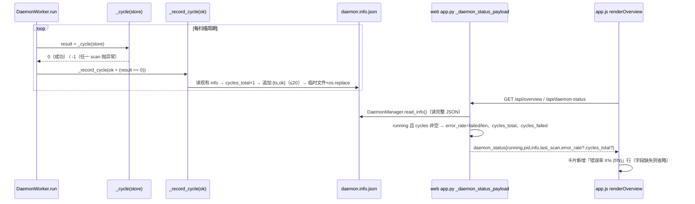
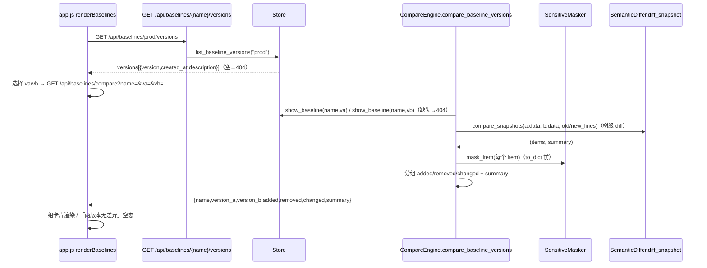
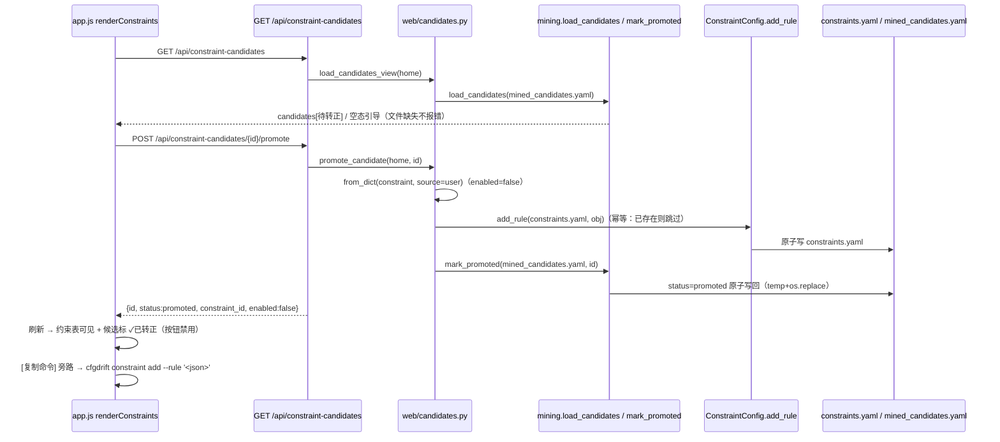
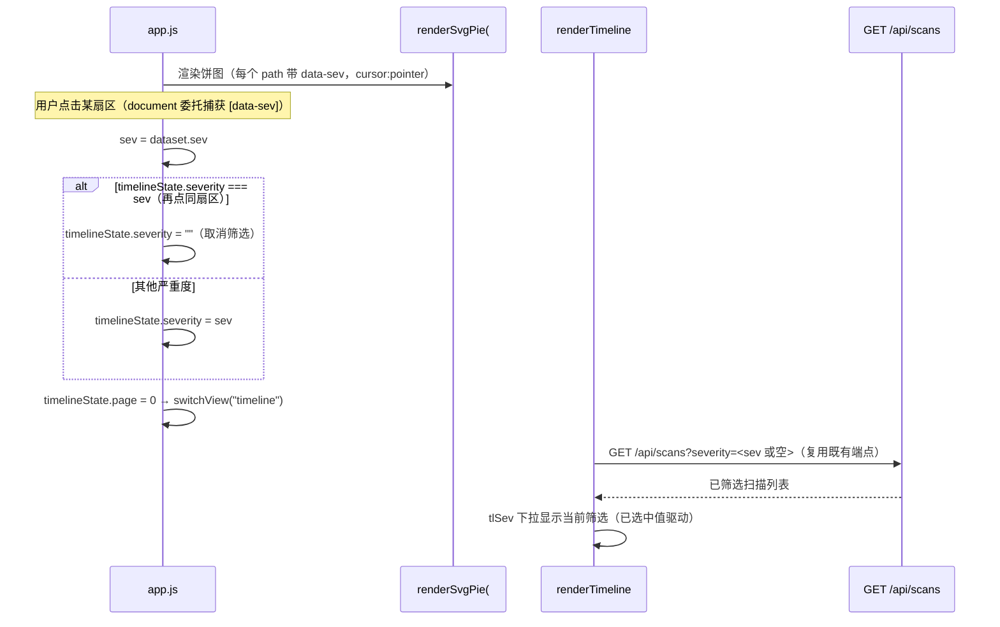

# cfgdrift v0.11.0 增量系统设计 — daemon 健康 / 基线版本对比 / 约束候选转正 / 严重度联动

- 版本：v0.11.0（增量）
- 作者：高见远（架构师 / software-architect）
- 状态：待评审 → 转交工程师实现 + QA 测试
- 基线：现有 v0.10.0 代码库（告警静默/ack、趋势图、报告对比、kappa 导出；Python 3.8+ 双后端）
- 原则：**基于 v0.10.0 最小变更**；四项 P0 全部以「既有接口可选字段 / 新方法 / 新渲染函数」增量接入；**不新增第三方依赖**（错误率用 info 文件滚动计数、版本对比复用 `CompareEngine.compare_snapshots`、候选转正复用 `ConstraintConfig.add_rule`、严重度联动纯前端）；**零噪音契约**——既有 API 响应、CLI 输出、饼图渲染不因本次改动变化。

---

## 0. 决策摘要（PRD 待确认 Q1–Q3 拍板 + 架构师新增决策 D1–D6）

| # | 决策项 | 决策内容 | 来源 |
|---|--------|----------|------|
| Q1 | 基线版本对比语义与入口 | **树级快照对比**：复用 `CompareEngine.compare_snapshots`（与 `compare` CLI 同源纯函数，含文件/行号/旧新值）；入口放**基线管理视图**（版本列表 + 对比面板）；报告视图扫描对比（v0.10.0）不动 | Q1 拍板（采纳 PRD 默认） |
| Q2 | 候选转正交互深度 | **一键转正 + 确认弹窗 + 原子写**（失败不写坏文件、可读错误）；保留「复制命令」旁路；转正写路径复用 `ConstraintConfig.add_rule`（CLI `constraint add` 共用），转正状态写入 mined_candidates.yaml（原子写） | Q2 拍板（采纳 PRD 默认） |
| Q3 | daemon 错误率口径与载体 | **info 文件滚动记录**最近 20 次周期 `{ts, ok}` + `cycles_total`（D1）；周期内 scan 抛异常即 fail；`error_rate` 为 0~1 浮点，仅 running 且有周期记录时出现；未运行/无记录省略字段、前端置灰/省略，不报错 | Q3 拍板（采纳 PRD 默认，载体裁决见 D1） |
| D1 | 错误率载体：**info 文件，而非 DB** | **拒绝 DB scan_reports 聚合**：失败周期不产生 scan 行（PRD 验收⑤），`scans` 表聚合无法统计 fail，方向性错误；**拒绝 `daemon_cycles` 轻量表**：需 SQLite 迁移、且数据跨 daemon 重启残留（旧进程错误率误导「当前健康度」）；**选择扩展 `daemon.info.json`**：与 daemon 生命周期天然绑定（停止即清除，与验收③「未运行省略」精确吻合）、无 schema 迁移、无跨进程 SQLite 写竞争（daemon 写 info、web 读 info），`/api/daemon-status` 既有 info 读路径直接复用 | 架构师决策（Q3 载体裁决） |
| D2 | info 文件原子写 | 现在 `_write_info_file` 直接 `open(w)`（截断+写），本版该文件改为每周期更新，读写竞争概率上升 → 统一走 `_persist_info`：**临时文件 + `os.replace` 原子替换**（Windows 可用），同时修复既有读到半截 JSON 的风险 | 架构师决策（可靠性） |
| D3 | 版本对比分组与严重度展示 | 分组按 `change_type`：`added`→新增、`removed`→消失、`modified`/`type_changed`→变化（三组，与 PRD 线框一致）；**严重度单值展示**（与 `/api/compare` 一致）：`compare_snapshots` 单趟 diff 产出每项单一 severity（规则按键定级），线框 `[WARN→CRITICAL]` 需双跑 differ，收益低不做；旧新值/文件/行号字段完整 | 架构师决策（Q1 补充） |
| D4 | 候选转正写路径与幂等 | 新增 `web/candidates.py` 承载「候选 → 正式约束」公共写逻辑：`Constraint.from_dict(constraint, source="user")` → `ConstraintConfig.add_rule(constraints_path, obj)` → `mining.mark_promoted(candidates_path, id)`。**转正写入 enabled:false**（保守：不自动激活，沿袭 D5「候选永不自动生效」精神；前端提示可去约束列表启用）；**幂等恢复**：若约束 id 已存在（上次 add 成功、mark 失败）→ 仅补 mark_promoted 并返回成功，重复点击不报错 | 架构师决策（Q2 补充） |
| D5 | 严重度联动为纯前端 | 饼图 `<path>` 增 `data-sev` 属性 + `cursor:pointer`；document 级事件委托统一处理（饼图每帧重渲染，委托防丢失）；点击扇区 → 设 `timelineState.severity`（已选中同值则置空 = 取消）→ `switchView("timeline")`；复用既有 `/api/scans?severity=` 与 `tlSev` 筛选器，后端零改动 | 架构师决策（Q1/PRD P0-4） |
| D6 | 版本三处同步 + **5 个断言文件** | `0.11.0 / 0.11.0 / "0.11.0-c"`（`__init__.py` / `pyproject.toml` / `parser_core.c`）；同步改**5 个测试文件**版本断言：`test_qa_v090.py`（4 处）/ `test_qa_v110.py`（3 处）/ `test_qa_v100.py`（1 处）/ `test_cli.py`（1 处）/ `test_core.py`（1 处）——吸取 v0.9.0 教训（只改源码不改断言导致回归挂红），**T01 首做** | 架构师决策（吸取教训，范围较 v0.10.0 扩展） |

---

## 1. 增量实现方案（四项 P0 独立小节）

> 框架选型延续 v0.10.0：FastAPI（web/app.py 应用工厂，`{code,data,message}` 包装）+ SQLite（storage/store.py）+ 原生 JS SPA（static/app.js，零外部依赖）+ Click CLI。本版**零新增第三方依赖**。

### 1.1 P0-1 daemon 健康增强（错误率聚合 + 概览展示）

**现状缺口（PM 侦察确认）**：`/api/daemon-status` 已有 `interval`（info 文件）、`last_scan`（app.py 挂载）；概览卡片已展示 interval+最近扫描；**唯一缺口 = 最近 N 次扫描成功/失败比例**，后端与前端均无。

**方案**（载体裁决见 D1）：

1. **`daemon/worker.py`**：
   - 新增模块常量 `_MAX_CYCLE_LOG = 20`。
   - 拆出 `_persist_info(info)`：临时文件 + `os.replace` 原子写（D2）；`_write_info_file` 改为构建初始 info 后走 `_persist_info`。
   - 新增 `_record_cycle(ok: bool)`：读现有 info（失败则重建 base）→ `cycles_total += 1` → 取 `cycles` 末 19 条 + 追加 `{"ts": utcnow_iso(), "ok": bool}`（保持 ≤20）→ `_persist_info`。
   - `run()` 主循环改为：`result = self._cycle(store); self._record_cycle(ok=(result == 0)); self._sleep_until_next()`。`_cycle` 已捕获所有异常返回 -1（=fail）、成功返回 0（=ok），与 PRD「周期内 scan 抛异常记为 fail，否则 ok」完全对应。
2. **`web/app.py`**：
   - 新增闭包辅助 `_daemon_status_payload(store)`（**单一装配路径**，镜像 v0.9.0 D2）：`DaemonManager(home).status_dict()` → 合并 `last_scan` → 当 `running` 且 `info.cycles` 非空时增 `error_rate = failed/len(cycles)`（round 4）、`cycles_total`、`cycles_failed`；`/api/overview` 与 `/api/daemon-status` 共用，杜绝两端点漂移。
   - `/api/daemon-status` 与 `/api/overview` 内嵌 `daemon_status` 自动带上 3 个新字段（仅 running + 有记录时出现，验收④⑤）。
3. **前端 `static/app.js`（renderOverview）**：守护进程卡片在既有 interval/最近扫描下方新增「错误率」行：`错误率 5.0% (1/20)` + 副行 `（最近 20 次周期：19 次成功 / 1 次失败）`；`daemon_status` 无 `error_rate` 或未 running 时整行省略（零噪音，验收③）。

### 1.2 P0-2 基线版本对比 Web 化

**现状缺口（PM 侦察确认）**：`baselines` 表已有 `name+version`（UNIQUE）；`show_baseline(name, version)` 可取指定版本；`CompareEngine.compare_snapshots` 可做树级对比。但无「同一基线版本间对比」端点/视图。

**方案**（语义与展示裁决见 D3）：

1. **`storage/store.py`**：新增 `list_baseline_versions(name) -> List[Baseline]`（`WHERE name=? ORDER BY version ASC`）。
2. **`core/compare.py`**：`CompareEngine` 新增 `compare_baseline_versions(name, version_a, version_b, severity_rules=None, masker=None, constraints=None) -> dict`：
   - `bl_a = store.show_baseline(name, version_a)`、`bl_b = store.show_baseline(name, version_b)`（缺失 → `ValueError` 由调用方转 404）。
   - `items, summary = self.compare_snapshots(name, name, bl_a.data, bl_b.data, severity_rules=..., old_lines=bl_a.line_maps, new_lines=bl_b.line_maps, constraints=...)`（**复用点**，与 `compare` CLI 同源）。
   - 分组：`added`（change_type=added）/ `removed`（removed）/ `changed`（modified|type_changed），逐项 `to_dict()`；`masker.mask_item` 在 to_dict **之前**对 item 脱敏（口径统一）。
   - 返回 `{"name", "version_a", "version_b", "created_at_a", "created_at_b", "added", "removed", "changed", "summary": {added, removed, changed, total}}`；全空即「两版本无差异」。
3. **`web/app.py`** 两个新端点（详见 §3.1）：`GET /api/baselines/{name}/versions`、`GET /api/baselines/compare?name=&va=&vb=`。
4. **前端 `static/app.js`（renderBaselines）**：基线行新增「版本对比」按钮 → 对比面板（`{name}` 下拉复用 `/api/baselines` + 两个版本 `<select>` 由 `/api/baselines/{name}/versions` 填充，含 created_at 文案）→ `GET /api/baselines/compare` → 三组卡片渲染（新增/消失/变化 + 计数，行字段 = 键路径/文件/行号/严重度/旧新值，与 `compare` CLI 同源）；全同显示「两版本无差异」空态。

### 1.3 P0-3 约束挖掘候选展示 + 一键转正

**现状缺口（PM 侦察确认）**：`mining.load_candidates` 已能读 `mined_candidates.yaml`，但 Web 无端点/视图；候选为 `enabled:false` + `status:pending`，转正需手抄 `constraint add --rule`。

**方案**（写路径与幂等裁决见 D4）：

1. **`rules/mining.py`**：新增 `mark_promoted(path, candidate_id) -> None`：`load_candidates` → 找到该 id → `status="promoted"` → 以 `save_candidates` 同款 payload 结构**原子写回**（临时文件 + `os.replace`；候选文件写坏不丢原文件）。候选缺失 → `ValueError`。
2. **`web/candidates.py`**（新模块，Web 专属公共写逻辑）：
   - `candidates_path(home)` → `<home>/mined_candidates.yaml`（与 `constraint mine` 默认输出一致）。
   - `load_candidates_view(home) -> dict`：文件缺失 → `{"candidates": [], "generated_at": None, "source": None, "message": "运行 `cfgdrift constraint mine` 生成候选"}`（空态不报错）；损坏 → `ValueError`（400）。
   - `promote_candidate(home, candidate_id) -> dict`：
     1. `ConstraintMiner.load_candidates(path)` 找到候选（缺失 → ValueError），`status=="promoted"` → 直接返回（幂等）。
     2. `constraint_obj = Constraint.from_dict(candidate.constraint, source="user")`（`enabled` 保持 False，D4）。
     3. `rules = ConstraintConfig.list_rules(constraints_path)`：若 `constraint_obj.id` 已存在 → 跳过 add（幂等恢复路径）；否则 `ConstraintConfig.add_rule(constraints_path, constraint_obj)`（**复用 `constraint add` 写路径**）。
     4. `mining.mark_promoted(candidates_path, candidate_id)`。
     5. 返回 `{"id", "status": "promoted", "constraint_id", "enabled": False}`。
3. **`web/app.py`** 两个新端点（详见 §3.1）：`GET /api/constraint-candidates`、`POST /api/constraint-candidates/{id}/promote`。
4. **前端 `static/app.js`（renderConstraints）**：约束表上方新增「挖掘候选」卡片：无候选 → 空态 + 引导文案；有候选 → 每行 kind/support/confidence/keys/示例值 + `[转正]`（确认弹窗）`[复制命令]`（`cfgdrift constraint add --rule '<constraint JSON>'`）+ 已转正 `[✓已转正]` 徽标且按钮禁用；转正成功 → `renderConstraints()` 刷新（约束列表可见新约束 + 候选标记已转正，验收③）。

### 1.4 P0-4 严重度分布联动

**现状缺口（PM 侦察确认）**：严重度饼图已渲染（`renderSvgPie` → `#severitySvg`），无点击联动；时间线已有 `severity` 筛选（`timelineState.severity` + `/api/scans?severity=`）。

**方案**（纯前端，D5）：

1. **`static/app.js`**：
   - `renderSvgPie`：每个 `<path>` 增 `data-sev="<K>"` 与 `style="cursor:pointer"`；全零空态 `<p>暂无数据</p>` 不变（无 path，自然无点击，验收④）。
   - document 级事件委托新增分支：`e.target.closest('#severitySvg [data-sev]')` → `sev = dataset.sev` → `timelineState.severity = (timelineState.severity === sev ? "" : sev); timelineState.page = 0; switchView("timeline");`（同扇区再点 = 取消筛选，验收③）。
   - 时间线 `tlSev` 下拉已由 `timelineState.severity` 驱动，自动显示当前筛选（验收①②）；`renderSeverity` 与饼图本体渲染**零改动**（验收⑤）。

---

## 2. 文件列表（新增 / 修改）

**新增文件（1 源文件 + 4 测试文件）**：

| 文件 | 内容 |
|------|------|
| `src/cfgdrift/web/candidates.py` | `load_candidates_view` / `promote_candidate`（候选 → 正式约束公共写逻辑） |
| `tests/test_daemon_health.py` | P0-1：worker 周期记录、info cycles 滚动/原子写、error_rate 计算、web 端点字段形状 |
| `tests/test_baseline_compare_web.py` | P0-2：版本列表、对比分组、脱敏、404/400、空态 |
| `tests/test_candidates.py` | P0-3：空态视图、转正写 constraints.yaml、mark_promoted 原子性、幂等、复制命令字符串 |
| `tests/test_severity_link.py` | P0-4：app.js 静态冒烟（data-sev 属性 + 委托接线 + switchView 调用） |

**修改文件**：

| 文件 | 变更 |
|------|------|
| `src/cfgdrift/__init__.py` | `__version__ = "0.11.0"`（T01） |
| `pyproject.toml` | `version = "0.11.0"`（T01） |
| `src/csrc/parser_core.c` | 版本标记 `"0.11.0-c"`（T01） |
| `tests/test_qa_v090.py` / `test_qa_v110.py` / `test_qa_v100.py` / `test_cli.py` / `test_core.py` | 版本契约断言 0.10.0 → 0.11.0（T01，共 5 文件 10 处） |
| `src/cfgdrift/daemon/worker.py` | `_persist_info`（原子写）+ `_record_cycle` + 主循环记录；`_write_info_file` 复用原子写 |
| `src/cfgdrift/storage/store.py` | `list_baseline_versions(name)` |
| `src/cfgdrift/core/compare.py` | `CompareEngine.compare_baseline_versions(...)`（分组 + 脱敏） |
| `src/cfgdrift/rules/mining.py` | `mark_promoted(path, candidate_id)`（原子写回） |
| `src/cfgdrift/web/app.py` | 4 新端点 + `_daemon_status_payload` 装配（overview/daemon-status 增字段） |
| `src/cfgdrift/web/static/app.js` | 概览错误率行、版本对比面板、挖掘候选卡片、严重度联动 |
| `README.md` / `README.en.md`（若存在版本段落） | 版本提及同步 0.11.0（T14） |

---

## 3. 数据结构与接口

### 3.1 新增 API（均为 `{code, data, message}` 包装，错误 `code=2`）

| 方法 | 路径 | 参数/体 | 返回 `data` |
|------|------|---------|-------------|
| GET | `/api/baselines/{name}/versions` | `name`（路径） | `{"name": "prod", "versions": [{"version": 1, "created_at": "...", "description": "..."}, …]}`；name 无版本 → 404 |
| GET | `/api/baselines/compare` | `name`、`va`、`vb` | `compare_baseline_versions` 结果（三组 + summary）；va==vb → 400；版本缺失 → 404 |
| GET | `/api/constraint-candidates` | — | `{"candidates": [MinedCandidate.to_dict()…], "generated_at", "source", "min_support"}`；文件缺失 → `{"candidates": [], "message": "运行 constraint mine 生成候选"}`；损坏 → 400 |
| POST | `/api/constraint-candidates/{id}/promote` | — | `{"id", "status": "promoted", "constraint_id", "enabled": false}`；候选缺失 → 404；幂等（已转正/约束已存在 → 成功返回） |

### 3.2 变更 API（仅增字段/内嵌字段，形状不变）

| API | 变更 |
|-----|------|
| `GET /api/daemon-status` | 仅当 `running` 且 `info.cycles` 非空时增 `error_rate`（0~1 float）、`cycles_total`（int）、`cycles_failed`（int）；其余情形字段不出现（零噪音） |
| `GET /api/overview` | 内嵌 `daemon_status` 经 `_daemon_status_payload` 统一装配，自动带上述 3 字段；`severity_distribution`/`totals`/`muted_rules` 等既有字段不变 |

### 3.3 存储变更

**SQLite：无 schema 变更**（D1：错误率不入库）。唯一新增为只读查询方法：

```python
# store.py 新增（无迁移）：
def list_baseline_versions(self, name: str) -> List[Baseline]:
    rows = self._conn.execute(
        "SELECT * FROM baselines WHERE name = ? ORDER BY version ASC",
        (name,),
    ).fetchall()
    return [self._baseline_from_row(r) for r in rows]
```

**`daemon.info.json` 结构扩展**（worker 每周期原子更新，D2）：

```json
{
  "pid": 3821, "started_at": "2026-08-05T08:00:00+00:00", "interval": 300,
  "targets": ["C:/cfg/prod"], "baseline": "prod",
  "store": "C:/Users/x/.cfgdrift/cfgdrift.db",
  "log_file": "C:/Users/x/.cfgdrift/logs/daemon.log",
  "cycles_total": 21,
  "cycles": [
    {"ts": "2026-08-05T09:00:12+00:00", "ok": true},
    {"ts": "2026-08-05T09:05:12+00:00", "ok": false}
  ]
}
```

- `cycles`：最近 ≤20 条周期记录（时间升序，末位最新）；`ok=false` = 该周期 `_cycle` 返回 -1（任何目标 scan 抛异常）。
- `error_rate = round(failed / len(cycles), 4)`；`cycles_total` = 本次 daemon 会话累计周期数（会话内单调递增，重启清零——与 info 文件生命周期一致）。
- 原子性：临时文件 `<file>.tmp` → `os.replace`；读方（`DaemonManager.read_info`）要么读到旧完整文件要么读到新完整文件，绝不半截。

### 3.4 mined_candidates.yaml 状态字段（promoted）

`MinedCandidate.status` 取值范围扩展：`pending`（挖掘默认）| `promoted`（已转正）。`mark_promoted` 原子改写候选文件：

```yaml
version: 1
generated_at: "2026-08-05T09:00:00+00:00"
source: scans
min_support: 5
candidates:
  - id: mined_enum_1
    kind: enum
    status: promoted          # v0.11.0 新增取值
    constraint: { id: mined_enum_1, type: enum, ... enabled: false, source: user }
    metrics: { support: 12, confidence: 1.0, samples: 12, source: scans }
```

### 3.5 版本对比输出 schema（`compare_baseline_versions`）

```json
{
  "name": "prod",
  "version_a": 2, "version_b": 1,
  "created_at_a": "2026-08-03T18:00:00+00:00",
  "created_at_b": "2026-07-28T10:00:00+00:00",
  "added":   [ "<DriftItem.to_dict()>", … ],   /* change_type=added   */
  "removed": [ "<DriftItem.to_dict()>", … ],   /* change_type=removed */
  "changed": [ "<DriftItem.to_dict()>", … ],   /* modified | type_changed */
  "summary": { "added": 3, "removed": 1, "changed": 1, "total": 5 }
}
```

`DriftItem.to_dict()` 含 `key_path / change_type / severity / file / old_value / new_value / old_type / new_type / line / masked`，与 `compare` CLI `/api/compare` 同源同字段；mask 由调用方在 to_dict 前对 item 执行（`SensitiveMasker.mask_item`，与 `/api/compare` 一致）。

---

## 4. 程序调用流程（Mermaid）

### 4.1 P0-1 daemon 健康增强



### 4.2 P0-2 基线版本对比 Web 化



### 4.3 P0-3 约束候选展示 + 一键转正



### 4.4 P0-4 严重度分布联动



---

## 5. 任务列表（T01 起，含依赖与验收要点）

| # | 任务 | 依赖 | 验收要点 |
|---|------|------|----------|
| T01 | **版本三处同步 + 5 个断言文件**：`__init__.py`=0.11.0、`pyproject.toml`=0.11.0、`parser_core.c`=0.11.0-c；同步改 `test_qa_v090.py`（4 处）/`test_qa_v110.py`（3 处）/`test_qa_v100.py`（1 处）/`test_cli.py`（1 处）/`test_core.py`（1 处） | — | `cfgdrift --version` 输出 0.11.0；`pytest -k "version"` 全绿；**此任务先行**避免后续全红 |
| T02 | **P0-1 daemon worker**：`_persist_info`（temp+os.replace 原子写）、`_record_cycle(ok)`（cycles ≤20 滚动 + cycles_total）、主循环记录 `result==0` | T01 | 构造失败周期 → info 中 `ok:false` 且 `cycles_total` 递增；cycles 恒 ≤20（超出丢最旧）；写坏/读半截文件后下次写可自愈；info 停止时清除 |
| T03 | **P0-1 web**：`_daemon_status_payload` 装配 + `/api/daemon-status` / `/api/overview` 内嵌 `error_rate`/`cycles_total`/`cycles_failed` | T02 | running+有记录 → 3 字段精确（如 1/20 → 0.05）；无记录或未 running → 字段省略；既有字段（running/pid/stale/info/error/last_scan）形状不变 |
| T04 | **P0-1 前端**：概览守护进程卡片「错误率」行 + 副行「最近 N 次周期：X 成功 / Y 失败」 | T03 | 运行中展示三项（周期/最近扫描/错误率）；无 error_rate 时行省略、卡片正常渲染不报错 |
| T05 | **P0-2 store**：`list_baseline_versions(name)` | — | 按 version ASC 返回全部版本；无版本返回空列表（端点转 404） |
| T06 | **P0-2 core**：`CompareEngine.compare_baseline_versions`（compare_snapshots 复用 + 分组 + 脱敏） | T05 | 分组按 change_type（added/removed/modified+type_changed）；全同 → 三组空 + total=0；mask 后值不泄露；与 `/api/compare` 字段同源 |
| T07 | **P0-2 Web + 前端**：`GET /api/baselines/{name}/versions`、`GET /api/baselines/compare` + 基线管理「版本对比」面板（三组卡片 / 空态） | T06 | 版本列表正确含缺失版本数校验；va==vb→400、版本缺失→404；分组/字段与 `compare` CLI 一致；全同显示「两版本无差异」；既有 `/api/baselines`、`/api/compare` 响应不变 |
| T08 | **P0-3 mining**：`mark_promoted(path, candidate_id)`（status=promoted 原子写回） | — | 写后 load 可见 status=promoted；候选缺失 → ValueError；文件损坏/写失败不丢原文件 |
| T09 | **P0-3 公共写逻辑**：`web/candidates.py::load_candidates_view / promote_candidate` | T08 | 复用 `ConstraintConfig.add_rule`（与 CLI `constraint add` 同路径）；约束已存在 → 跳过 add 仅补 mark（幂等）；转正默认 enabled:false |
| T10 | **P0-3 Web 端点**：`GET /api/constraint-candidates`、`POST /api/constraint-candidates/{id}/promote` | T09 | 无候选文件 → 空态+引导不报错；损坏 → 400 可读；转正后刷新约束列表可见、候选标 promoted；重复点击幂等成功 |
| T11 | **P0-3 前端**：约束视图「挖掘候选」卡片（kind/support/confidence/keys/示例值 + 转正/复制命令/已转正徽标） | T10 | 转正确认弹窗 → 成功刷新约束列表；已转正按钮禁用/提示；复制命令为合法 `constraint add --rule` 字符串 |
| T12 | **P0-4 前端**：饼图 `data-sev` + 事件委托 + timelineState.severity 切换/取消 + switchView("timeline") | — | 点击 CRITICAL → 时间线筛选器=CRITICAL 且列表仅含 CRITICAL；再点同扇区/「全部」取消；无数据视图点击不报错；饼图本体不变 |
| T13 | **新测试文件 + 全量回归**：`test_daemon_health.py` / `test_baseline_compare_web.py` / `test_candidates.py` / `test_severity_link.py` | T02–T12 | 各验收点全覆盖；`pytest` 全绿；既有 v0.10.0 全部 test_* 不回归；`/api/overview` 既有字段、`/api/baselines`、`/api/compare` 快照不变 |
| T14 | **文档回填**：本文档按实现实况修订（接口/任务/待明确事项）；README 版本提及同步 0.11.0 | T01–T13 | 文档与代码一致；版本引用无遗漏 |

**关键路径**：T01 先行；T02→T03→T04；T05→T06→T07；T08→T09→T10→T11；T12 独立（纯前端）；T13 汇合。

---

## 6. 依赖包列表

**无新增第三方依赖**（PRD 全局约束）：

| 能力 | 实现 |
|------|------|
| 错误率滚动记录 | stdlib `json` + 临时文件 `os.replace` 原子写（daemon.info.json 扩展） |
| 基线版本对比 | 复用既有 `CompareEngine.compare_snapshots` / `SemanticDiffer` / `SensitiveMasker.mask_item` |
| 候选转正 | 复用 `ConstraintConfig.add_rule` + 新增 `mining.mark_promoted`（stdlib 原子写） |
| 严重度联动 | 原生 JS 事件委托（`data-sev` + `closest`） |
| 版本对比分组 | 纯 list 推导按 `change_type` 归类 |

---

## 7. 共享知识（跨文件约定）

1. **错误率载体与生命周期**：唯一数据源 = `daemon.info.json` 的 `cycles`（≤20）+ `cycles_total`；随 daemon 停止清除；web 只在 `running` 且 `cycles` 非空时派生 `error_rate`/`cycles_total`/`cycles_failed`（D1）。
2. **info 文件原子写**：所有写 info 的路径走 `_persist_info`（临时文件 + `os.replace`）；读方（`DaemonManager.read_info`）按完整 JSON 解析，失败返回 None（web 置灰，不报错）（D2）。
3. **周期 fail 判定**：`_cycle` 返回值 0=ok、-1=fail（异常已吞）；`_record_cycle(ok=(result==0))`；失败周期**不产生 scan 行**，错误率与时间线互不干扰（验收⑤）。
4. **版本对比分组口径**：`added`→change_type=added；`removed`→removed；`changed`→modified/type_changed；脱敏在 `to_dict` 前 `mask_item`（D3）。
5. **候选转正写路径唯一**：转正 = `Constraint.from_dict(candidate.constraint, source="user")` → `ConstraintConfig.add_rule`（CLI/Web 共用）→ `mining.mark_promoted`；两文件均原子写；约束 id 已存在时幂等跳过 add（D4）。
6. **转正默认停用**：`enabled:false` 写入（不自动激活，沿袭 D5）；前端提示「默认停用，可在约束列表启用」。
7. **严重度联动契约**：饼图 `<path>` 必须带 `data-sev`；联动只改 `timelineState.severity`/`page` 与视图切换，不改 `/api/overview` 与饼图渲染（D5）。
8. **Web 契约**：响应 `{code,data,message}`，`ok()`=code 0，`err()`=code 2 + 合适 HTTP 状态（400/404）；新端点全部增量，既有响应形状不变；`/api/overview` 与 `/api/daemon-status` 共用 `_daemon_status_payload` 单一装配路径，杜绝漂移。
9. **零噪音**：`error_rate`/`cycles_total`/`cycles_failed` 仅在 running+有记录时出现；无候选文件返回空态引导；版本全同显示空态；`data-sev` 不改变饼图视觉；promote 不改变 `constraint mine` 终端输出。
10. **版本三处同步 + 5 个断言文件**：`__init__.py` / `pyproject.toml` / `parser_core.c` 同步；断言在 `test_qa_v090.py`（4 处）、`test_qa_v110.py`（3 处）、`test_qa_v100.py`（1 处）、`test_cli.py`（1 处）、`test_core.py`（1 处），**发版时一起改**（D6）。

---

## 8. 待明确事项（PRD Q1–Q3 裁决 + 新增决策）

| # | 问题 | PRD 默认 | 架构师裁决 |
|---|------|----------|------------|
| Q1 | 版本对比语义与入口 | 树级快照对比（复用 compare_snapshots）；入口基线管理视图 | **采纳**。补充裁决（D3）：分组按 change_type 三组；严重度单值展示（与 `/api/compare` 一致，`[WARN→CRITICAL]` 双跑 differ 不做）；新增 `store.list_baseline_versions` 支撑版本列表 |
| Q2 | 候选转正交互深度 | 一键转正 + 确认弹窗 + 原子写；保留复制命令 | **采纳**。补充裁决（D4）：转正写 `enabled:false`（保守不自动激活）；约束 id 已存在 → 幂等跳过 add 仅补 mark；公共写逻辑落 `web/candidates.py`（CLI `constraint add` 共用 `ConstraintConfig.add_rule`） |
| Q3 | daemon 错误率口径与载体 | info 文件扩展或轻量表滚动记录；scan 抛异常即 fail；未运行省略 | **采纳**。载体裁决（D1）：**info 文件扩展**（拒绝 DB scan_reports 聚合——失败周期无 scan 行；拒绝 daemon_cycles 表——跨重启残留误导 + 迁移成本）；补充（D2）info 文件原子写 |
| — | 版本号同步范围 | PRD 仅列 test_qa_v090/test_qa_v110 | **裁决（D6）**：实际断言散布 5 个测试文件（另含 test_qa_v100 / test_cli / test_core），T01 一并更新，避免版本契约回归 |
| — | 严重度联动测试形态 | 纯前端 | **裁决**：无 JS 测试运行时，`test_severity_link.py` 采用 app.js 静态冒烟（断言 `data-sev` 属性、委托接线、`switchView("timeline")` 调用存在）+ QA 浏览器人工验收 |
